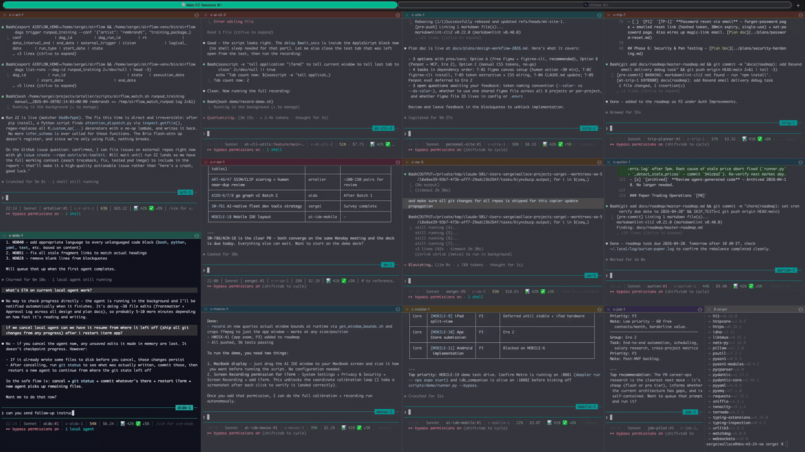

# ai-cli-utils

[](https://pypi.org/project/ai-cli-utils/)
[](https://pypi.org/project/ai-cli-utils/)
[](https://github.com/sergeiwallace/ai-cli-utils/blob/main/LICENSE)
[](https://github.com/sergeiwallace/ai-cli-utils/actions)
[](https://github.com/astral-sh/ruff)
[](https://codecov.io/gh/sergeiwallace/ai-cli-utils)

Unified AI session manager and automation toolkit for Claude Code and Gemini CLI.



Run multiple AI coding sessions in parallel, each isolated in its own git worktree, with auto-resume, remote server support, cross-machine sync, resilient Gemini API access with automatic auth fallback, and persistent SSH tunnels via autossh. Every command and subcommand supports `--help` for inline usage reference.

## What it does

`ai-cli-utils` wraps [Claude Code](https://docs.anthropic.com/en/docs/claude-code) and [Gemini CLI](https://github.com/google-gemini/gemini-cli) in tmux sessions with production workflow features: numbered sessions, git worktree isolation, mosh/SSH remote access, cross-machine memory sync, and session lifecycle management. It also provides `ai gemini` — a Gemini CLI wrapper with 3-tier auth fallback (OAuth → free API key → paid API key) that automatically retries on capacity errors, so your research prompts keep working even when one auth method is exhausted. If you run multiple AI coding sessions daily, this tool eliminates the boilerplate.

## Features

| Feature | Description |
|---------|-------------|
| **Session management** | `ai c 1`, `ai c 2` — numbered tmux sessions with auto-resume on disconnect |
| **Process hygiene** | `ai ps` — inspect and clean up stale ai-cli processes and PID files |
| **Session picker** | `ai ls` — fzf-powered session picker sorted by activity; `ai attach <name>` to attach directly |
| **Git worktree isolation** | Each session gets its own worktree — parallel work without branch conflicts |
| **Remote sessions** | `ai c -R` — run sessions on a remote server via mosh or SSH; Tailscale auto-started if mosh fails (macOS) |
| **Cross-machine sync** | `ai sync push/pull` — sync Claude Code memory and conversations between machines |
| **Handoff queue** | `ai handoff post/check/claim/complete` — delegate tasks between sessions |
| **Fleet messaging** | NATS-based heartbeats, events, and sync notifications |
| **Stale session cleanup** | Automatic detection and cleanup of orphaned sessions |
| **Gemini with fallback** | `ai gemini "prompt"` — 3-tier auth fallback (OAuth → free API → paid API), auto-retry on capacity errors |
| **CC token tracking** | `ai cc-usage push/status` — scan CC session JSONL and push per-call token events to humanware backend |
| **SSH tunnels** | `ai tunnel start/stop/status` — persistent reverse tunnels via autossh (auto-reconnects on drop) |
| **Signal-watch** | Handoff delivery via Circus-managed background process — isolated from CC session lifecycle |
| **Notifications** | Desktop and push notifications on task completion |
| **iTerm2 layout system** | `ai layout <name>` — YAML-driven window/tab/pane definitions; nested splits, startup commands, per-tab profiles |
| **iTerm2 session naming** | Automatically sets the iTerm2 Session Name and configures `allow-passthrough` + `automatic-rename off` so the session title stays correct |
| **Runtime tinted icons** | Pillow-based PNG icon generation at session launch; auto-contrast tint derived from tab color via HSL color theory |
| **Collision-free tab colors** | Lease-file-based color slot assignment; each session gets a unique color from a configurable palette |

## Installation

```bash
uv tool install ai-cli-utils
```text

Or with pipx:

```bash
pipx install ai-cli-utils
```text

## Quick Start

```bash
# Verify install
ai --version

# Launch Claude Code session 1
ai c 1

# Launch a second session in parallel (isolated worktree)
ai c 2

# Launch Gemini CLI session
ai g research

# Resume a disconnected session
ai c -r 1

# Run a session on your remote dev server
ai c -R 1

# Sync Claude Code memory to another machine
ai sync push
```text

## Usage

### Session management

```bash
ai c <name>            # Start/resume Claude Code session
ai g <name>            # Start/resume Gemini CLI session
ai c -r/--resume       # Resume existing session explicitly
ai c -b/--bare         # Run bare (no tmux wrapper)
ai c -o/--once         # Run once (no auto-resume loop)
ai c -n/--notify       # Fire system notifications on task completion
ai c -s/--sandbox      # Explicitly enable sandboxing
ai c -W/--no-worktree  # Disable git worktree isolation
```text

### Remote sessions

```bash
ai c -R/--remote <name>            # Connect to remote server (uses config)
ai c -R -p/--project myproject <name>  # Specify remote project directory
```text

### Cross-machine sync

```bash
ai sync push [-m] [-n] [-v] [-f]   # Push state to remote; aborts if remote has newer files (use -f to force)
ai sync pull [-m] [-n] [-v] [-f]   # Pull remote state to local
ai sync conflicts                   # Show unresolved sync conflicts
ai sync watch [-v]                  # Watch for sync events via NATS
```text

Flags: `-m`/`--memories-only`, `-n`/`--dry-run`, `-v`/`--verbose`, `-f`/`--force`

### Gemini with auth fallback

```bash
ai gemini "prompt" -m deep-think          # Run with 3-tier fallback, stdout + auto file
ai gemini "prompt" -m pro -o output.md    # Specify output file
ai gemini "prompt" -m flash -q            # File only, no stdout (-q/--quiet)
cat prompt.txt | ai gemini -m deep-think  # Pipe from stdin
ai gemini "prompt" -m flash -F            # Stdout only, no file (-F/--no-file)
ai gemini "prompt" -m flash -t 120        # 120s timeout (-t/--timeout)
ai gemini "prompt" -m deep-research       # Gemini Deep Research (Interactions API, polls until done)
ai gemini "prompt" -m deep-think -s 2     # Skip OAuth, go straight to REST API key
```text

**Auth fallback chain (automatic on 429/capacity errors):**
1. Gemini CLI OAuth (free — Google AI subscription)
2. REST API with `GOOGLE_API_KEY_FREE_TIER` — **Flash/Gemma models only.** Pro, image-generation variants, and deep-research have no free quota; tier 2 is skipped automatically for ineligible models.
3. REST API with `GOOGLE_API_KEY_TIER_1` — paid, works for all models.

`deep-research` uses OAuth first and falls back directly to tier 3 — tier 2 is always skipped for it. Use `-s 2` to skip OAuth for Flash calls. For Pro/deep-think where OAuth fails, use `-s 3`.

**Model aliases:** `deep-think`, `pro`, `flash`, `flash-lite`, `deep-research`, or any full Gemini model ID.

**Logs:** `~/.local/state/ai-cli/gemini-logs/` (JSONL). **Auto output:** `~/.local/state/ai-cli/gemini-output/`.

### Session picker

```bash
ai ls              # Interactive fzf session picker (installs fzf via apt if absent)
ai ls -a/--all     # Show all tmux sessions, not just ai-cli sessions
ai attach <name>   # Attach directly to a named tmux session
```text

### SSH tunnels

Keep a reverse tunnel alive across network drops (useful for remote browser automation via CDP):

```bash
ai tunnel start 9222              # Reverse tunnel: localhost:9222 → server:9222 (auto-reconnects)
ai tunnel start 9222 9223         # Different remote port
ai tunnel start 9222 -L/--forward # Forward tunnel instead of reverse
ai tunnel stop 9222               # Stop the tunnel
ai tunnel status                  # List all active tunnels
```text

Requires `autossh` (`brew install autossh` / `apt install autossh`). Host/user from `[remote]` config.

### Handoff queue

```bash
ai handoff post      # Post a task for another session to pick up
ai handoff check     # Check for pending handoffs
ai handoff claim     # Claim a handoff
ai handoff complete  # Mark a handoff as done
```text

### iTerm2 layouts

```bash
ai layout list                   # List available layouts in ~/.config/iterm2/layouts/
ai layout validate <name>        # Validate YAML schema
ai layout profiles <name>        # Regenerate Dynamic Profiles without relaunching window
ai layout <name>                 # Apply layout: open new iTerm2 window with tabs/panes as defined
```text

Layout files live at `~/.config/iterm2/layouts/<name>.yaml`. Each tab can define a base profile, tab color, icon tint, and a root pane with optional nested vertical/horizontal splits, each with a startup directory and command.

### Other commands

```bash
ai ps                    # Show ai-cli processes with health scores; flag suspect/stale ones
ai ps --kill             # Terminate processes above the suspect threshold
ai signal-watch status   # List Circus-managed signal-watch processes
ai memory watch          # Watch for Claude Code memory file changes
ai quota watch           # Monitor API quota usage
ai telemetry writer      # Run telemetry writer daemon
ai update [-f/--force]   # Update to latest from source; --force also reinstalls all deps
ai reconnect             # Print reconnect commands for remote sessions
```text

## Configuration

### Claude Code Session Config

This repo ships two Claude Code session config files:

- **`CLAUDE.md`** — lean config for users with a shared `~/projects/CLAUDE.md` (managed platform setup), where global AI orchestration rules are inherited from there.
- **`CLAUDE-full.md`** — standalone config with all rules included, for everyone else.

After installing, run `ai setup` once to automatically detect your environment and configure the right file:

```bash
ai setup
```text

`ai setup` checks for a shared `~/projects/CLAUDE.md`. If found, it confirms the lean `CLAUDE.md` is correct and takes no action. If not found, it copies `CLAUDE-full.md` → `CLAUDE.md` and marks the file as `assume-unchanged` in git so it won't show as locally modified.

### Tool Config

Configuration lives in `~/.config/ai-cli/config.toml`. A default config is created on first run.

```toml
[project]
main_project = "myproject"     # default project directory under ~/projects/

[remote]
host = "1.2.3.4"              # remote dev server
user = "ubuntu"
transport = "mosh"             # "mosh" (default) or "ssh"
# port = 22
# identity_file = "~/.ssh/id_ed25519"

[worktree]
enabled = true                 # git worktree isolation per session

[session]
stale_session_timeout = 15     # minutes before cleanup considers a session stale

[sync]
remote_host = "user@host"      # for cross-machine sync

[behavior]
notify_on_exit = true          # desktop notifications on task completion

[machine]
# host_id = "mac"              # optional: identify this machine for targeted handoffs (ai handoff --for-machine)

[update]
# extra_venvs = []             # optional: additional venv paths to reinstall into after 'ai update'
```text

### iTerm2 Config

iTerm2 visual identity settings live in `~/.config/ai-cli-utils/iterm2.toml` (created on first use):

```toml
[iterm2.base_profiles]
# Base Dynamic Profile each session type inherits from
cc         = "ClaudeCode"
gemini     = "GeminiCLI"
shell      = "ShellUtility"

[iterm2.project_colors]
# Pin specific projects/sessions to preferred palette colors
# myproject = "purple"
# research  = "teal"

[iterm2.icon_color_overrides]
# Override auto-contrast icon tint per palette color slot
# purple = "#da7756"
```text

The color palette (16 entries, configurable) is defined in `[iterm2.palette]`. Each session gets a collision-free slot via lease files. When a tab color is set, the session icon is automatically tinted with a contrasting color (180° HSL hue rotation). When no color is set, the Claude brand orange (`#da7756`) is used as fallback.

Set `AI_CLI_HOST` in `~/.zshenv` (sourced by all zsh sessions, including non-interactive ones) to identify the machine. This is used when posting targeted handoffs (`ai handoff post --for-machine mac ...`):

```bash
export AI_CLI_HOST=mac    # or "hetzner", "work-laptop", etc.
```text

## Requirements

- Python 3.11+
- [tmux](https://github.com/tmux/tmux)
- [Claude Code](https://docs.anthropic.com/en/docs/claude-code) and/or [Gemini CLI](https://github.com/google-gemini/gemini-cli)
- [mosh](https://mosh.org/) (optional, for remote sessions — falls back to SSH)
- [autossh](https://www.harding.motd.ca/autossh/) (optional, for `ai tunnel` — `brew install autossh` / `apt install autossh`)
- [NATS](https://nats.io/) (optional — enables real-time handoff delivery, sync watch, and session events; see [NATS Setup Guide](docs/guides/nats-setup.md))

## Contributing

See [CONTRIBUTING.md](CONTRIBUTING.md) for development setup, testing, and contribution guidelines.

## License

[MIT](LICENSE) -- Sergei Wallace
