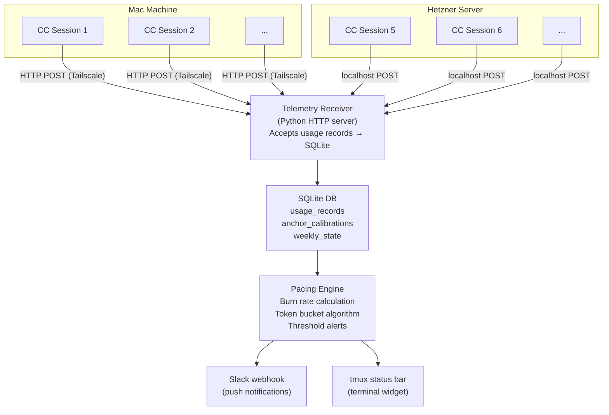

<!-- doc:region name="overview" kind="replaceable" -->

# Claude Usage Telemetry — Token Tracking and Quota Pacing

**Status:** APPROVED — *Note: System Architecture and Data Model sections below reflect the original design (standalone SQLite + HTTP receiver). The actual implementation uses NATS JetStream → Postgres via ai-core. See `ai-core/docs/designs/ai-usage-tracking.md` for the authoritative architecture.*

**Created:** 2026-04-01

**Tasks:** AI-CLI-22 (hidden pane scraper), AI-CLI-23 (native API investigation), AI-CLI-55 (Sonnet % in statusline), AI-CLI-56 (duplicate statusline boxes)
**Research:** R-5 (deep-think, 2026-04-01)

<!-- FEEDBACK RULES (for AI agents):
  1. Never edit, rewrite, or remove user-written feedback. It is permanent record.
  2. When the user writes feedback: commit the doc immediately BEFORE responding or revising.
  3. Each round is a --- bounded section: opening --- before Feedback Round N, closing --- after AI Response Round N.
  4. Append AI response as > **AI Response Round N:** below user feedback, then add closing --- + > **Feedback Round N+1:** prompt + closing ---.
  5. Never overwrite prior rounds.
  6. After each round, add a line item to the Approval Log: date, round N, key decisions/approvals from that round.
-->

<!-- AIDO-128: the ToC sits ABOVE the Executive Summary (it is self-referential otherwise).
  D5 (c): list EVERY `## ` and EVERY `### ` heading in the real doc, with GitHub-style
  anchors (lowercase, spaces→hyphens, punctuation stripped) so they navigate in-window
  (incl. VS Code Remote-SSH). `aido toc check` validates this once AIDO-127 lands. If
  all-`###` proves too noisy, fall back to D5 (a) "meaningful `###`" — a deterministic
  OR-rule: include a `###` when it (1) has child `####`, (2) its section body ≥ ~8-10
  lines, (3) its parent `##` is allowlisted (Design Decisions / Open Questions /
  appendices), or (4) matches a pattern (`### D-N`); `<!-- toc:skip -->` /
  `<!-- toc:include -->` on a heading override the heuristic. -->

## Table of Contents

- [Problem Statement](#problem-statement)
- [Research Findings Summary](#research-findings-summary)
- [Design Decisions](#design-decisions)
- [System Architecture](#system-architecture)
- [Data Model](#data-model)
- [Integration](#integration)
- [Implementation Phases](#implementation-phases)
- [Risks and Mitigations](#risks-and-mitigations)
- [Open Questions](#open-questions)
- [Approval Log](#approval-log)
- [Appendix: Research Prompt](#appendix-research-prompt)

## Problem Statement

We run 6-10 parallel Claude Code sessions across two machines (Mac + Hetzner) on a Claude Pro subscription. The subscription enforces a weekly token allowance with a 5-hour rolling sub-limit, but Anthropic provides no programmatic API for subscription-tier usage data. The only visibility into quota state is a percentage bar in the claude.ai web UI.

This creates a blind spot: each Claude Code session tracks its own local token count, but no session knows the aggregate usage across all sessions and machines, and none can query the server-side remaining quota. Without cross-session aggregation and pacing, we routinely burn through the weekly quota unevenly — heavy early-week usage leads to throttled sessions later.

The system must: (1) capture token usage from every CC session on both machines, (2) aggregate into a central store, (3) estimate remaining weekly quota, and (4) alert when burn rate threatens to exhaust the quota before the reset window.

## Research Findings Summary

R-5 (deep-think, 2026-04-01) surveyed Anthropic's official surfaces, community tooling, and quota pacing patterns. Key findings:

### What Anthropic Exposes

- **API Usage endpoint** (`/v1/organizations/usage_report/messages`): requires an `sk-ant-admin` key from the Console. Strictly for pay-per-token API accounts, not Pro/Team subscriptions. `[VERIFIABLE FACT]`
- **Claude.ai web UI**: shows a visual percentage bar for both the 5-hour rolling limit and the weekly limit. No public JSON endpoint exists to fetch this programmatically. `[VERIFIABLE FACT]`
- **Claude Code CLI**: tracks local usage per session. Machine-readable JSON available via `--output-format json` or the `statusLine` directive in `~/.claude/settings.json`, exposing `total_tokens`, `cost`, and `model` data for the active session. `[VERIFIABLE FACT]`
- **CLI limitation**: the `/usage` command only knows about locally consumed tokens — it does not query the server for global account quota state. `[SYNTHESIZED INFERENCE]`
- **No known programmatic limit endpoint**: exhaustive search of Anthropic docs, GitHub, and developer forums found no way to query the numeric weekly token allowance for a Pro account. `[NO SOURCE FOUND]`

### Community Tools & Prior Art

1. **Browser extensions** (Claude Usage Tracker, Claude Counter): inject into the web UI DOM to read progress bars or intercept internal API calls. Completely blind to CLI usage. `[INDUSTRY HEURISTIC]`
2. **CLI aggregators** (Claude Code Usage Monitor): parse local CLI output for terminal dashboards and burn rate predictions. Single-machine only — no multi-machine aggregation. `[SYNTHESIZED INFERENCE]`

## Design Decisions

### Decision Summary

<!-- Recommendation-vs-choice tracking (AIH-148): track the AI recommendation and the human
  choice in SEPARATE columns so preference-divergence is queryable, not buried in prose.
  - Recommended (AI): the AI's pick. If the rec was CORRECTED mid-discussion, put the final pick
  here and KEEP the original recommendation + its reasoning in Rationale (or the detail) — never
  silently overwrite it; the correction is signal.
  - Chosen: the human's final pick. Fill when decided.
  - Diverged?: `Yes` if Chosen != Recommended (final), else `No`. On `Yes`, Rationale MUST state
  WHY the human chose differently — that "why" is the highest-value datapoint.
  Full rules: ai-harness docs/procedures/decision-framework.md (Decision Summary tracking). -->

| # | Decision | Options Considered | Chosen | Rationale | Status |
|---|----------|-------------------|--------|-----------|--------|
| 1 | Limit detection strategy | (a) Web UI scraping, (b) Heuristic aggregation, (c) Hybrid: aggregation + manual anchor, (d) Automated tmux terminal scraping | (d) tmux scraping | Direct server-side percentage with no manual anchoring or heuristic drift; if it works, nothing else needed | **Approved** |
| 2 | Data capture mechanism | (a) statusLine hook, (b) Log file parsing, (c) CC hook scripts | (a) statusLine | Official CC feature, structured JSON, no parsing fragility | **Approved** |
| 3 | Central store | (a) SQLite on primary machine, (b) Redis, (c) HTTP webhook to Python server | (a) SQLite | Simplest; no additional infrastructure; both machines accessible via SSH/Tailscale | **Approved** |
| 4 | Cross-machine transport | (a) UDP packets, (b) HTTP POST to central server, (c) SSH-tunneled SQLite writes, (d) Shared filesystem | (b) HTTP POST | Reliable delivery, trivial Python receiver, works over Tailscale | **Approved** |
| 5 | Alerting channel | (a) ntfy.sh, (b) Slack webhook, (c) Terminal-only | (b) Slack | ntfy push notifications are broken — appear as generic "ntfy message" with no visible content without opening the app; Slack delivers rich message previews natively | **Approved** |
| 6 | Statusline format when Sonnet % is absent (AI-CLI-55) | (A) omit Sonnet field, (B) show dimmed placeholder + fire background scrape | (B) dimmed placeholder + scrape | Consistent with session % handling; background scrape means placeholder is short-lived | **Approved** |
| 7 | Sonnet quota label (AI-CLI-55) | `son`, `sonnet`, `S` | `S` (with `W` for all-models weekly) | Terse; consistent with statusline style | **Approved** |
| 8 | Sonnet % alert thresholds (AI-CLI-55) | Same as all-models, or tighter | Same as all-models | Consistent; revisable after observing real usage | **Approved** |
| 9 | Statusline label names and styling (AI-CLI-64) | (A) color/bold `W`/`S`, (B) `Week`/`Son`, (C) `All`/`Son`, (D) icons, (E) adaptive-width with color/bold | (E) adaptive-width | `Week`/`Son` when terminal wide enough; `W`/`S` when narrow; both styled with bold + distinct color as field headers | **Approved** |
| 10 | Sonnet pace % visibility (AI-CLI-64) | (a) always show dimmed placeholder + background scrape, (b) omit until populated | (a) dimmed placeholder + scrape | Consistent with D6 and weekly pace behavior; prevents layout jitter | **Approved** |

<!-- DECISION FORMATTING (AIH-114) — applies when filling in REAL option content below:
  each option's Pros and Cons must be BULLETED lists, and `**Pros:**` / `**Cons:**` must be
  each on its own line — a blank line before each header, and a hard newline between the header
  and its bullet list — otherwise PDF export collapses them onto one line. The placeholder
  skeleton below already shows the correct shape; match it exactly. -->

### Decision Details

#### Decision 1: Limit Detection Strategy

The core hard problem. The actual weekly token limit is not exposed via any supported API, so we must either scrape it, guess it, or combine automated tracking with periodic manual calibration.

##### (a) Web UI Scraping (Headless Browser)

Run a background Playwright script that authenticates to claude.ai, navigates to the dashboard, and scrapes the percentage bar.

**Pros:**
- Ground truth — reflects the exact server-side throttling state

**Cons:**
- Extremely brittle: session cookies, Cloudflare bot protection, React UI changes
- High maintenance cost relative to value delivered
- Scraping authenticated SPA dashboards behind bot protection is notoriously unstable `[INDUSTRY HEURISTIC]`

##### (b) Heuristic Aggregation Only

Capture every token sent/received across all sessions, push to central DB. Assume a fixed weekly limit (e.g., ~10M tokens/week based on historical throttle points) and pace against that number.

**Pros:**
- 100% reliable data capture — never breaks due to UI changes
- Fully automated, no human-in-the-loop

**Cons:**
- The assumed limit is wrong by definition — Anthropic's limit fluctuates based on server load
- Drift between assumed and actual limit compounds over time
- No self-correcting mechanism

##### (c) Hybrid: Aggregation + Manual Anchor

Use option (b) for continuous automated tracking, but periodically calibrate against the web UI. The developer checks the UI, sees "50% used," and runs `ai quota anchor 50`. The system deduces the actual weekly limit from known token count vs reported percentage.

**Pros:**
- Automated tracking handles the high-frequency work
- Manual anchor solves the "opaque server limit" problem with minimal friction
- Self-correcting — each anchor recalibrates the assumed limit
- Resilient to Anthropic changing the limit week-to-week

**Cons:**
- Requires human action ~2x/week (low friction but not zero)
- Accuracy degrades between anchor points if Anthropic's limit changes mid-week

##### (d) Automated Terminal Scraping via tmux

Use `tmux send-keys` to inject `/usage` into an active Claude Code session, then poll `tmux capture-pane` to read the percentage back. Claude Code is built on React/Ink, which uses a differential ANSI renderer — `tmux capture-pane` absorbs the ANSI diffs and exposes a clean text buffer.

**Pros:**
- Fully automated — no human anchor step required
- tmux is already in our stack
- More reliable than web UI scraping (no auth, no bot protection, no SPA complexity)

**Cons:**
- Race condition risk: stale previous `/usage` output may match before new response renders. **Mitigation:** inject `C-l` (clear screen) before `/usage`
- Terminal sizing: detached panes may default to narrow geometry causing line wrapping. **Mitigation:** use `capture-pane -J` flag to join wrapped lines
- Requires an active CC session to be running (no on-demand scraping)
- No prior art specifically for `/usage` scraping — empirical testing needed `[NO SOURCE FOUND]`
- Claude Code's Ink rendering may include unpredictable layout whitespace — regex may need tuning

**Research source:** R-50 (`docs/research/claude-usage-terminal-automation.md`)

##### Recommendation

**Option (d)** — start here. It gives you the actual server-side percentage directly from `/usage` with no manual anchoring and no heuristic drift. Validate with a test harness that exercises the full tmux pipeline end-to-end and asserts the extracted percentage. If tests pass, option (d) is the complete solution. Option (c) hybrid is the fallback if the test harness reveals option (d) is unreliable (e.g., Ink rendering whitespace defeats the regex or the race condition mitigation is insufficient).

---

#### Decision 2: Data Capture Mechanism

How each CC session reports its token usage to the central system.

##### (a) statusLine Hook

Use Claude Code's `statusLine` directive in `~/.claude/settings.json` to reference a script that receives JSON with `total_tokens`, `cost`, and `model` on every status update.

**Pros:**
- Official CC feature — structured JSON output
- Fires on every status update (high granularity)
- No log parsing, no fragile regex

**Cons:**
- Requires the script to be fast (runs in the status update path)
- Must be deployed to `~/.claude/` on both machines

##### (b) Log File Parsing

Parse CC's local log files or SQLite database for token counts.

**Pros:**
- No configuration changes to CC

**Cons:**
- Log format is an internal implementation detail — can change without notice
- Polling-based, not event-driven
- Parsing complexity

##### (c) CC Hook Scripts

Use Claude Code's hook system (PreToolCall, PostToolCall, etc.) to capture usage data.

**Pros:**
- Runs in the CC lifecycle

**Cons:**
- Hooks fire per tool call, not per status update — different granularity
- Hook overhead on every tool call across 6-10 sessions
- Not designed for telemetry

##### Recommendation

Option (a), the statusLine hook. It is the officially supported mechanism for machine-readable session data. It provides structured JSON without parsing, fires at the right granularity, and the implementation is a small fast script. Deploy identically to both machines.

---

#### Decision 3: Central Store

Where aggregated token data lives.

##### (a) SQLite on Primary Machine (Hetzner)

A single SQLite database on the Hetzner server that receives usage records from both machines.

**Pros:**
- Zero additional infrastructure — SQLite is already in the stack
- Simple backup (single file)
- Python's `sqlite3` stdlib — no dependencies
- Sufficient for this workload (writes are low-frequency, reads are dashboard/CLI)

**Cons:**
- Write contention if multiple sessions POST simultaneously (mitigated by WAL mode)
- Not a network-native store — needs an HTTP receiver in front

##### (b) Redis

Redis instance on Hetzner for real-time counters and time-series.

**Pros:**
- Native atomic increments, TTL for rolling windows
- Network-native

**Cons:**
- Additional infrastructure to maintain for a low-volume use case
- Overkill — we are tracking ~10 sessions, not 10K

##### (c) HTTP Webhook to Python Server (with any backing store)

Lightweight Python HTTP server that accepts POSTs and writes to whatever store.

**Pros:**
- Decouples transport from storage

**Cons:**
- This is a transport decision, not a store decision — compatible with (a) or (b)

##### Recommendation

Option (a), SQLite on Hetzner, fronted by a lightweight Python HTTP receiver (which is option c as transport, not store). The write volume is trivially low. SQLite in WAL mode handles concurrent writes from a few sessions without issue. Redis adds operational overhead for no benefit at this scale.

---

#### Decision 4: Cross-Machine Transport

How usage data gets from Mac sessions to the Hetzner central store.

##### (a) UDP Packets

Fire-and-forget UDP to the central server.

**Pros:**
- Fastest, lowest overhead

**Cons:**
- No delivery guarantee — dropped packets mean lost usage data
- UDP through firewalls/NAT can be unreliable

##### (b) HTTP POST to Central Server

Each statusLine script sends an HTTP POST to a lightweight receiver on Hetzner.

**Pros:**
- Reliable delivery (TCP, retries possible)
- Trivial to implement (Python `requests` or `httpx`)
- Works over Tailscale without port forwarding
- Easy to debug (standard HTTP tooling)

**Cons:**
- Slightly higher latency than UDP (irrelevant at this scale)
- Requires a running HTTP server on Hetzner

##### (c) SSH-Tunneled SQLite Writes

Mac sessions write directly to the Hetzner SQLite DB over an SSH tunnel.

**Pros:**
- No separate server process

**Cons:**
- SSH tunnel management adds complexity
- SQLite over network filesystem is fragile
- Not how SQLite is meant to be used

##### (d) Shared Filesystem (NFS/SSHFS)

Mount the Hetzner filesystem on Mac and write directly.

**Pros:**
- Simple conceptually

**Cons:**
- Network filesystem + SQLite = corruption risk
- Latency-sensitive

##### Recommendation

Option (b), HTTP POST. Reliable, simple, debuggable, and works naturally over Tailscale. The receiver is ~50 lines of Python (FastAPI or even `http.server`). Hetzner sessions POST to localhost; Mac sessions POST to the Tailscale IP.

---

#### Decision 5: Alerting Channel

How the system notifies when burn rate is dangerous.

##### (a) ntfy.sh

Push notifications via ntfy.sh (self-hosted on Hetzner or public instance).

**Pros:**
- Already deployed on Hetzner infrastructure
- Simple HTTP POST to send

**Cons:**
- Push notifications appear as generic "ntfy message" with no visible content — must open the ntfy app to read the message. This defeats the purpose of a push alert.
- Outstanding bug: notification payloads not surfacing in the OS notification preview

##### (b) Slack Webhook

Send alerts to a Slack channel via incoming webhook.

**Pros:**
- Rich message previews visible directly in the OS notification banner — no app-open required
- Structured message formatting (blocks, fields) for showing percentage, burn rate, session breakdown
- Simple HTTP POST to send (same as ntfy)
- Webhook setup is a one-time 2-minute config in Slack

**Cons:**
- Requires a Slack workspace

##### (c) Terminal-Only

Print warnings in the CC session status line or a tmux status bar.

**Pros:**
- Zero infrastructure

**Cons:**
- Easy to miss across 6-10 sessions
- No mobile notifications when away from terminal

##### Recommendation

Option (b), Slack webhook. The ntfy notification bug makes option (a) useless as an alert mechanism — a notification that shows no information without opening the app is not actionable. Slack delivers full message content in the OS notification banner. Terminal warnings as a secondary channel (tmux status bar) for at-a-glance visibility while at the keyboard.

---

#### Decision 6: Statusline Format When Sonnet % Is Absent (AI-CLI-55) — `APPROVED: (B)`

##### (A) Omit Sonnet field entirely

Show only the all-models block when `weekly_sonnet_pct` is `None`.

**Pros:** Cleaner output — no placeholder.
**Cons:** Inconsistent with how `session_pct` is handled; statusline width changes when data populates, causing layout jitter.

##### (B) Show dimmed placeholder + fire background scrape

Render `\033[2m-% S\033[0m` (dim) in place of Sonnet %, and trigger `_launch_background_scrape()` immediately.

**Pros:** Consistent with session % handling; placeholder is short-lived because scrape fires automatically; stable statusline width prevents layout jitter.
**Cons:** Slightly more visual noise when data is absent.

##### Recommendation

> **Decision:** `APPROVED — (B) dimmed placeholder + background scrape`
<!-- decision-record: chosen-option=(b); ai-family=N/A; ai-model=N/A; ai-effort=N/A; ai-profile=N/A -->

Option (B). Consistency with the rest of the widget and stable width both favor this approach.

---

#### Decision 7: Sonnet Quota Label (AI-CLI-55) — `APPROVED: S / W`

Options: `son`, `sonnet`, or `S` for the Sonnet label; implicit all-models label.

##### Recommendation

> **Decision:** `APPROVED — S for Sonnet %, W for all-models weekly %`
<!-- decision-record: chosen-option=N/A; ai-family=N/A; ai-model=N/A; ai-effort=N/A; ai-profile=N/A -->

Both values now labeled. Terse, consistent with statusline aesthetic. Format: `📊 42% W ✅ →8% | 87% S`. When Sonnet absent: `📊 42% W ✅ →8% | \033[2m-% S\033[0m`.

---

#### Decision 8: Sonnet % Alert Thresholds (AI-CLI-55) — `APPROVED: same as all-models`

Options: same thresholds as all-models (<50% green, 50–75% yellow, ≥75% red), or tighter thresholds given Sonnet is easier to hit.

##### Recommendation

> **Decision:** `APPROVED — same thresholds as all-models`
<!-- decision-record: chosen-option=N/A; ai-family=N/A; ai-model=N/A; ai-effort=N/A; ai-profile=N/A -->

Consistent and revisable after observing real usage. If Sonnet is consistently hit harder, tighten thresholds empirically.

---

#### Decision 9: Statusline Label Names and Styling (AI-CLI-64) — `APPROVED: (E)`

The v1 statusline uses `W` (weekly all-models) and `S` (Sonnet) as right-positioned labels. AI-CLI-64 moves labels left. The question is whether the label text and presentation should also change.

##### (A) Keep `W`/`S` with ANSI color/bold

Add a distinct ANSI color to each label (e.g. bold cyan `W`, bold magenta `S`). Labels stay single-character.

**Pros:**
- Minimal character count — no impact on narrow tmux panes
- Color adds identifiability without changing muscle memory for existing users
- Consistent with terse statusline aesthetic

**Cons:**
- Color rendering varies across terminal themes (dark/light, 256-color vs. truecolor) — may look wrong or invisible in some configurations
- Single-letter labels remain ambiguous without prior context

##### (B) Rename to `Week`/`Son`

Replace `W`/`S` with `Week` and `Son`.

**Pros:**
- More self-descriptive — readable without prior knowledge of the format
- Still terse (4/3 chars) — same character budget as existing `42% W` since labels move left
- Works in any terminal without ANSI support

**Cons:**
- Slightly wider than single-char labels; may wrap in very narrow panes
- `Son` could be read as "son" (not "Sonnet") without context

##### (C) Rename to `All`/`Son`

Replace `W`/`S` with `All` and `Son`.

**Pros:**
- `All` more clearly signals "all models" (vs. `Week` which implies time window, not scope)
- Same width advantage as (B)

**Cons:**
- `Week` better reflects what the metric actually measures (weekly budget), not which models; `All` vs `Son` implies a model filter, not a time filter — slightly misleading
- Same potential `Son` ambiguity as (B)

##### (D) Use icons (`🗓`/`🤖`)

Replace text labels with emoji.

**Pros:**
- Visually distinctive, no ANSI color required

**Cons:**
- Emoji rendering in tmux is unreliable — double-width, invisible, or misaligned depending on font and terminal
- Adds visual noise; inconsistent with the existing `📊` prefix which already carries the widget identity
- Hard to grep/parse in scripts

##### (E) Adaptive-width with color/bold — `APPROVED`

Use `Week`/`Son` labels (readable) when the terminal is wide enough; fall back to `W`/`S` (compact) when narrow. Both modes styled with bold + distinct ANSI color to make them visually stand out as field headers rather than ordinary text.

Implementation: `statusline-command.sh` passes `$COLUMNS` as `AI_CLI_STATUSLINE_COLS` env var; `quota_statusline_part()` reads it and chooses label style. Threshold: ≥80 cols → `Week`/`Son`; <80 cols → `W`/`S`. Color: bold cyan for the all-models label, bold magenta for the Sonnet label (or similar high-contrast pair).

**Pros:**
- Best of both worlds: readable when space permits, terse when not
- Bold + color makes labels visually distinct from numeric values — immediately readable as field headers
- Adaptive — no user configuration required; degrades gracefully in narrow panes

**Cons:**
- Requires terminal width passed from shell script to Python (one env var)
- Slightly more rendering logic

##### Recommendation

> **Decision:** `APPROVED — (E) adaptive-width with bold + color`
<!-- decision-record: chosen-option=(e); ai-family=N/A; ai-model=N/A; ai-effort=N/A; ai-profile=N/A -->

Option (E). Adaptive behavior gives `Week`/`Son` readability in normal-width terminals while degrading cleanly to `W`/`S` in narrow panes. The bold + distinct color styling for the labels answers the request to make them visually distinct field headers regardless of which label text is chosen.

---

#### Decision 10: Sonnet Pace % Visibility (AI-CLI-64) — `APPROVED: (a)`

AI-CLI-64 adds pace % for Sonnet (mirroring the all-models `→8%`). The question is what to show when `weekly_sonnet_pct` hasn't been scraped yet (so no pace baseline exists).

##### (a) Always show — dimmed placeholder when absent

Show `→-%` in dim ANSI when Sonnet pace data is unavailable, and fire a background scrape to populate it. Consistent with how `weekly_sonnet_pct` itself is handled (D-6/Round 2: show dimmed `-% S` + fire scrape).

**Pros:**
- Consistent behavior: Sonnet section always has the same structure regardless of data availability
- Background scrape fires automatically — placeholder is short-lived in practice
- User sees the field exists and knows data is incoming

**Cons:**
- Slightly more visual noise when data is absent (dimmed placeholder)
- Requires dim ANSI for both the usage % and the pace % simultaneously

##### (b) Omit until populated

Don't render the Sonnet pace field at all if `weekly_sonnet_pct` is absent. Section shrinks from `S 87% →X%` to `S 87%` until a pace baseline is available.

**Pros:**
- Cleaner output — no placeholder characters
- Simpler rendering path

**Cons:**
- Inconsistent with the established D-6 decision (show dimmed placeholder + scrape, not omit)
- Statusline width changes as data populates — can cause layout jitter in tmux

##### Recommendation

> **Decision:** `APPROVED — (a) dimmed placeholder + background scrape`
<!-- decision-record: chosen-option=(a); ai-family=N/A; ai-model=N/A; ai-effort=N/A; ai-profile=N/A -->

Option (a). Consistent with D6 (Sonnet usage %) and with the existing weekly pace behavior — when the weekly pace is absent, the same dimmed placeholder + background scrape pattern is used. Stable statusline width prevents layout jitter.

---

> **Feedback Round 1:**
> 1. D-1: approved
> 2. D-2: approved
> 3. D-3: approved
> 4. D-4: approved
> 5. D-5: open to Slack. ntfy notifications are broken — appear as generic "ntfy message" with no visible information without opening the ntfy app. Need to fix this. If Slack is better and more reliable, fine with that.
> - Also: on D-1, this is engineering — we create the tools to do empirical testing. We don't passively observe. Build a test harness.
>
> **AI Response Round 1:**
> - D-1 through D-4: approved, decision table updated to Approved.
> - D-5: switched to Slack webhook. ntfy issue noted in cons: notifications appear as generic "ntfy message" with no content visible in OS banner — defeats the purpose of a push alert. Slack delivers full message content in the notification banner natively.
> - D-1 recommendation language updated: "Validate with a test harness that exercises the full tmux pipeline end-to-end and asserts the extracted percentage."
> - All ntfy references updated to Slack throughout (architecture diagram, alerting section, config, integration list).

---

> **Feedback Round 2:**
> - <enter feedback here>

<!-- When user writes feedback above, AI appends the following pattern (do not remove this comment):

> **AI Response Round N:**
> - <AI response here>

---

> **Feedback Round N+1:**
> - <enter feedback here>

-->

## System Architecture

### Overview



### Data Capture (The Edge)

Each CC session runs a statusLine script (`~/.claude/telemetry.sh`) configured in `~/.claude/settings.json`. On every status update, the script:

1. Parses the JSON payload for `total_tokens`, `cost`, `model`
2. Adds machine ID and session ID metadata
3. POSTs the record to the central receiver

The script must be fast (sub-100ms) since it runs in the status update path. It should fire-and-forget with a short timeout — a slow or down receiver must not block CC sessions.

### Pacing Logic (The Core)

The pacing engine runs as a background process on Hetzner and implements:

- **Expected burn rate**: based on the deduced weekly limit and time remaining in the week. E.g., if 7 days remain and the limit is 10M tokens, the expected rate is ~1.43M/day. `[INDUSTRY HEURISTIC]` — standard SRE and cloud FinOps practice.
- **Actual burn rate**: calculated over a rolling 12-hour window from the usage records.
- **Alert thresholds**: if actual burn rate exceeds expected by 1.5x, send a warning. If a session is spiking the burn rate, identify it specifically.
- **Token bucket algorithm**: models the remaining quota as a bucket that drains with usage and refills at the weekly reset.

### Alerting (The Output)

Push notifications via Slack webhook when:
- Burn rate exceeds 1.5x expected pace
- Aggregate usage crosses 50%, 75%, 90% of deduced weekly limit
- A single session accounts for >40% of total usage (session imbalance)

Tmux status bar integration as a secondary channel for at-a-glance visibility.

> **Feedback Round 1:** Approved — architecture follows directly from approved decisions. No changes requested.

<!-- When user writes feedback above, AI appends the following pattern (do not remove this comment):

> **AI Response Round N:**
> - <AI response here>

---

> **Feedback Round N+1:**
> - <enter feedback here>

-->

## Data Model

### SQLite Schema

```sql
CREATE TABLE usage_records (
    id INTEGER PRIMARY KEY AUTOINCREMENT,
    session_id TEXT NOT NULL,        -- CC session identifier
    machine_id TEXT NOT NULL,        -- 'mac' or 'hetzner'
    model TEXT NOT NULL,             -- e.g. 'claude-opus-4', 'claude-sonnet-4'
    total_tokens INTEGER NOT NULL,   -- cumulative tokens for this session
    delta_tokens INTEGER,            -- tokens since last report (calculated)
    cost_usd REAL,                   -- cost estimate if available
    recorded_at TEXT NOT NULL        -- ISO 8601 timestamp
);

CREATE TABLE anchor_calibrations (
    id INTEGER PRIMARY KEY AUTOINCREMENT,
    reported_percent REAL NOT NULL,  -- e.g. 50.0 for "50% used"
    known_tokens INTEGER NOT NULL,   -- our tracked total at anchor time
    deduced_limit INTEGER,           -- calculated: known_tokens / (percent/100)
    anchored_at TEXT NOT NULL        -- ISO 8601 timestamp
);

CREATE TABLE weekly_state (
    week_start TEXT PRIMARY KEY,     -- ISO 8601 date of week start
    deduced_limit INTEGER,           -- latest deduced limit for this week
    total_consumed INTEGER DEFAULT 0,
    last_anchor_at TEXT,
    reset_at TEXT                    -- when the week resets
);
```

### Configuration

```toml
# ~/.config/claude-telemetry/config.toml
[receiver]
host = "0.0.0.0"
port = 9847

[pacing]
alert_burn_rate_multiplier = 1.5   # alert when actual > expected * this
alert_thresholds = [50, 75, 90]    # percent-used thresholds for alerts
session_imbalance_threshold = 40   # alert if one session > N% of total

[alerting]
slack_webhook_url = "https://hooks.slack.com/services/..."

[anchoring]
min_anchor_interval_hours = 12     # don't accept anchors more frequently
```

## Integration

- **Claude Code**: statusLine hook in `~/.claude/settings.json` on both machines
- **ai-cli**: `ai quota` subcommands for scrape, status, history, sync, statusline-part
- **Slack**: incoming webhook for push alerts
- **Tailscale**: cross-machine networking (Mac to Hetzner)
- **tmux**: hidden pane scraping (`_scrape_usage_hidden_pane`); status bar integration via `quota_statusline_part`
- **NATS JetStream**: `quota.snapshot` subject (stream: `quota`) — Hetzner publishes after each scrape; Mac durable consumer `quota-subscriber-mac` replays missed messages on reconnect
- **NATS core**: `hw.events.usage.claude.snapshot` subject — Hetzner publishes alongside `quota.snapshot` so the ai-core `UsageConsumer` can ingest snapshots into Postgres for cross-provider usage reporting
- **NATS KV (`hw_state`)**: `quota.claude.current` key — Hetzner writes after each scrape; other services (workers, dashboards) read without SSHing to Mac. (Renamed from the older `quota.claude.weekly` key — consumers now read the single canonical "latest snapshot" key.)
- **hw-scheduling (myproject)**: `claude_quota_scrape` job (Hetzner, 10 min) triggers scrape; `claude_quota_sync` job (Mac, 10 min) SSH-pulls as fallback catch-up; `gemini_cost_sync` job (Hetzner, 4h) tracks Gemini API cost separately
- **`ai internal quota-subscriber`**: persistent Circus-managed daemon on Mac; JetStream durable consumer for `quota.snapshot`; survives CC session exits
- **Platform MCP**: future integration for quota state in priority guidance
- **Orchestrated sessions**: AI orchestrator-spawned CC sessions should be captured by the shared statusLine hook; validate in test harness
- **Scheduled workers**: workers read `quota.claude.current` from NATS KV before executing AI-tagged jobs. Currently enforced worker-side.

## Implementation Phases

<!-- Per-phase task ACs follow the canonical AC quality rules. `docs/procedures/task-authoring-standards.md`
  is AUTHORITATIVE (open it for the full/latest standard; this inline reminder is sync-checked
  against its canonical block by `aido validate-doc` and must not be edited independently): -->
<!-- doc:ac-rules:mirror:begin -->
- Every AC is independently testable — a test can fail if only this AC is violated.
- Every AC is falsifiable — "works correctly" is not an AC.
- Use EARS as the default for textual behavioral ACs: `When <trigger>, the system shall <response>` (event-driven); `While <state>` / `Where <feature>` (state-driven / optional); `If <condition>, then the system shall <response>` (unwanted-behavior / failure path). When a decision table, state machine, formula, executable Gherkin, property, or contract expresses the behavior more clearly, wrap it in an `<!-- ac-format: <value> ... --> ... <!-- /ac-format -->` scope (`decision-table` / `state-machine` / `formula` / `gherkin` / `property` / `contract`; unmarked ACs default to `ears`). Full per-format `ac-format` schemas are normative at `task-authoring-standards.md` § Per-Format AC Schemas — **always check that live source directly for the current schemas before relying on this reminder; this mirrored block itself can drift out of date and must never be treated as authoritative on its own.**
- At least one failure-path AC per public function changed — EARS `If <condition>, then the system shall …`, or the marked format's own negative-path convention (a decision table's infeasible-combination row, a state machine's invalid-transition row, a formula's invalid-input row).
- Replacement/refactor tasks: inventory the existing behaviors, then a parity AC for each (preserved, or intentionally dropped + reason).
<!-- doc:ac-rules:mirror:end -->

<!-- SPEC RIGOR (implementation-readiness) — so a sub-agent executes this from the doc alone
  (task-spec best-practices research R-1780610095; full standard: docs/procedures/task-authoring-standards.md):
  • Ship each AC as an executable test where feasible; commit failing tests first.
  • Mandate >=1 NON-MOCKED behavioral assertion per behavior — do not mock the primary inputs;
  gate on mutation score, treat line coverage as a floor not a target.
  • Spec the WHAT (I/O, edge cases, failure paths, parity), NOT the HOW (internal data
  structures, algorithm, naming) — over-constraining internals degrades quality.
  • Exit gates are harness-enforced, runnable predicates (run the suite; fresh-context diff
  review against the ACs), never self-declared "done". -->

### Phase 1: tmux Scraping + Capture + Local Store ✅ (Shipped 2026-04-07)

- Hidden pane scraper (`_scrape_usage_hidden_pane`) — injects `/usage` into CC, captures all 4 metrics
- Local SQLite store on each machine (`~/.local/state/ai-cli/quota.db`) — no central HTTP server needed
- `ai quota scrape/status/history/record/sync/statusline-part` CLI commands
- Lazy TTL background scrape in `quota_statusline_part` (30-min TTL, lock file)

### Phase 2: Cross-Machine Sync via NATS ✅ (Shipped 2026-04-08)

- `_publish_quota_snapshot()` — publishes to `quota.snapshot` JetStream + `hw.events.usage.claude.snapshot` NATS core after each scrape; writes `quota.claude.current` NATS KV
- `ai internal quota-subscriber` — persistent Circus daemon on Mac; JetStream durable consumer; replays missed messages
- hw-scheduling jobs: `claude_quota_scrape` (Hetzner, 10 min), `claude_quota_sync` (Mac fallback, 10 min)
- Renamed `quota_sync` → `gemini_cost_sync` in hw-scheduling to eliminate naming ambiguity

### Phase 3: Alerting + Pacing *(partially shipped — gaps remain, tracked in `AI-CLI-58`)*

**What's shipped:**
- `compute_burn_rate()` in `quota_db.py` — actual vs expected %/day, multiplier, displayed in `ai quota status`
- `quota_watch()` daemon — polls every 300s, fires threshold alerts (50/75/90%) via `_notify_threshold()`
- Notification dispatch via Discord webhook + ntfy + OS native (`Notifier` class, `AI-CLI-25`)
- `ai quota history` — weekly summaries (peak %, snapshot count, week start)
- NATS publish on threshold cross (`quota.threshold.{N}` subject)

**Why the doc said "pending":** Original design specified Slack webhook. The notification system was implemented with Discord + ntfy instead (Slack was never set up). The doc was never updated when Phase 3 shipped incrementally.

**Remaining gaps (not yet implemented):**
- Burn rate-triggered alerts — `compute_burn_rate()` calculates the 1.5x multiplier but `quota_watch()` never checks it; only percentage thresholds fire notifications
- Session imbalance detection — per-session data exists in `get_current_status()` but no alert when one session exceeds 40% of total usage
- Weekly trend analysis — `quota_history()` shows per-week peak/count but no week-over-week comparison, per-day breakdowns, or trend direction
- 5-hour rolling sub-limit alerting — `extra_pct` is scraped and stored but not monitored by `quota_watch()`

> **Feedback:** Phase 3 gap review — should the remaining gaps be implemented?
>
> - Burn rate alert (1.5× multiplier): still relevant, or is % threshold sufficient?
> - Session imbalance (>40% one session): useful or too noisy with 6–10 parallel sessions?
> - Weekly trends: worth adding to `ai quota history`, or current weekly summary is enough?
> - 5-hour rolling sub-limit: you mentioned never hitting it — skip alerting?
> - Notification channel: Discord + ntfy are wired; Slack is not and not needed?
>
> - <enter feedback here>

### Phase 4: Statusline Improvements

- **`AI-CLI-55`** ✅ — Shipped v0.5.3. Format: `📊 42% W ✅ →8% | 87% S`. Labels: `W` (weekly all-models), `S` (Sonnet). Sonnet color-coded independently.
- **`AI-CLI-56`** ✅ — Shipped v0.5.5. Duplicate-box bug fixed (DB migration + bash cache flag).
- **`AI-CLI-64`** — Statusline format v2. See below for spec and open decisions.
- Model-level usage breakdown in `ai quota status`
- Refine pacing algorithm from real usage data
- Investigate native CC usage API (`AI-CLI-23`)

> **Feedback:** Open design decisions for Phase 4 — please review before implementation starts:
>
> **D-6 (AI-CLI-55): Statusline format when Sonnet % is absent**
> If `weekly_sonnet_pct` is `None` (not yet scraped), should the statusline: (A) omit the Sonnet field entirely, showing only `📊 42% all`; or (B) show a placeholder `📊 42% all | —% son`? Recommendation: A — omit when absent, consistent with how `session_pct` is handled.
>
> **D-7 (AI-CLI-55): Label for Sonnet quota**
> Should the label be `son` (short, fits narrow tmux panes), `sonnet` (explicit), or `S` (minimal)? Recommendation: `son` — matches the existing terse statusline style.
>
> **D-8 (AI-CLI-55): Thresholds for Sonnet %**
> Confirmed same thresholds as all-models %? (<50% green, <50–75% yellow, ≥75% red). Or should Sonnet use tighter thresholds given it's easier to hit? Recommendation: same thresholds for consistency, revisable after observing real usage.
>
> **Feedback Round 2:**
> - D-6: Show `-% S` (dimmed) when Sonnet is absent — do not omit. Fire an immediate background scrape to populate it. (Same `_launch_background_scrape()` already used when all-models data is missing.)
> - D-7: `S` for Sonnet %, `W` for all-models weekly %. Both values now labeled. Format: `📊 42% W ✅ →8% | 87% S`. When Sonnet absent: `📊 42% W ✅ →8% | \033[2m-% S\033[0m`.
> - D-8: Same thresholds as all-models % — confirmed.
>
> **Feedback Round 1:** Approved — phasing updated to reflect Option D (tmux scraping) as primary. Option C (anchoring) moved to Phase 4 fallback only. Architecture approved.

### AI-CLI-64: Statusline Format v2 Spec

**Current format (v1):** `📊 42% W ✅ →8% | 87% S`

- `42% W` — weekly all-models % (label on right)
- `✅ →8%` — pace indicator + pace %
- `87% S` — Sonnet weekly % (label on right)
- No Sonnet pace %

**Requested changes (2026-04-25):**

1. **Sonnet pace %** — add pace % for Sonnet alongside Sonnet usage %, mirroring the all-models pace `→X%`
2. **Labels on left** — move W/S labels to the LEFT of values, e.g. `W: 42%` not `42% W`
3. **Label renaming** — **Resolved (D-9):** adaptive-width with bold + color. `Week`/`Son` when terminal ≥80 cols, `W`/`S` when narrow. See D-9 for approved format.
4. **Clearer section divider** — stronger visual split between all-models block and Sonnet block (spacing, color, symbol, or label redesign)

**Approved format (v2):**

- Wide terminal (≥80 cols): `📊 **Week** 42% →8% ✅  |  **Son** 87% →X%` (bold cyan `Week`, bold magenta `Son`)
- Narrow terminal (<80 cols): `📊 **W** 42% →8% ✅  |  **S** 87% →X%` (bold cyan `W`, bold magenta `S`)
- When Sonnet data absent: `📊 **W** 42% →8% ✅  |  **S** \033[2m-% →-%\033[0m` (dimmed placeholder, background scrape fires)

Terminal width passed from `statusline-command.sh` as `AI_CLI_STATUSLINE_COLS=$COLUMNS`. Decisions D9 and D10 are both approved — see [Design Decisions](#design-decisions).

## Risks and Mitigations

| # | Risk | Impact | Mitigation |
|---|------|--------|------------|
| 1 | statusLine API changes in future CC versions | Capture breaks silently | Version-pin expected JSON schema; alert on parse failures |
| 2 | Anthropic changes weekly limit structure (e.g., model-weighted, rolling vs fixed) | Pacing accuracy degrades | Anchor calibration self-corrects; monitor for systematic drift between anchors |
| 3 | Deduced limit is wrong between anchors | Over/under-pacing | Recommend anchoring 2x/week minimum; alert if deduced limit changes >20% between anchors |
| 4 | HTTP receiver downtime on Hetzner | Usage data lost during outage | statusLine script queues failed POSTs to a local file; batch-send on recovery |
| 5 | Model weighting unknown — Opus tokens may cost 5x Sonnet internally | Pacing wildly inaccurate for mixed-model usage | Phase 4 addresses this; until then, track by model and flag mixed-model sessions |

## Open Questions

1. **Model weighting**: ~~Does the weekly subscription limit treat Opus and Sonnet tokens 1:1, or is there an internal multiplier?~~ **Resolved:** Tokens are tokens — a token is a unit of measurement, no internal multiplier. Opus tasks simply consume more tokens than Sonnet tasks. Track by model for visibility but no weighting needed. If the math doesn't cohere with the percentage over time, revisit empirically.

2. **Reset timing**: ~~Does the weekly limit reset at a fixed UTC hour on the 7th day, or is it a continuous 168-hour rolling window?~~ **Resolved:** Fixed 7-day window. Next reset: April 4 at 1 AM EST. Use this as the anchor for the first weekly_state record.

3. **5-hour rolling limit interaction**: Track both — we'll have the data anyway. The 5-hour sub-limit is less of a concern in practice (never hit), so it's a secondary signal. Pacing focus is the weekly limit; 5-hour is detection-only.

4. **Orchestrator token tracking**: Likely covered automatically if orchestrator-spawned CC sessions pick up `~/.claude/settings.json` — validate this in the test harness.

5. **Accuracy baseline**: The deduced limit may be a moving target, so dynamic calibration from the `/usage` percentage is essential. Anthropic is unlikely to change limits mid-week but shouldn't be ruled out. **The ground truth is the weekly usage quota percentage** — that's what actually matters. The mathematical tracking (token counts, deduced limit) is secondary scaffolding to give context to the percentage.

> **Feedback Round 1:**
> 1. Tokens are tokens, right? It's a unit of measurement. Opus just uses more tokens than Sonnet. We'll see if the tracking doesn't cohere over time.
> 2. It's a set week window. Resets next on April 4 1 AM EST. Fixed 7-day window from that point.
> 3. Track both because we'll have that data anyway, but I've never hit the 5-hour sub-limit so less worried about that.
> 4. Incorporate Claude usage token tracking into orchestrator nodes systematically.
> 5. Limit may be a moving target so needs dynamic calibration based on % and token tracking. Unlikely they change it mid-week but shouldn't rule it out. Ground truth is the weekly usage quota % — that's what actually matters. Rest is just mathematical tracking.
>
> **AI Response Round 1:**
> - OQ-1: Agreed. No weighting applied. Tracking by model for visibility only. Validated empirically if math drifts from percentage over time.
> - OQ-2: Fixed 7-day window confirmed. Next reset April 4 1 AM EST recorded as first weekly_state anchor.
> - OQ-3: Track both, pacing focus on weekly limit, 5-hour is detection-only.
> - OQ-4: Test harness should validate orchestrator-spawned CC sessions are captured by the statusLine hook automatically.
> - OQ-5: Agreed — the percentage is the ground truth. Token counting is scaffolding. Dynamic calibration essential since limit may shift week to week.

---

> **Feedback Round 2:**
> - <enter feedback here>

<!-- When user writes feedback above, AI appends the following pattern (do not remove this comment):

> **AI Response Round N:**
> - <AI response here>

---

> **Feedback Round N+1:**
> - <enter feedback here>

-->

## Approval Log

| Date | Decision | Notes |
|------|----------|-------|
| 2026-04-01 | Round 1 | D-1 through D-4 approved as-is. D-5 switched to Slack (ntfy notifications broken — no visible content in OS banner). D-1 choice updated to option (d) tmux scraping as primary (option (c) hybrid as fallback). All OQs resolved. Architecture and phasing approved. Status: DRAFT → APPROVED. |
| 2026-04-25 | Round 2 (Phase 4) | D-6: show dimmed `-% S` when Sonnet absent + fire immediate background scrape. D-7: labels are `W` (all-models weekly) and `S` (Sonnet); format `📊 42% W ✅ →8% \| 87% S`. D-8: same thresholds as all-models %. AI-CLI-55 unblocked. |
| 2026-04-29 | Round 3 (AI-CLI-64) | D-9: approved option (E) — adaptive-width labels (`Week`/`Son` ≥80 cols, `W`/`S` <80 cols) with bold + distinct ANSI color to style labels as field headers. D-10: approved option (a) — dimmed placeholder + background scrape when Sonnet pace absent (same as weekly pace + D-6 behavior). D6–D8 added to Decision Summary and Details from existing Phase 4 feedback history. AI-CLI-64 now unblocked. |

---

## Appendix: Research Prompt

**Registry ID:** R-5
**Model:** `deep-think` (Gemini 3.1 Pro + HIGH reasoning)
**Date:** 2026-04-01

```text
You are a developer tooling engineer who has built observability and cost
management systems for AI API workloads. You know the community tooling
landscape — what developers actually build and share for this problem, what
providers officially support, and where the gaps are.

I need to build a Claude Code token usage tracking and quota pacing system.
The developer is on Claude's subscription plan (not pay-per-token), so quota
is a weekly token allowance, not a dollar limit. They run 6–10 parallel Claude
Code sessions across two machines and want real-time awareness of where they
stand against their weekly limit so they can pace their usage dynamically.

Survey the landscape and produce a design document covering:

1. **What Anthropic actually exposes for subscription usage data:**
   Check every surface — the Anthropic API, the `claude` CLI, the Claude Code
   `/usage` slash command, the claude.ai web UI, and the Anthropic Console
   billing dashboard. For each: what data is available, is it structured and
   machine-readable, and what are the access constraints? Are there any
   official API endpoints for subscription plan usage as of 2025–2026?

2. **How developers are solving this today:**
   Search GitHub, PyPI, npm, Reddit, HN, and blog posts for existing tools
   and approaches. What data sources do community tools use? What have
   developers found that works? What approaches have been tried and failed?

3. **Weekly limit detection — the hard problem:**
   If Anthropic doesn't expose the limit officially, what approaches exist?
   Look for community findings on: automating the claude.ai browser UI to
   run `/usage` and parse the output, scraping the Anthropic Console billing
   dashboard, inferring the limit from throttling responses, or any other
   approaches the community has documented. Also assess a manual fallback
   — the user periodically runs `/usage` and logs the limit % into a tracking
   system — and whether this is viable long-term.

4. **Quota pacing and alerting patterns:**
   In the broader API quota monitoring space (OpenAI, AWS, GCP, other AI
   providers), what patterns are standard for pace-based alerting (burn rate
   vs expected pace) and threshold design? Reference any existing tools,
   libraries, or patterns that handle this well.

Output a design document with this structure:
- **Problem Statement** — what we're solving and why it's non-trivial
- **What Anthropic Exposes** — honest inventory of official data surfaces
- **Community Tools & Prior Art** — what already exists, with links
- **Limit Detection Options** — options with honest pros/cons for each
- **Architecture Options** — data capture, pacing, alerting: options with
  tradeoffs (not a single prescribed design)
- **Recommended Approach** — your honest recommendation with rationale
- **Open Questions** — what remains unresolved after the research

<grounding_instructions>
You are a developer tooling engineer who has built cost observability systems
for AI API workloads and follows the community tooling ecosystem closely. You
know what Anthropic and other providers actually expose vs what developers
assume is available. You distinguish between what you can verify and what you
are inferring, and you surface what the community has actually found rather
than speculating.

Before generating your final output, execute a Chain-of-Verification (CoVe)
to ensure factual fidelity over compliance.

Inside your thought process:
1. Isolate the core facts required.
2. Draft a tentative response.
3. Hostile Cross-Examination: flag any claim where you are citing a source
   because the prompt implied you should, rather than because you verified it.
4. Strip away any claim that cannot be empirically verified.

When generating your final output, classify every major claim. Write your
rationale before appending the tag — writing the tag first causes post-hoc
rationalization. Rationale → evidence check → tag.

- [VERIFIABLE FACT]: backed by official Anthropic docs or public technical
  references (2024–2026). Provide the direct URL or DOI.
- [INDUSTRY HEURISTIC]: widely accepted practice without a specific citation.
- [SYNTHESIZED INFERENCE]: logical conclusion from context. Provide reasoning.
  Do not fabricate a source.
- [NO SOURCE FOUND]: state explicitly when no verifiable source exists.

Hard constraint: never invent a citation. Accuracy > completeness.

Format diagrams using Mermaid.js or ASCII. Format math using LaTeX.
NEVER generate binary images.
</grounding_instructions>
```

<!-- /doc:region name="overview" -->

<!-- doc:region name="decisions" kind="replaceable" -->

(empty — populated as work progresses)

<!-- /doc:region name="decisions" -->

<!-- doc:region name="feedback_rounds" kind="append_only" -->

(empty — populated as work progresses)

<!-- /doc:region name="feedback_rounds" -->

<!-- doc:region name="approval_log" kind="append_only" -->

(empty — populated as work progresses)

<!-- /doc:region name="approval_log" -->
