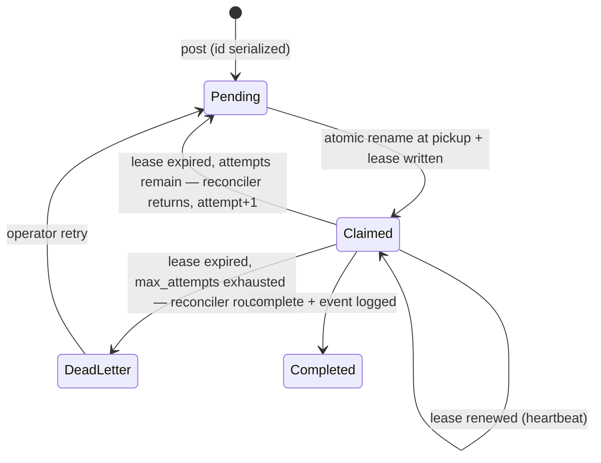
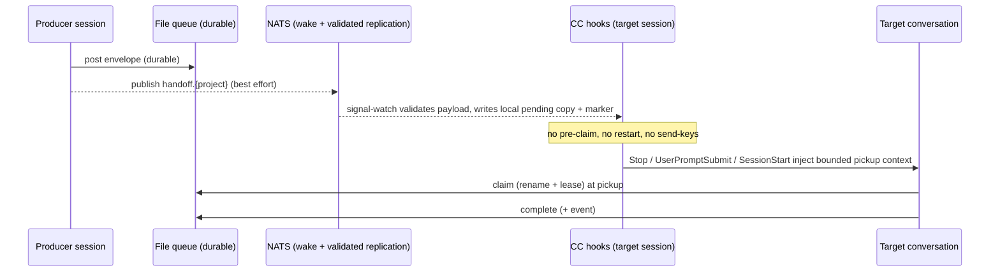

<!-- doc:region name="overview" kind="replaceable" -->

# Cross-Session Handoff v2 — Design Document

**Status:** REVIEW — technical decisions resolved by the coordinator (Claude Fable); human ratification pending

**Created:** 2026-08-02

**Task:** AI-CLI-153..156 (implementation phases), AI-CLI-157 (payload-validation bug); supersedes-in-part [📄 ai-cli-utils/docs/plans/cross-session-signaling-plan.md](../plans/cross-session-signaling-plan.md) (AI-CLI-14)

**Research:** [📄 ai-cli-utils/docs/research/ai-session-cross-terminal-handoff.md](../research/ai-session-cross-terminal-handoff.md)

## Table of Contents

- [Executive Summary](#executive-summary)
- [Problem Statement](#problem-statement)
- [Design Overview](#design-overview)
- [Current Implementation Assessment (coordinator review)](#current-implementation-assessment-coordinator-review)
  - [What the current system does right](#what-the-current-system-does-right)
  - [Defects and gaps found](#defects-and-gaps-found)
  - [Root-cause synthesis](#root-cause-synthesis)
- [Target Architecture](#target-architecture)
  - [Separation of concerns](#separation-of-concerns)
  - [Handoff lifecycle](#handoff-lifecycle)
  - [Delivery paths](#delivery-paths)
- [Data Model](#data-model)
- [Integration](#integration)
- [Implementation Phases](#implementation-phases)
- [Implementation Audit](#implementation-audit)
- [Risks and Mitigations](#risks-and-mitigations)
- [Design Decisions](#design-decisions)
  - [Decision Summary](#decision-summary)
  - [Decision Details](#decision-details)
  - [D-1: Build vs adopt](#d-1)
  - [D-2: Live-session delivery mechanism](#d-2)
  - [D-3: Claim lifecycle — leases, reconciliation, dead-letter](#d-3)
  - [D-4: Role of NATS](#d-4)
  - [D-5: Third-party and CC-native component adoption](#d-5)
  - [D-6: Test strategy](#d-6)
- [Open Questions](#open-questions)
- [Approval Log](#approval-log)

## Executive Summary

This design fixes the cross-session handoff system — the mechanism by which one Claude Code
session hands a task to another session, possibly on another machine. The current system's
durable storage (a flat-file queue with atomic-rename claims) is sound and is kept. What never
worked reliably is delivery into a live session: the two planned Claude Code hook layers were
never built, today's delivery pre-claims work and then restarts the target session to inject it,
and the claim lifecycle has no lease, no completion logging, and no recovery for stranded work.
The decision is **build thin, adopt native**: complete the missing delivery layer using Claude
Code's own hook events now, add lease/expiry/dead-letter semantics to the existing queue, move
claiming to pickup time, validate the cross-machine payload path (which today permits path
traversal — AI-CLI-157), and pilot Claude Code's new Channels mechanism as the real-time wake
path once its research preview matures. No third-party package is adopted. Implementation is
deferred to specced issues (AI-CLI-153..157); nothing in the currently-live mechanism is removed
by this design document itself.

## Problem Statement

Cross-session/cross-terminal handoff (`ai handoff post|check|claim|complete` + NATS
signal-watch) has been unreliable since its 2026-04 implementation, with open reliability issues
AI-CLI-3b3 (P1) and AI-CLI-0ay (P2) and a history of post-hoc fixes. Sessions cannot dependably
hand tasks to each other, so cross-session delegation falls back to manual terminal pasting and
human relay, defeating the purpose of a multi-session setup.

## Design Overview

**Status:** stub — to be filled during/after implementation.

## Current Implementation Assessment (coordinator review)

End-to-end review of the existing implementation (`src/ai_cli/handoff.py`, `messaging.py`,
`main.py` signal-watch/drain/handlers, `session_script.py` launch template), performed
2026-08-02 against repo HEAD `ec5ce59`.

### What the current system does right

- **Durable file queue with atomic-rename claims.** `pending/ → claimed/ → completed/` with
  `src.rename(dst)` as the claim primitive is correct single-filesystem claim semantics at this
  queue's volume (research doc §1.1's "when a plain file queue is right" criteria all hold).
- **NATS as best-effort, non-fatal push.** Every NATS path degrades silently to the file queue —
  the Option B "dual-layer" choice from the AI-CLI-14 plan remains right.
- **Pre-launch drain works.** `_internal_handoff_drain` (local scan first, bounded 6 s NATS pull
  second) has hundreds of logged runs; the while-loop restart pickup works.
- **Plan bugs B-01/B-02 were fixed.** `subscribe_durable` now blocks; signal-watch subscribes on
  the project name, not the task prefix.

### Defects and gaps found

Tiered. MUST-FIX = the system is broken without it.

**MUST-FIX**

1. **The turn-boundary delivery layers were never built.** The AI-CLI-14 plan's Layer 1 (Stop
   hook) and Layer 2 (UserPromptSubmit hook) — the only mechanisms that deliver into a *busy* or
   *user-attended* session at a safe turn boundary — have zero implementation
   (`grep -rn "hooks.Stop\|UserPromptSubmit" src/ai_cli/` is empty). The plan doc's status says
   COMPLETE; it is not. Layers 4–5 exist as specified; Layer 3 exists only in a mutated form
   (see #2), not as the planned actionable nudge.
2. **Delivery works by pre-claiming and restarting the target session.**
   `_on_handoff_signal_watch` (main.py) claims the handoff *before* any session has accepted it,
   writes a resume-prompt file, then touches a `cc-exit-<session>` signal file; the session
   wrapper then makes Claude Code exit so the while-loop restarts it with the handoff as its
   prompt. This destroys the target's in-flight conversation state, and every claim made for a
   session that never restarts or picks up is stranded (see #4).
3. **The cross-machine record path is unvalidated (security).** Both
   `_on_handoff_signal_watch` and `_write_pending_if_claimed_drain` write payload-supplied
   `content` to `pending_dir / filename` with `filename` taken verbatim from the NATS message —
   a crafted filename escapes the queue directory (path traversal), and the untrusted content is
   later injected into a session prompt with no schema validation or sender authentication.
   Filed as AI-CLI-157 (P1 bug, fixable independently of this design).
4. **No lease/expiry on claims, and incomplete lifecycle observability.** A claimed handoff
   whose target dies is stranded forever: 67 files sit in `claimed/` vs 21 in `completed/`, plus
   orphaned per-session pending-marker files months old. Signal/drain claim paths do log
   `handoff.claimed`, but the manual `claim_handoff` CLI path logs nothing and **no path ever
   logs completion** — `complete_handoff` writes no event, so success is unobservable and the
   plan's "observability-driven testing" strategy was structurally impossible.
5. **No delivery acknowledgment concept.** A successful NATS publish is not delivery; a
   restart-injection is not acceptance. No state distinguishes notified / claimed / started /
   completed / failed.

**WORTH-CONSIDERING**

6. **Post ID assignment race** (`post_handoff`: max-ID directory scan then write, no lock) — two
   concurrent posters can mint the same ID. (Confidence: high that the race exists; medium that
   it has fired in practice.)
7. **`for_machine` targeting is enforced in the signal/drain handlers but not in
   `claim_handoff`/`check_handoff`/`_find_best_handoff`** — a manual claim can take another
   machine's work; pending items targeted at the other machine sit unclaimed with no alert.
8. **All tests are mocked; no live NATS test exists** (130 tests, 100 % `AsyncMock`/`patch` on
   the transport). The suite cannot fail on the failure modes that actually occurred
   (AI-CLI-0ay's exact open complaint). Repeated post-hoc fixes (`239b7ea`, `90d1d8c`,
   `1eff009`, `28c235e`) are the fingerprint of a system whose gates cannot catch its real bugs.
9. **Exception-swallowing throughout** (`except Exception: pass` on publish, drain, watch) —
   correct for non-fatality, wrong for silence; failures should log to the event log.

**TAKE-IT-OR-LEAVE-IT**

10. Frontmatter mutation by `str.replace("claimed_by: null", …)` is brittle; a parsed
    round-trip would be safer. Defensible at current schema size.

### Root-cause synthesis

Pre-mortem (the system did fail in production) traces to two decisions: **the racy/destructive
delivery mechanisms shipped first while the reliable turn-boundary ones were deferred**, behind
observability that was never wired for the success path; and **claiming was attached to
notification rather than to acceptance**, so every failed delivery strands a claim.
First-principles re-derivation from the constraints (durable intent / exclusive ownership /
wake-up / conversation delivery as four separate concerns — research doc §1.1) shows the current
system conflates wake-up with delivery and ownership with notification. The storage decision was
right; the delivery and lifecycle decisions are where v2 diverges.

> **Feedback Round 1:** Does this assessment match your experience of the system?
> - <enter feedback here>

## Target Architecture

### Separation of concerns

Four concerns, each owned by exactly one mechanism:

| Concern | Owner (v2) |
|---|---|
| Durable intent | File queue (per-machine authoritative), replicated cross-machine by validated NATS payload |
| Exclusive ownership | Atomic rename at **pickup time** + lease fields + reconciler |
| Wake-up | NATS signal (existing) now; Channels bridge (pilot) later |
| Conversation delivery | CC hook pickup at turn boundaries (Stop / UserPromptSubmit / SessionStart) |

### Handoff lifecycle

File-position states (where the file lives) and event-level statuses (what happened) are
distinct. File positions:



Event-level statuses, appended to `handoff-events.jsonl` on every transition and delivery
attempt: `posted`, `replicated` (cross-machine file write), `notified` (wake signal or hook
context injected — does not move the file), `claimed`, `started` (target began acting; emitted
by the pickup instruction), `lease_renewed`, `lease_expired`, `completed`, `failed` (explicit
failure report), `dead_letter`, `publish_failed`, `payload_rejected`.

Lease renewal is a concrete operation: `ai handoff renew <file>` (short form `-r`) rewrites
`lease_expires_at`; the pickup instruction directs the claiming session to renew when work will
outlast the lease. The reconciler runs from the periodic session-maintenance path and on session
start; it never reclaims a file whose lease is unexpired.

**Migration:** existing `claimed/` files without lease fields are treated as expired with
`attempt: 1` on first reconciler pass (returned to `pending/` or dead-lettered by age — items
older than 30 days go straight to `dead-letter/`).

### Delivery paths



- **Stop hook**: after each turn, if a pending marker or matching queue item exists, output
  `{"decision": "block", "reason": "<one bounded pickup instruction>"}` once; never loop to
  drain a queue (Claude Code caps consecutive Stop blocks; the hook emits at most one block per
  handoff id). Hook-JSON shapes are taken from the current hooks reference (research doc [^8])
  and re-verified against the live documentation at implementation time.
- **UserPromptSubmit hook**: inject pending-handoff context alongside the user's prompt
  (additive context, not a prompt block — simpler and less intrusive than the 2026-04 design's
  block-and-copy-paste flow).
- **SessionStart hook**: same check at session start/resume (complements the existing pre-launch
  drain).
- **Retired delivery mechanisms** (Phase 2 parity inventory): signal-watch pre-claim,
  exit-signal restart injection, and any keystroke-injection delivery are removed from the
  correctness path. The terminal banner print is retained for visibility.
- **Channels bridge (Phase 4 pilot)**: a small MCP channel server per session pushes
  `<channel>` events (task id + priority + sanitized summary — never the full untrusted
  payload) into the live conversation; busy-session events queue in order natively. Channels
  carry no processing acknowledgment and are a research preview behind a development flag, so
  the durable queue remains authoritative and hooks remain the fallback.

## Data Model

Queue file frontmatter (YAML), extending the existing schema — existing fields unchanged.
As stored today: `id` is unpadded (`id: "42"`; only the filename zero-pads), `priority` is
stored verbatim as posted (commonly `P1`-style):

```yaml
id: "42"                 # existing — assignment serialized in v2 (O_EXCL lock)
title: "…"               # existing
priority: P1             # existing — verbatim as posted
project: myproject       # existing
created_by: session-1    # existing
created_at: "…Z"         # existing
for_machine: machine-a   # existing — enforced at ALL claim paths in v2
claimed_by: session-2    # existing
claimed_at: "…Z"         # existing
# v2 additions:
lease_expires_at: "…Z"   # claim + 30 min default; renewed via `ai handoff renew`
attempt: 1               # increments on each return-to-pending
schema_version: 2
```

Replicated-payload validation (AI-CLI-157): the local filename is **derived** from the payload's
`id` + slugged `title` (`{id:03d}-{slug}.md` pattern), never taken from the payload; payload
fields are schema-validated (types, id integer, bounded sizes) and non-conforming messages are
rejected with a `payload_rejected` event.

Directory layout gains `dead-letter/` beside `pending/`, `claimed/`, `completed/`. The queue
root remains the configured handoff-queue directory (derived from `[project] main_project` in
`config.toml`), per machine.

## Integration

- **Session launch template** (`session_script.py`): registers/removes the three per-session
  hooks; signal-watch loses its pre-claim and exit-signal branches and only validates, writes
  the local pending copy, writes the marker, and prints the banner.
- **Session-continuity tooling (external): unchanged.** Save-state/resume mechanisms solve
  *same-session* continuity across compaction/restart; this design solves *cross-session* task
  transfer. The two touch only at SessionStart ordering (resume injection first, then handoff
  pickup context) — an explicit AC, not a code dependency. No migration of any currently-live
  mechanism is performed by this design.
- **Task tracker (`bd`):** remains the durable system of record for *work items*; the handoff
  queue is a *transfer* mechanism. A handoff SHOULD reference a tracker issue id in its body per
  existing convention; no schema coupling.
- **Cross-machine:** each machine's queue directory is authoritative for work claimed on that
  machine; the validated NATS payload is the replication path (this is what the code already
  does — v2 legitimizes and validates it rather than pretending NATS is wake-only);
  `ai handoff post --remote` covers broker-down posting. JetStream-authoritative claiming is the
  documented scale path (D-4), not built now.

## Implementation Phases

<!-- doc:ac-rules:mirror:begin -->
- Every AC is independently testable — a test can fail if only this AC is violated.
- Every AC is falsifiable — "works correctly" is not an AC.
- Use EARS as the default for textual behavioral ACs: `When <trigger>, the system shall <response>` (event-driven); `While <state>` / `Where <feature>` (state-driven / optional); `If <condition>, then the system shall <response>` (unwanted-behavior / failure path). When a decision table, state machine, formula, executable Gherkin, property, or contract expresses the behavior more clearly, wrap it in an `<!-- ac-format: <value> ... --> ... <!-- /ac-format -->` scope (`decision-table` / `state-machine` / `formula` / `gherkin` / `property` / `contract`; unmarked ACs default to `ears`). Full per-format `ac-format` schemas are normative at `task-authoring-standards.md` § Per-Format AC Schemas — **always check that live source directly for the current schemas before relying on this reminder; this mirrored block itself can drift out of date and must never be treated as authoritative on its own.**
- At least one failure-path AC per public function changed — EARS `If <condition>, then the system shall …`, or the marked format's own negative-path convention (a decision table's infeasible-combination row, a state machine's invalid-transition row, a formula's invalid-input row).
- Replacement/refactor tasks: inventory the existing behaviors, then a parity AC for each (preserved, or intentionally dropped + reason).
<!-- doc:ac-rules:mirror:end -->

### Phase 1: Queue integrity + observability (P1 — AI-CLI-153; includes AI-CLI-157)

- **Scope:** lifecycle events, leases, reconciler, dead-letter, ID serialization, machine
  targeting, replicated-payload validation. No delivery changes.
- **Deliverables:**
  - Files modified: `src/ai_cli/handoff.py`, `src/ai_cli/main.py` (handlers + reconciler
    entrypoint)
  - Tests added: `tests/test_handoff.py` (lifecycle, lease, reconciler, race, targeting,
    payload validation)
- **Tasks + acceptance criteria:**
  - **T-1.1 Lifecycle event logging**
    - [ ] When a handoff is claimed via `claim_handoff` (manual CLI), the system shall append a
      `handoff.claimed` event naming the claim path. (Signal/drain paths already log — parity
      preserved.)
    - [ ] When `complete_handoff` succeeds, the system shall append a `handoff.completed` event
      with time-from-posted.
    - [ ] If the event log is unwritable, then the system shall still complete the queue
      operation (observability never blocks the operation).
  - **T-1.2 Leases + reconciler**
    - [ ] When a claim succeeds, the system shall write `lease_expires_at` (default now+30 min)
      and `attempt` into the file's frontmatter.
    - [ ] When `ai handoff renew`/`-r` runs on a claimed file, the system shall extend
      `lease_expires_at` and log `handoff.lease_renewed`.
    - [ ] If `renew` targets a file that is not in `claimed/`, then it shall exit non-zero with
      an error.
    - [ ] When the reconciler finds a claimed file past `lease_expires_at` with attempts
      remaining, the system shall move it back to `pending/`, increment `attempt`, and log
      `handoff.lease_expired`.
    - [ ] If `attempt` has reached `max_attempts` (default 3) at expiry, then the reconciler
      shall move the file to `dead-letter/` and log `handoff.dead_letter`.
    - [ ] While a lease is unexpired, the reconciler shall not move the file.
    - [ ] When the reconciler first encounters a pre-v2 claimed file without lease fields, it
      shall treat it as expired with `attempt: 1` (or dead-letter it when older than 30 days).
  - **T-1.3 ID serialization**
    - [ ] When two posters run concurrently, the system shall never assign the same id
      (lock-file or O_EXCL-create loop; property test with concurrent posts).
    - [ ] If the lock cannot be acquired within 5 s, then `post_handoff` shall fail loudly with
      a non-zero exit, not write a duplicate id.
  - **T-1.4 Machine targeting parity** (parity inventory: signal/drain filtering preserved;
    manual-claim bypass intentionally dropped — reason: it was the defect)
    - [ ] When `_find_best_handoff` evaluates a file whose `for_machine` differs from the local
      machine id, it shall skip it unless the any-machine flag (`-M`/`--any-machine`) is set.
    - [ ] When `claim_handoff` is invoked on a file targeting another machine without
      `-M`/`--any-machine`, it shall refuse with a non-zero exit naming the target machine.
    - [ ] When `check_handoff` runs, it shall list only local-machine (or untargeted) items
      unless `-M`/`--any-machine` is set.
    - [ ] When `ai handoff status` runs, it shall list any pending handoff unclaimed past the
      stale threshold as stale-unrouted, including its `for_machine`.
    - [ ] If the event log or queue directory is unreadable, then `ai handoff status` shall
      exit non-zero with a diagnostic (not print an empty healthy report).
  - **T-1.5 Replicated-payload validation (AI-CLI-157)**
    - [ ] When a NATS handoff payload is consumed, the system shall derive the local filename
      from validated `id` + slugged `title`, ignoring any payload-supplied filename.
    - [ ] If any payload field fails schema validation (missing id, non-integer id, oversized
      content, non-string fields), then the system shall reject the message and log
      `handoff.payload_rejected`.
    - [ ] If a payload's derived filename would resolve outside the pending directory, then the
      system shall reject it (regression test with a traversal-shaped title/id).
- **Exit gate:** full suite green including new failure-path tests; `ruff check` +
  `ruff format --check` pass; fresh-context diff review against Phase-1 ACs.

### Phase 2: Hook-based delivery (P1 — AI-CLI-154)

- **Scope:** the never-built turn-boundary layers, redesigned per current CC hook semantics;
  restart-based delivery and pre-claim retired.
- **Deliverables:**
  - Files modified: `src/ai_cli/session_script.py` (hook registration/cleanup),
    `src/ai_cli/main.py` (signal-watch), new hook script(s) under the session state dir
  - Tests added: hook-script behavior tests (real subprocess fixtures, not mocked JSON)
- **Tasks + acceptance criteria:**
  - **T-2.1 Stop-hook pickup**
    - [ ] When a turn ends and a pending marker or matching `pending/` item exists, the Stop
      hook shall emit one `{"decision":"block","reason":…}` bounded pickup instruction.
    - [ ] While a pickup instruction has already been emitted for the same handoff id in the
      current turn chain, the Stop hook shall exit 0 (no loop; stays under the platform's
      consecutive-block cap).
    - [ ] If the queue directory is unreachable, then the Stop hook shall exit 0 silently
      (never wedge a session on queue failure).
  - **T-2.2 UserPromptSubmit pickup**
    - [ ] When a user submits a prompt while a matching pending handoff exists, the hook shall
      add pending-handoff context (additive context, not a prompt block).
    - [ ] If the hook exceeds a 2 s internal budget, then it shall exit 0 without context
      (prompt latency is protected).
  - **T-2.3 SessionStart pickup ordering**
    - [ ] When a session starts or resumes with both a resume-injection payload and pending
      handoffs, the system shall deliver resume injection before handoff context.
  - **T-2.4 Retire pre-claim + restart delivery (replacement inventory)**
    - [ ] When signal-watch receives a valid handoff for this machine, it shall write the local
      pending copy (validated per T-1.5), write the pending marker, and print the banner —
      and shall NOT claim the file. (Parity: banner + local replication preserved; pre-claim
      intentionally dropped — reason: claims-before-acceptance stranded work; exit-signal
      restart intentionally dropped — reason: destroys in-flight conversation state.)
    - [ ] When a hook pickup instruction is acted on, the claiming session shall perform the
      claim (rename + lease) at pickup time and log `handoff.claimed` with `layer: hook`.
    - [ ] If the target session never picks up, then the file shall remain in `pending/`
      (visible to `status` as stale) rather than stranded in `claimed/`.
  - **T-2.5 Race-safe hook registration**
    - [ ] When two sessions register or remove their per-session hooks concurrently, the
      settings state shall contain exactly the union of live sessions' hook entries
      (lock-guarded read-modify-write; concurrency test).
    - [ ] If a session exits uncleanly, then the next session start shall garbage-collect its
      stale hook entries and scripts.
- **Exit gate:** hook scripts exercised via real subprocess fixtures against the documented
  hook JSON shapes (re-verified against the live hooks reference at implementation time); live
  two-session UAT (post → busy-session pickup at next turn boundary) demonstrated; suite + ruff
  gates green.

### Phase 3: Real-transport tests + failure injection (P2 — AI-CLI-155)

- **Scope:** close AI-CLI-0ay-class gaps — live `nats-server` integration tests and a
  failure-injection matrix.
- **Deliverables:** `tests/integration/test_handoff_nats_live.py` (spawns local `nats-server`),
  failure-injection fixtures.
- **Tasks + acceptance criteria:**
  - **T-3.1 Live-transport happy path**
    - [ ] When a handoff is posted with a live local NATS server, a durable subscriber shall
      receive it (no mocks on the NATS path).
    - [ ] When the drain consumer reconnects after downtime, it shall replay messages missed
      while down.
  - **T-3.2 Failure injection** (one independent test per row)
    - [ ] If the broker restarts mid-subscription, then the file-queue truth shall be preserved
      and the subscriber shall recover or degrade non-fatally.
    - [ ] If the same handoff is published twice, then at most one local pending copy shall
      exist (dedupe by id).
    - [ ] If a malformed payload arrives, then it shall be rejected per T-1.5 with no file
      written.
    - [ ] If the consuming process is killed after claim, then the reconciler shall recover the
      file per the Phase-1 state machine.
- **Exit gate:** integration suite green locally on both supported platforms; documented run
  instructions.

### Phase 4: Channels bridge pilot (P2 — AI-CLI-156; gated on OQ-1)

- **Scope:** real-time delivery into a live conversation via a `claude/channel` MCP server;
  pilot on one session pair only.
- **Deliverables:** channel server script, launch wiring behind an opt-in flag.
- **Tasks + acceptance criteria:**
  - **T-4.1** — [ ] When a handoff is posted for a piloted session, the channel server shall
    emit a notification containing id, priority, and a sanitized summary only (never the raw
    body), and the session shall claim via the CLI before acting.
  - **T-4.2** — [ ] If the channel is unregistered or blocked (events drop silently by
    design), then the hook path shall still deliver the handoff (Channel is wake-up only,
    never the sole copy).
  - **T-4.3** — [ ] If a notification's producer is not on the sender allowlist, then the
    server shall drop it before emission (prompt-injection gate).
- **Exit gate:** pilot postmortem written into this doc's Design Overview; go/no-go decision
  recorded in the Approval Log.

> **Feedback Round 1:** Does the phasing feel right — too big, too small? Should anything move earlier or later?
> - <enter feedback here>

## Implementation Audit

> **Step 14 gate** — complete before updating docs or presenting UAT.
> Verify every design section and decision against the actual implementation. Check each item off;
> any gap restarts from implementation (step 5), not from planning.
>
> **For replacement/refactor tasks:** re-read the original implementation from git history
> (`git show HEAD~N:path/to/old.py`) and verify every behavior is either preserved or explicitly documented as dropped.

| # | Section / Decision | Verified | Notes |
|---|--------------------|---------|-------|
| 1 | **Design Overview filled** — confirm the `## Design Overview` section above is filled in with concrete implementation knowledge, not left as a stub | - [ ] | |
| 2 | Lifecycle state machine matches shipped transitions + events | - [ ] | |
| 3 | Pre-claim, exit-signal restart, and keystroke injection absent from delivery path (grep gate) | - [ ] | |
| 4 | Hook registration/cleanup parity with session template EXIT trap + GC | - [ ] | |
| 5 | Payload validation rejects traversal + malformed messages (T-1.5 tests) | - [ ] | |

**Audit completed:** <!-- YYYY-MM-DD -->

## Risks and Mitigations

| # | Risk | Impact | Mitigation |
|---|------|--------|------------|
| 1 | Hook latency on every turn/prompt | Session sluggishness | Hard 2 s internal budget; local-filesystem checks only; exit-0-on-anything-slow |
| 2 | Stop-hook loops or conflicts with other registered Stop hooks | Wedged turns | Single bounded injection per handoff; ordering test alongside existing hooks; platform consecutive-block cap as backstop |
| 3 | Channels preview churn or development flag unacceptable (OQ-1) | Phase 4 blocked | Phases 1–3 are complete without it; Channel is wake-only by design |
| 4 | Reconciler races a live claimant | Duplicate execution | Lease renewal (`ai handoff renew`); claim-side re-verify after rename; idempotency guidance per OQ-4 |
| 5 | Removing restart-injection delays pickup to the next turn boundary | Slower handoff for idle attended sessions | Acceptable per OQ-3 default; Channels pilot restores immediacy natively |
| 6 | Concurrent hook registration corrupts shared settings | Broken sessions fleet-wide | T-2.5 lock-guarded read-modify-write + stale-entry GC + concurrency test |
| 7 | Two-machine queue split-brain (each machine's dir is authoritative locally) | Cross-machine claim ambiguity | `for_machine` routing enforced at all claim paths; validated replication; D-4 scale path documented |

## Design Decisions

### Decision Summary

| # | Decision | Options Considered | Recommended (AI) | Chosen | Diverged? | Rationale | Status |
|---|----------|-------------------|------------------|--------|-----------|-----------|--------|
| D-1 | Build vs adopt | (a) adopt OSS stack, (b) rebuild on new transport, (c) keep + complete thin custom stack | (c) | (c) | No | Storage sound; delivery never built; no OSS fit (license/blast-radius/wrong-layer) | `✅ Resolved by Fable` (high confidence) |
| D-2 | Live-session delivery | (a) harden keystroke/restart injection, (b) CC hook pickup, (c) Channels bridge, (d) b now + c pilot | (d) | (d) | No | Hooks are documented, stable, buildable now; Channels native but preview + no ack | `✅ Resolved by Fable` (high on hooks; medium on Channels timing) |
| D-3 | Claim lifecycle | (a) rename-only status quo, (b) lease + reconciler + dead-letter, claim at pickup, (c) JetStream-authoritative lifecycle | (b) | (b) | No | 67 stranded claims prove (a) insufficient; pre-claim was the stranding engine; (c) is the scale path, premature now | `✅ Resolved by Fable` (high) |
| D-4 | Role of NATS | (a) authoritative queue, (b) wake-hint only, (c) wake + validated best-effort record replication; file queue authoritative per machine | (c) | (c) | No | (b) was v1's *stated* posture but the code already replicates records via payload; v2 legitimizes + validates that instead of pretending it away | `✅ Resolved by Fable` (medium-high) |
| D-5 | Component adoption | (a) adopt Claude Squad / Ruflo / MCP Agent Mail / task-graph-as-transport, (b) adopt none; mine protocol ideas; Agent Teams intra-job only | (b) | (b) | No | Wrong layer / license rider / blast radius per research §2; Agent View = separate pilot, out of scope | `✅ Resolved by Fable` (high) |
| D-6 | Test strategy | (a) extend mocked suite, (b) live nats-server integration + real hook-subprocess fixtures + failure injection | (b) | (b) | No | 100 % mocked suite demonstrably cannot catch the real failure class | `✅ Resolved by Fable` (high) |

### Decision Details

<a id="d-1"></a>

#### D-1: Build vs adopt — `✅ Resolved by Fable: (c) keep + complete the thin custom stack`

**Context.** The originating task's core question. The system has never worked reliably; the
choice is whether the fix is adoption of an external stack, a transport rebuild, or completion
of what exists.

##### (a) Adopt an OSS orchestrator/mailbox stack

**Pros:**
- Someone else maintains it; community-tested concepts (MCP Agent Mail has acks + TTL leases).

**Cons:**
- No surveyed candidate combines durable cross-machine claims, live-session delivery, and
  harness visibility without replacing the harness (research §2).
- MCP Agent Mail carries a non-standard license rider (research §6.4); Ruflo is a
  whole-platform buy; Claude Squad is a session UI, not a handoff layer.

##### (b) Rebuild on a new authoritative transport (JetStream-centric)

**Pros:**
- Acks, redelivery, backoff, replication are built-in (research §1.2).

**Cons:**
- Solves the un-broken part (storage) while still needing the broken part (delivery) built;
  makes the durable record depend on a broker + tunnel that are today best-effort.

##### (c) Keep + complete the thin custom stack, CC-native delivery

**Pros:**
- The durable layer already works and fits the queue's scale criteria exactly.
- The genuinely missing pieces (hooks, leases, events, validation) are small, testable, native.

**Cons:**
- The project continues to own the code (mitigated by its small surface).

##### Recommendation

> **Decision:** `✅ Resolved by Fable — (c)` (high confidence)

The failure analysis shows a sound storage design with an unfinished delivery layer — complete
it rather than replace it. A well-evidenced "the current design is closer to right than it
looks" outcome.

---

<a id="d-2"></a>

#### D-2: Live-session delivery mechanism — `✅ Resolved by Fable: (d) hooks now + Channels pilot`

**Context.** The 2026-04 plan's hook layers were never built; delivery shipped as pre-claim +
restart injection, which destroys in-flight conversation state, and earlier keystroke injection
is unacknowledged and racy (local evidence + community corroboration, research §4).

##### (a) Harden keystroke/restart injection

**Pros:**
- No new mechanism.

**Cons:**
- Community evidence: even hardened keystroke implementations still lack any delivery
  acknowledgment (research §4); restart injection additionally destroys the target's in-flight
  turn. Correctness stays coupled to mutable TUI/process state.

##### (b) CC hook pickup (Stop / UserPromptSubmit / SessionStart)

**Pros:**
- Documented, stable hook events; deterministic turn-boundary safe points; testable as
  subprocesses; no preview flags.

**Cons:**
- Cannot preempt a long busy turn (bounded by OQ-3's latency tolerance).

##### (c) Channels bridge only

**Pros:**
- The native inbound push primitive; busy-session events queue in order.

**Cons:**
- Research preview; custom channels require a development flag; no processing acknowledgment;
  silent drop when unregistered.

##### (d) (b) now + (c) as gated pilot

**Pros:**
- Reliable path ships immediately; native real-time path adopted when mature; queue stays
  authoritative under both.

**Cons:**
- Two delivery paths to keep coherent (mitigated: Channel is wake-only by design).

##### Recommendation

> **Decision:** `✅ Resolved by Fable — (d)` (high confidence on hooks; medium on Channels timing)

---

<a id="d-3"></a>

#### D-3: Claim lifecycle — `✅ Resolved by Fable: (b) lease + reconciler + dead-letter, claim at pickup`

**Context.** 67 stranded claims and months-old orphan markers prove claims need an expiry and a
recovery path — and that claiming at notification time (before acceptance) is itself the
stranding engine.

##### (a) Rename-only status quo

**Pros:**
- Simplest.

**Cons:**
- Empirically insufficient — stranded work is the norm, not the edge case.

##### (b) Lease fields + reconciler + dead-letter; claim moves to pickup time

**Pros:**
- Industry-standard lease/redelivery semantics (SQS/Kubernetes pattern, research §1.2) at
  file-queue cost; human-inspectable; un-picked-up work stays visible in `pending/`.

**Cons:**
- Duplicate-execution window on expiry (bounded by renewal + OQ-4 idempotency policy).

##### (c) JetStream-authoritative lifecycle

**Pros:**
- Acks/redelivery for free.

**Cons:**
- Ties the durable record to broker+tunnel availability; premature per D-4.

##### Recommendation

> **Decision:** `✅ Resolved by Fable — (b)` (high confidence)

---

<a id="d-4"></a>

#### D-4: Role of NATS — `✅ Resolved by Fable: (c) wake + validated record replication`

**Context.** v1's plan stated NATS was a pure push/wake layer, but the shipped code also
replicates the queue record cross-machine through the message payload (`content` + filename
written locally by the consumer). The decision must describe the system that actually exists.

##### (a) Authoritative queue

**Pros:**
- Real acks; replication with broker guarantees.

**Cons:**
- Broker/tunnel becomes a hard dependency of the durable record; current usage shows frequent
  connect failures absorbed harmlessly precisely because NATS is best-effort.

##### (b) Wake-hint only (v1's stated posture)

**Pros:**
- Simplest mental model.

**Cons:**
- Factually not what the code does; removing payload replication would break cross-machine
  handoff entirely (the queue directories are per-machine; without replication the target
  machine has nothing to claim).

##### (c) Wake + validated best-effort record replication; per-machine file queues authoritative

**Pros:**
- Matches and legitimizes the working mechanism; adds the missing validation (T-1.5);
  degradation unchanged (broker down → drain/`--remote` paths).

**Cons:**
- Replication is still best-effort — a missed message defers cross-machine visibility to the
  next drain (acceptable; the durable copy exists on the origin machine).

##### Recommendation

> **Decision:** `✅ Resolved by Fable — (c)` (medium-high confidence). Revisit trigger:
> routine two-machine claiming of the same work items (then (a) per research §1.2 with durable
> pull consumers + explicit ack tied to claim).

---

<a id="d-5"></a>

#### D-5: Third-party and CC-native component adoption — `✅ Resolved by Fable: (b) adopt none; mine ideas`

**Context.** Research §2 surveyed Claude Squad, Ruflo, MCP Agent Mail, task-graph stores, tmux
orchestrators; §3 surveyed Agent Teams / Agent View.

##### (a) Adopt one or more components

**Pros:**
- Maintained elsewhere; Agent Mail's ack/lease protocol is genuinely good prior art.

**Cons:**
- Each is the wrong layer, a license risk, or a platform buy (research §2 verdict column);
  Agent Teams are session-scoped and non-resumable across sessions; a task-graph store is the
  *work-item* system, not a live-delivery transport.

##### (b) Adopt none; mine protocol ideas; Agent Teams stay intra-job; Agent View piloted separately

**Pros:**
- Zero new dependencies; the good ideas (acks, leases, TTL, sender gating) are small enough to
  implement natively.

**Cons:**
- No external maintenance leverage.

##### Recommendation

> **Decision:** `✅ Resolved by Fable — (b)` (high confidence). Agent View evaluation is
> deliberately out of scope here — file separately if wanted.

---

<a id="d-6"></a>

#### D-6: Test strategy — `✅ Resolved by Fable: (b) live-transport + real-fixture tests`

**Context.** The mocked suite passed while the system failed for four months.

##### (a) Extend the mocked suite

**Pros:**
- Fast, hermetic.

**Cons:**
- Structurally cannot fail on broker semantics, hook wiring, or process-death recovery — the
  classes that actually fired.

##### (b) Live `nats-server` integration tests + real hook-subprocess fixtures + failure injection

**Pros:**
- Tests can fail for the reasons production fails; directly closes AI-CLI-0ay.

**Cons:**
- Slower; needs a local `nats-server` binary (self-hostable, no SaaS).

##### Recommendation

> **Decision:** `✅ Resolved by Fable — (b)` (high confidence)

---

> **Feedback Round 1:** Your approval/feedback on each decision:
> 1. D-1: <approval or feedback>
> 2. D-2: <approval or feedback>
> 3. D-3: <approval or feedback>
> 4. D-4: <approval or feedback>
> 5. D-5: <approval or feedback>
> 6. D-6: <approval or feedback>
> - <enter feedback here>

## Open Questions

1. Is the Channels development flag (`--dangerously-load-development-channels`) operationally
   acceptable for sessions during the research preview (Phase 4 gate)? This is a human
   risk-acceptance call, not a technical option choice.
2. Should `ai handoff status` surface both machines' queues (e.g. via SSH) given each machine's
   queue directory is independently authoritative, or is single-machine status + stale-unrouted
   alerts sufficient?
3. What maximum pickup latency is acceptable for a busy attended session? (Bounds whether
   hook-only delivery suffices until Phase 4; default assumption: next turn boundary is
   acceptable.)
4. May a handoff ever execute twice after a lease expiry, or must consumers provide idempotency
   keys / compensating actions for side-effecting handoffs?

> **Feedback Round 1:** Your thoughts on the open questions:
> 1. <!-- Response to question 1 -->
> 2. <!-- Response to question 2 -->
> 3. <!-- Response to question 3 -->
> 4. <!-- Response to question 4 -->
> - <enter feedback here>

## Approval Log

| Date | Decision | Notes |
|------|----------|-------|
| 2026-08-02 | D-1..D-6 resolved by Fable | Coordinator run; technical scope per decision-authority framework; human ratification pending |
| 2026-08-02 | Implementation deferred to AI-CLI-153..157 | Multi-machine + session-template blast radius → design-first; phases filed with dep edges |
| 2026-08-02 | Cross-family review round 1 (Codex, flagship/high): FAIL → fixes applied | Accepted: NATS record-replication reality (D-4 reframed to (c)), payload validation (T-1.5 + AI-CLI-157), pre-claim/exit-restart parity inventory (T-2.4), lifecycle statuses + heartbeat + migration, AC splits, short+long CLI flags, public-repo sanitization. Declined: none. |

<!-- /doc:region name="overview" -->

<!-- doc:region name="decisions" kind="replaceable" -->

<!-- /doc:region name="decisions" -->

<!-- doc:region name="feedback_rounds" kind="append_only" -->

<!-- /doc:region name="feedback_rounds" -->

<!-- doc:region name="approval_log" kind="append_only" -->

<!-- /doc:region name="approval_log" -->
