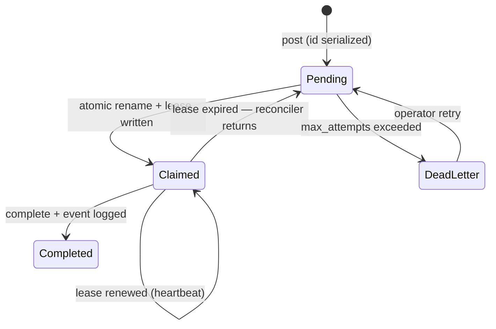
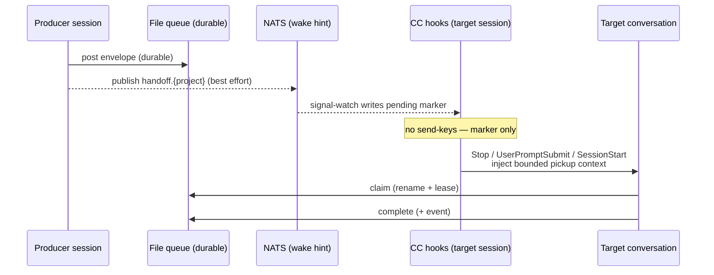

<!-- doc:region name="overview" kind="replaceable" -->

# Cross-Session Handoff v2 — Design Document

**Status:** REVIEW — technical decisions resolved by Fable (SW-996); human ratification pending

**Created:** 2026-08-02

**Task:** SW-996 (sergei `SW-49si`); supersedes-in-part [📄 ai-cli-utils/docs/plans/cross-session-signaling-plan.md](../plans/cross-session-signaling-plan.md) (AI-CLI-14)

**Research:** [📄 ai-cli-utils/docs/research/ai-session-cross-terminal-handoff.md](../research/ai-session-cross-terminal-handoff.md)

## Table of Contents

- [Executive Summary](#executive-summary)
- [Problem Statement](#problem-statement)
- [Design Overview](#design-overview)
- [Current Implementation Assessment (Fable review)](#current-implementation-assessment-fable-review)
  - [What the current system does right](#what-the-current-system-does-right)
  - [Defects and gaps found](#defects-and-gaps-found)
  - [Root-cause synthesis](#root-cause-synthesis)
- [Target Architecture](#target-architecture)
  - [Separation of concerns](#separation-of-concerns)
  - [Handoff lifecycle state machine](#handoff-lifecycle-state-machine)
  - [Delivery paths](#delivery-paths)
- [Data Model](#data-model)
- [Integration](#integration)
- [Implementation Phases](#implementation-phases)
- [Implementation Audit](#implementation-audit)
- [Risks and Mitigations](#risks-and-mitigations)
- [Design Decisions](#design-decisions)
  - [Decision Summary](#decision-summary)
  - [Decision Details](#decision-details)
  - [D-1: Build vs adopt](#d-1)
  - [D-2: Live-session delivery mechanism](#d-2)
  - [D-3: Claim lifecycle — leases, reconciliation, dead-letter](#d-3)
  - [D-4: Role of NATS](#d-4)
  - [D-5: Third-party and CC-native component adoption](#d-5)
  - [D-6: Test strategy](#d-6)
- [Open Questions](#open-questions)
- [Approval Log](#approval-log)

## Executive Summary

This design fixes the fleet's cross-session handoff system — the mechanism by which one Claude
Code session hands a task to another session, possibly on another machine. The current system's
durable storage (a flat-file queue with atomic-rename claims) is sound and is kept. What never
worked is delivery into a live session: the two planned Claude Code hook layers were never built,
leaving unreliable `tmux send-keys` carrying the whole load, and the claim lifecycle has no
lease, no completion logging, and no recovery for stranded work. The decision is **build thin,
adopt native**: complete the missing delivery layer using Claude Code's own hook events now, add
lease/expiry/dead-letter semantics to the existing queue, remove `send-keys` from the correctness
path, and pilot Claude Code's new Channels mechanism as the real-time wake path once its research
preview matures. No third-party package is adopted. Implementation is deferred to specced bd
issues; nothing in the currently-live mechanism is removed by this design.

## Problem Statement

Cross-session/cross-terminal AI handoff (`ai handoff post|check|claim|complete` + NATS
signal-watch) has been unreliable since its 2026-04 implementation — "buggy + never worked" per
SW-996's filing, with open reliability issues AI-CLI-3b3 (P1) and AI-CLI-0ay (P2). Sessions
cannot dependably hand tasks to each other, so cross-session delegation falls back to manual
tmux-pane pasting and human relay, defeating the purpose of a multi-session fleet.

## Design Overview

**Status:** stub — to be filled during/after implementation.

## Current Implementation Assessment (Fable review)

This section is the SW-996-mandated end-to-end review of the existing implementation
(`src/ai_cli/handoff.py`, `messaging.py`, `main.py` signal-watch/drain, `session_script.py`
launch template), performed 2026-08-02 against repo HEAD `ec5ce59`.

### What the current system does right

- **Durable file queue with atomic-rename claims.** `pending/ → claimed/ → completed/` with
  `src.rename(dst)` as the claim primitive is correct single-filesystem claim semantics at this
  fleet's volume (research doc §1.1's "when a plain file queue is right" criteria all hold).
- **NATS as best-effort, non-fatal push.** Every NATS path degrades silently to the file queue —
  the Option B "dual-layer" choice from the AI-CLI-14 plan remains right.
- **Pre-launch drain works.** `_internal_handoff_drain` (local scan first, bounded 6 s NATS pull
  second) has 620 logged runs; the while-loop restart pickup works (11 logged events).
- **Plan bugs B-01/B-02 were fixed.** `subscribe_durable` now blocks; signal-watch subscribes on
  the project name, not the task prefix.

### Defects and gaps found

Tiered per the review mandate. MUST-FIX = the system is broken without it.

**MUST-FIX**

1. **The primary delivery layers were never built.** The AI-CLI-14 plan's Layer 1 (Stop hook)
   and Layer 2 (UserPromptSubmit hook) — the only mechanisms that deliver into a *busy* or
   *user-attended* session at a safe turn boundary — have zero implementation
   (`grep -rn "hooks.Stop\|UserPromptSubmit" src/ai_cli/` is empty). The plan doc's status says
   COMPLETE; it is not. Only 3 of 5 layers exist, and the surviving live-delivery mechanism is
   the one the plan itself called "the only racy mechanism" (`tmux send-keys`).
2. **No claim/completion observability.** `claim_handoff()` and `complete_handoff()` never call
   `_log_handoff_event()` — `handoff.claimed` is only logged by signal-watch paths, and
   `handoff.completed` is never logged anywhere. The 793 KB event log contains 4,926 `posted`
   against 94 `claimed` and zero completion events. The plan's "observability-driven testing"
   strategy was structurally impossible: the success path is unobservable.
3. **No lease/expiry on claims.** A claimed handoff whose session dies is stranded forever.
   Observed: 67 files in `claimed/` vs 21 in `completed/`, plus orphaned
   `handoff-pending-*` marker files dated April. Nothing ever reconciles.
4. **No delivery acknowledgment concept.** A successful NATS publish is not delivery; successful
   `send-keys` keystrokes are not acceptance. No state distinguishes notified / claimed /
   started / completed / failed.

**WORTH-CONSIDERING**

5. **Post ID assignment race** (`post_handoff`: max-ID directory scan then write, no lock) — two
   concurrent posters can mint the same ID. Low observed frequency; real defect. (Confidence:
   high that the race exists; medium that it has fired in practice.)
6. **`for_machine` targeting is enforced only at pickup layers, not in `claim_handoff`/
   `check_handoff`** — a manual claim can take another machine's work; 9 pending items targeted
   at `hetzner` sit unclaimed with no alert. (Confidence: high.)
7. **All tests are mocked; no live NATS test exists** (83 + 29 + 18 tests, 100 % `AsyncMock`/
   `patch`). The suite cannot fail on the failure modes that actually occurred (AI-CLI-0ay's
   exact open complaint). Repeated post-hoc fixes (`239b7ea`, `90d1d8c`, `1eff009`, `28c235e`)
   are the fingerprint of a system whose gates cannot catch its real bugs.
8. **Exception-swallowing throughout** (`except Exception: pass` on publish, drain, watch) —
   correct for non-fatality, wrong for silence; failures should log to the event log.

**TAKE-IT-OR-LEAVE-IT**

9. Frontmatter mutation by `str.replace("claimed_by: null", …)` is brittle; a parsed
   round-trip would be safer. Defensible at current schema size.

### Root-cause synthesis

Pre-mortem (the system did fail in production) traces to one decision: **the racy delivery
mechanism shipped first and the reliable ones were deferred behind observability that was never
wired for the success path.** First-principles re-derivation from the fleet's constraints
(durable intent / exclusive ownership / wake-up / conversation delivery as four separate
concerns — research doc §1.1) shows the current system conflates wake-up with delivery
(`send-keys` tries to be both) and has no ownership lifecycle beyond the initial rename. The
storage decision was right; the delivery and lifecycle decisions are where v2 diverges.

> **Feedback Round 1:** Does this assessment match your experience of the system?
> - <enter feedback here>

## Target Architecture

### Separation of concerns

Four concerns, each owned by exactly one mechanism:

| Concern | Owner (v2) |
|---|---|
| Durable intent | File queue (`.handoff-queue/`), authoritative |
| Exclusive ownership | Atomic rename + lease fields + reconciler |
| Wake-up | NATS signal (existing) now; Channels bridge (pilot) later |
| Conversation delivery | CC hook pickup at turn boundaries (Stop / UserPromptSubmit / SessionStart) |

### Handoff lifecycle state machine



Every transition appends a `handoff.*` event to `handoff-events.jsonl`. `attempt` increments on
each return-to-pending; `max_attempts` (default 3) routes to `dead-letter/`.

### Delivery paths



- **Stop hook**: after each turn, if a pending marker or matching queue item exists, output
  `{"decision": "block", "reason": "<one bounded pickup instruction>"}` once; never loop to
  drain a queue (Claude Code caps consecutive Stop blocks at 8).
- **UserPromptSubmit hook**: inject pending-handoff context alongside the user's prompt
  (additive context, not a prompt block — simpler and less intrusive than the 2026-04 design's
  block-and-copy-paste flow).
- **SessionStart hook**: same check at session start/resume (complements the existing pre-launch
  drain).
- **send-keys**: removed from the correctness path. Retained only as the terminal banner print
  (visibility), never as message delivery.
- **Channels bridge (Phase 4 pilot)**: a small MCP channel server per session pushes
  `<channel>` events (task id + priority + safe summary — never the full untrusted payload)
  into the live conversation; busy-session events queue in order natively. Channels carry no
  processing acknowledgment and are a research preview behind
  `--dangerously-load-development-channels`, so the durable queue remains authoritative and
  hooks remain the fallback.

## Data Model

Queue file frontmatter (YAML), extending the existing schema — existing fields unchanged:

```yaml
id: "042"            # existing — assignment serialized in v2 (O_EXCL lock)
title: "…"           # existing
priority: 1          # existing
project: ai-cli-utils # existing
created_by: c-sw-1   # existing
created_at: "…Z"     # existing
for_machine: mac     # existing — enforced at ALL claim paths in v2
claimed_by: c-sw-2   # existing
claimed_at: "…Z"     # existing
# v2 additions:
lease_expires_at: "…Z"   # claim + N min; renewed by heartbeat
attempt: 1               # increments on each return-to-pending
schema_version: 2
```

Event log (`handoff-events.jsonl`) gains: `handoff.claimed` (all claim paths),
`handoff.completed`, `handoff.lease_expired`, `handoff.dead_letter`, `handoff.publish_failed`,
`handoff.hook_pickup` (with `hook` field: `stop|prompt|session_start`). Directory layout gains
`dead-letter/` beside `pending/claimed/completed/`.

## Integration

- **Session launch template** (`session_script.py`): registers/removes the three per-session
  hooks; signal-watch loses its send-keys branch and only writes the pending marker.
- **`save-state` / `resume-inject.sh` / `auto-start` (ai-harness skills): unchanged.** They
  solve same-session continuity across compaction; this design solves cross-session task
  transfer. The two systems touch only at SessionStart ordering (resume injection first, then
  handoff pickup context) — an explicit AC, not a code dependency. No migration of the live
  mechanism is proposed (SW-996 scope boundary).
- **`task-panel` skill: unchanged** — it mirrors Beads, not the handoff queue.
- **Beads:** remains the durable task system of record for *work items*; the handoff queue is a
  *transfer* mechanism. A handoff SHOULD reference a bd issue id in its body per existing
  convention; no schema coupling.
- **Cross-machine:** unchanged posture — each machine's queue directory is local-authoritative;
  `for_machine` routes; `ai handoff post --remote` covers tunnel-down posting. JetStream-
  authoritative claiming is the documented scale path (D-4), not built now.

## Implementation Phases

<!-- doc:ac-rules:mirror:begin -->
- Every AC is independently testable — a test can fail if only this AC is violated.
- Every AC is falsifiable — "works correctly" is not an AC.
- Use EARS as the default for textual behavioral ACs: `When <trigger>, the system shall <response>` (event-driven); `While <state>` / `Where <feature>` (state-driven / optional); `If <condition>, then the system shall <response>` (unwanted-behavior / failure path). When a decision table, state machine, formula, executable Gherkin, property, or contract expresses the behavior more clearly, wrap it in an `<!-- ac-format: <value> ... --> ... <!-- /ac-format -->` scope (`decision-table` / `state-machine` / `formula` / `gherkin` / `property` / `contract`; unmarked ACs default to `ears`). Full per-format `ac-format` schemas are normative at `task-authoring-standards.md` § Per-Format AC Schemas — **always check that live source directly for the current schemas before relying on this reminder; this mirrored block itself can drift out of date and must never be treated as authoritative on its own.**
- At least one failure-path AC per public function changed — EARS `If <condition>, then the system shall …`, or the marked format's own negative-path convention (a decision table's infeasible-combination row, a state machine's invalid-transition row, a formula's invalid-input row).
- Replacement/refactor tasks: inventory the existing behaviors, then a parity AC for each (preserved, or intentionally dropped + reason).
<!-- doc:ac-rules:mirror:end -->

### Phase 1: Queue integrity + observability (P1)

- **Scope:** lifecycle events, leases, reconciler, dead-letter, ID serialization, machine
  targeting. No delivery changes.
- **Deliverables:**
  - Files modified: `src/ai_cli/handoff.py`, `src/ai_cli/main.py` (reconciler entrypoint)
  - Tests added: `tests/test_handoff.py` (lifecycle, lease, reconciler, race, targeting)
- **Tasks + acceptance criteria:**
  - **T-1.1 Lifecycle event logging**
    - [ ] When a handoff is claimed via any path (`claim_handoff`, `_claim_handoff_for_signal`,
      drain), the system shall append a `handoff.claimed` event naming the claim path.
    - [ ] When `complete_handoff` succeeds, the system shall append a `handoff.completed` event
      with time-from-posted.
    - [ ] If the event log is unwritable, then the system shall still complete the queue
      operation (observability never blocks the operation).
  - **T-1.2 Leases + reconciler**
    - [ ] When a claim succeeds, the system shall write `lease_expires_at` (default now+30 min)
      and `attempt` into the file's frontmatter.
    - [ ] When the reconciler runs and finds a claimed file past `lease_expires_at`, the system
      shall move it back to `pending/`, increment `attempt`, and log `handoff.lease_expired`.
    - [ ] If `attempt` exceeds `max_attempts` (default 3), then the system shall move the file
      to `dead-letter/` and log `handoff.dead_letter`.
    - [ ] If a lease holder renews (touches `lease_expires_at`) before expiry, then the
      reconciler shall not reclaim the file.
  - **T-1.3 ID serialization**
    - [ ] When two posters run concurrently, the system shall never assign the same id
      (lock-file or O_EXCL-create loop; property test with concurrent posts).
    - [ ] If the lock cannot be acquired within 5 s, then `post_handoff` shall fail loudly with
      a non-zero exit, not write a duplicate id.
  - **T-1.4 Machine targeting parity**
    - [ ] When `claim_handoff`/`check_handoff`/`_find_best_handoff` evaluate a file whose
      `for_machine` differs from `AI_HOST`, the system shall skip it unless `--any-machine` is
      passed. (Parity inventory: pickup-layer filtering preserved; manual-claim bypass
      intentionally dropped — reason: it was the defect.)
    - [ ] If a pending handoff targets a machine that has not claimed it within the stale
      threshold, then `ai handoff status` shall list it as stale-unrouted.
- **Exit gate:** full suite green including new failure-path tests; `ruff check` +
  `ruff format --check` pass; fresh-context diff review against Phase-1 ACs.

### Phase 2: Hook-based delivery (P1)

- **Scope:** the never-built Layers 1/2, redesigned per current CC hook semantics; send-keys
  demoted out of the correctness path.
- **Deliverables:**
  - Files modified: `src/ai_cli/session_script.py` (hook registration/cleanup),
    `src/ai_cli/main.py` (signal-watch), new hook script(s) under the session state dir
  - Tests added: hook-script behavior tests (real subprocess fixtures, not mocked JSON)
- **Tasks + acceptance criteria:**
  - **T-2.1 Stop-hook pickup**
    - [ ] When a turn ends and a pending marker or matching `pending/` item exists, the Stop
      hook shall emit one `{"decision":"block","reason":…}` bounded pickup instruction.
    - [ ] While a pickup instruction has already been emitted for the same handoff id in the
      current turn chain, the Stop hook shall exit 0 (no loop; respects CC's 8-block cap).
    - [ ] If the queue directory is unreachable, then the Stop hook shall exit 0 silently
      (never wedge a session on queue failure).
  - **T-2.2 UserPromptSubmit pickup**
    - [ ] When a user submits a prompt while a matching pending handoff exists, the hook shall
      add pending-handoff context (additive `additionalContext`, not a prompt block).
    - [ ] If the hook exceeds a 2 s internal budget, then it shall exit 0 without context
      (prompt latency is protected).
  - **T-2.3 SessionStart pickup ordering**
    - [ ] When a session starts or resumes with both a resume-inject payload and pending
      handoffs, the system shall deliver resume injection before handoff context.
  - **T-2.4 send-keys demotion (replacement inventory)**
    - [ ] When signal-watch receives a handoff for an idle session, it shall write the pending
      marker and print the banner only (parity: banner preserved; send-keys message delivery
      intentionally dropped — reason: racy, unacknowledged, superseded by hooks).
    - [ ] If tmux is absent or the pane is gone, then signal-watch shall still write the
      pending marker (delivery does not depend on tmux state).
- **Exit gate:** hook scripts exercised via real `claude` hook-fixture subprocess tests; live
  two-session UAT (post → busy-session pickup at next turn boundary) demonstrated; suite +
  ruff gates green.

### Phase 3: Real-transport tests + failure injection (P2)

- **Scope:** close AI-CLI-0ay-class gaps — live `nats-server` integration tests and a
  failure-injection matrix.
- **Deliverables:** `tests/integration/test_handoff_nats_live.py` (spawns local `nats-server`),
  failure-injection fixtures.
- **Tasks + acceptance criteria:**
  - **T-3.1** — [ ] When a handoff is posted with a live local NATS server, a durable
    subscriber shall receive it and the drain consumer shall replay it after downtime
    (no mocks on the NATS path).
  - **T-3.2** — [ ] If the broker restarts mid-subscription / a publish is duplicated / a
    payload is malformed / the process is killed post-claim, then the system shall preserve the
    file-queue truth and reconcile per the Phase-1 state machine (one test per injection).
- **Exit gate:** integration suite green locally on both machines; documented run instructions.

### Phase 4: Channels bridge pilot (P2 — gated on OQ-1)

- **Scope:** real-time delivery into a live conversation via a `claude/channel` MCP server;
  pilot on one session pair only.
- **Deliverables:** `scripts/handoff-channel-server.ts` (or py equivalent), launch wiring
  behind an opt-in flag.
- **Tasks + acceptance criteria:**
  - **T-4.1** — [ ] When a handoff is posted for a piloted session, the channel server shall
    emit a notification containing id, priority, and a sanitized summary only (never the raw
    body), and the session shall claim via the CLI before acting.
  - **T-4.2** — [ ] If the channel is unregistered or blocked (events drop silently by
    design), then the hook path shall still deliver the handoff (Channel is wake-up only,
    never the sole copy).
  - **T-4.3** — [ ] If a notification's producer is not on the sender allowlist, then the
    server shall drop it before emission (prompt-injection gate).
- **Exit gate:** pilot postmortem written into this doc's Design Overview; go/no-go decision
  recorded in the Approval Log.

> **Feedback Round 1:** Does the phasing feel right — too big, too small? Should anything move earlier or later?
> - <enter feedback here>

## Implementation Audit

> **Step 14 gate** — complete before updating docs or presenting UAT.
> Verify every design section and decision against the actual implementation. Check each item off;
> any gap restarts from implementation (step 5), not from planning.
>
> **For replacement/refactor tasks:** re-read the original implementation from git history
> (`git show HEAD~N:path/to/old.py`) and verify every behavior is either preserved or explicitly documented as dropped.

| # | Section / Decision | Verified | Notes |
|---|--------------------|---------|-------|
| 1 | **Design Overview filled** — confirm the `## Design Overview` section above is filled in with concrete implementation knowledge, not left as a stub | - [ ] | |
| 2 | Lifecycle state machine matches shipped transitions + events | - [ ] | |
| 3 | send-keys absent from delivery path (grep gate) | - [ ] | |
| 4 | Hook registration/cleanup parity with session template EXIT trap | - [ ] | |

**Audit completed:** <!-- YYYY-MM-DD -->

## Risks and Mitigations

| # | Risk | Impact | Mitigation |
|---|------|--------|------------|
| 1 | Hook latency on every turn/prompt | Session sluggishness fleet-wide | Hard 2 s internal budget; local-filesystem checks only; exit-0-on-anything-slow |
| 2 | Stop-hook loops or fights other Stop hooks (background-wait-guard) | Wedged turns | Single bounded injection per handoff; ordering test with existing hooks; CC's 8-block cap as backstop |
| 3 | Channels preview churn or flag unacceptable (OQ-1) | Phase 4 blocked | Phases 1–3 are complete without it; Channel is wake-only by design |
| 4 | Reconciler races a live claimant | Duplicate execution | Lease renewal heartbeat; claim-side re-verify after rename; idempotency guidance per OQ-4 |
| 5 | Removing send-keys delays pickup until next turn boundary for attended-idle sessions | Slower handoff in one state | Acceptable per OQ-3 default; Channels pilot restores immediacy natively |
| 6 | Two-machine queue split-brain (each machine's dir is local) | Cross-machine claims unclear | Unchanged from v1 posture; `for_machine` routing + `--remote` post; D-4 scale path documented |

## Design Decisions

### Decision Summary

| # | Decision | Options Considered | Recommended (AI) | Chosen | Diverged? | Rationale | Status |
|---|----------|-------------------|------------------|--------|-----------|-----------|--------|
| D-1 | Build vs adopt | (a) adopt OSS stack, (b) rebuild on new transport, (c) keep + complete thin custom stack | (c) | (c) | No | Storage sound; delivery never built; no OSS fit (license/blast-radius/wrong-layer) | `✅ Resolved by Fable` (high confidence) |
| D-2 | Live-session delivery | (a) harden send-keys, (b) CC hook pickup, (c) Channels bridge, (d) b now + c pilot | (d) | (d) | No | Hooks are documented, stable, buildable now; Channels native but preview + no ack | `✅ Resolved by Fable` (high on hooks; medium on Channels timing) |
| D-3 | Claim lifecycle | (a) rename-only status quo, (b) lease + reconciler + dead-letter on file queue, (c) JetStream-authoritative lifecycle | (b) | (b) | No | 67 stranded claims prove (a) insufficient; (c) is the scale path, premature now | `✅ Resolved by Fable` (high) |
| D-4 | Role of NATS | (a) authoritative queue, (b) wake-hint only (non-fatal) | (b) | (b) | No | Reaffirms AI-CLI-14 Option B; (a) becomes live only if two-machine claiming becomes routine | `✅ Resolved by Fable` (medium-high) |
| D-5 | Component adoption | (a) adopt Claude Squad / Ruflo / MCP Agent Mail / Beads-as-transport, (b) adopt none; mine protocol ideas; Agent Teams intra-job only | (b) | (b) | No | Wrong layer / license rider / blast radius per research §2; Agent View = separate pilot, out of scope | `✅ Resolved by Fable` (high) |
| D-6 | Test strategy | (a) extend mocked suite, (b) live nats-server integration + real hook-subprocess fixtures + failure injection | (b) | (b) | No | 100 % mocked suite demonstrably cannot catch the real failure class | `✅ Resolved by Fable` (high) |

### Decision Details

<a id="d-1"></a>

#### D-1: Build vs adopt — `✅ Resolved by Fable: (c) keep + complete the thin custom stack`

**Context.** SW-996's core question. The system has never worked reliably; the choice is
whether the fix is adoption of an external stack, a transport rebuild, or completion of what
exists.

##### (a) Adopt an OSS orchestrator/mailbox stack

**Pros:**
- Someone else maintains it; community-tested concepts (MCP Agent Mail has acks + TTL leases).

**Cons:**
- No surveyed candidate combines durable cross-machine claims, live-session delivery, and
  harness visibility without replacing the harness (research §2, `[NO SOURCE]` on any full fit).
- MCP Agent Mail carries a non-standard license rider (research §6.4); Ruflo is a
  whole-platform buy; Claude Squad is a session UI, not a handoff layer.

##### (b) Rebuild on a new authoritative transport (JetStream-centric)

**Pros:**
- Acks, redelivery, backoff, replication are built-in (research §1.2).

**Cons:**
- Solves the un-broken part (storage) while still needing the broken part (delivery) built;
  makes the durable record depend on a broker + SSH tunnel that are today best-effort.

##### (c) Keep + complete the thin custom stack, CC-native delivery

**Pros:**
- The durable layer already works and fits the fleet's scale criteria exactly.
- The genuinely missing pieces (hooks, leases, events) are small, testable, and native.

**Cons:**
- The fleet continues to own the code (mitigated by its small surface).

##### Recommendation

> **Decision:** `✅ Resolved by Fable — (c)` (high confidence)

The failure analysis shows a sound storage design with an unfinished delivery layer — complete
it rather than replace it. A well-evidenced "the current design is closer to right than it
looks" outcome per the SW-996 mandate.

---

<a id="d-2"></a>

#### D-2: Live-session delivery mechanism — `✅ Resolved by Fable: (d) hooks now + Channels pilot`

**Context.** The 2026-04 plan's hook layers were never built; send-keys carried delivery and is
unacknowledged and racy (fleet evidence + community corroboration, research §4).

##### (a) Harden send-keys

**Pros:**
- No new mechanism.

**Cons:**
- Community evidence: even hardened implementations need literal-mode, delays, paste buffers,
  pane scraping — and still lack any delivery acknowledgment (research §4). Correctness stays
  coupled to mutable TUI state.

##### (b) CC hook pickup (Stop / UserPromptSubmit / SessionStart)

**Pros:**
- Documented, stable hook events; deterministic turn-boundary safe points; testable as
  subprocesses; no preview flags.

**Cons:**
- Cannot preempt a long busy turn (bounded by OQ-3's latency tolerance).

##### (c) Channels bridge only

**Pros:**
- The native inbound push primitive; busy-session events queue in order.

**Cons:**
- Research preview; requires `--dangerously-load-development-channels` for custom channels; no
  processing acknowledgment; silent drop when unregistered.

##### (d) (b) now + (c) as gated pilot

**Pros:**
- Reliable path ships immediately; native real-time path adopted when mature; queue stays
  authoritative under both.

**Cons:**
- Two delivery paths to keep coherent (mitigated: Channel is wake-only by design).

##### Recommendation

> **Decision:** `✅ Resolved by Fable — (d)` (high confidence on hooks; medium on Channels timing)

---

<a id="d-3"></a>

#### D-3: Claim lifecycle — `✅ Resolved by Fable: (b) lease + reconciler + dead-letter`

**Context.** 67 stranded claims and April-dated orphan markers prove claims need an expiry and
a recovery path.

##### (a) Rename-only status quo

**Pros:**
- Simplest.

**Cons:**
- Empirically insufficient — stranded work is the norm, not the edge case.

##### (b) Lease fields + reconciler + dead-letter on the file queue

**Pros:**
- Industry-standard lease/redelivery semantics (SQS/Kubernetes pattern) at file-queue cost;
  human-inspectable.

**Cons:**
- Duplicate-execution window on expiry (bounded by heartbeat + OQ-4 idempotency policy).

##### (c) JetStream-authoritative lifecycle

**Pros:**
- Acks/redelivery for free.

**Cons:**
- Ties the durable record to broker+tunnel availability; premature per D-4.

##### Recommendation

> **Decision:** `✅ Resolved by Fable — (b)` (high confidence)

---

<a id="d-4"></a>

#### D-4: Role of NATS — `✅ Resolved by Fable: (b) wake-hint only, non-fatal`

**Context.** Reaffirm or revise AI-CLI-14's Option B given v2.

##### (a) Authoritative queue

**Pros:**
- Real acks; replication.

**Cons:**
- Broker/tunnel becomes a hard dependency of the durable record; current usage shows frequent
  connect failures absorbed harmlessly precisely because NATS is best-effort.

##### (b) Wake-hint only (status quo role, kept non-fatal)

**Pros:**
- Graceful degradation preserved; all v2 correctness lives in queue + hooks.

**Cons:**
- Cross-machine real-time signal still depends on the tunnel (fallback: drain + hooks).

##### Recommendation

> **Decision:** `✅ Resolved by Fable — (b)` (medium-high confidence). Revisit trigger:
> two-machine claiming becoming routine (then (a) per research §1.2 with durable pull
> consumers + explicit ack tied to claim).

---

<a id="d-5"></a>

#### D-5: Third-party and CC-native component adoption — `✅ Resolved by Fable: (b) adopt none; mine ideas`

**Context.** Research §2 surveyed Claude Squad, Ruflo, MCP Agent Mail, Beads, tmux
orchestrators; §3 surveyed Agent Teams / Agent View.

##### (a) Adopt one or more components

**Pros:**
- Maintained elsewhere; Agent Mail's ack/lease protocol is genuinely good prior art.

**Cons:**
- Each is the wrong layer, a license risk, or a platform buy (research §2 verdict column);
  Agent Teams are session-scoped and non-resumable across sessions; Beads is the *work-item*
  store, not a live-delivery transport (and Codex workers cannot reach the bd store).

##### (b) Adopt none; mine protocol ideas; Agent Teams stay intra-job; Agent View piloted separately

**Pros:**
- Zero new dependencies; the good ideas (acks, leases, TTL, sender gating) are small enough to
  implement natively.

**Cons:**
- No external maintenance leverage.

##### Recommendation

> **Decision:** `✅ Resolved by Fable — (b)` (high confidence). Agent View evaluation is
> deliberately out of SW-996 scope — file separately if wanted.

---

<a id="d-6"></a>

#### D-6: Test strategy — `✅ Resolved by Fable: (b) live-transport + real-fixture tests`

**Context.** The mocked suite passed while the system failed for four months.

##### (a) Extend the mocked suite

**Pros:**
- Fast, hermetic.

**Cons:**
- Structurally cannot fail on broker semantics, hook wiring, or process-death recovery — the
  classes that actually fired.

##### (b) Live `nats-server` integration tests + real hook-subprocess fixtures + failure injection

**Pros:**
- Tests can fail for the reasons production fails; directly closes AI-CLI-0ay.

**Cons:**
- Slower; needs a local `nats-server` binary (self-hostable, no SaaS).

##### Recommendation

> **Decision:** `✅ Resolved by Fable — (b)` (high confidence)

---

> **Feedback Round 1:** Your approval/feedback on each decision:
> 1. D-1: <approval or feedback>
> 2. D-2: <approval or feedback>
> 3. D-3: <approval or feedback>
> 4. D-4: <approval or feedback>
> 5. D-5: <approval or feedback>
> 6. D-6: <approval or feedback>
> - <enter feedback here>

## Open Questions

1. Is `--dangerously-load-development-channels` operationally acceptable for fleet sessions
   during the Channels research preview (Phase 4 gate)? This is a human risk-acceptance call,
   not a technical option choice.
2. What is the intended cross-machine authority model for the queue directory itself — is
   `~/projects/sergei/.handoff-queue/` on each machine an independent local queue (current de
   facto), and if so should `ai handoff status` surface both machines' queues via SSH?
3. What maximum pickup latency is acceptable for a busy attended session? (Bounds whether
   hook-only delivery suffices until Phase 4; default assumption: next turn boundary is
   acceptable.)
4. May a handoff ever execute twice after a lease expiry, or must consumers provide idempotency
   keys / compensating actions for side-effecting handoffs?

> **Feedback Round 1:** Your thoughts on the open questions:
> 1. <!-- Response to question 1 -->
> 2. <!-- Response to question 2 -->
> 3. <!-- Response to question 3 -->
> 4. <!-- Response to question 4 -->
> - <enter feedback here>

## Approval Log

| Date | Decision | Notes |
|------|----------|-------|
| 2026-08-02 | D-1..D-6 resolved by Fable | SW-996 coordinator run; technical scope per decision-authority framework; human ratification pending |
| 2026-08-02 | Implementation deferred to bd issues | Multi-machine + session-template blast radius → design-first per SW-996 brief's lean; Phases 1–4 filed as AI-CLI issues |

<!-- /doc:region name="overview" -->

<!-- doc:region name="decisions" kind="replaceable" -->

<!-- /doc:region name="decisions" -->

<!-- doc:region name="feedback_rounds" kind="append_only" -->

<!-- /doc:region name="feedback_rounds" -->

<!-- doc:region name="approval_log" kind="append_only" -->

<!-- /doc:region name="approval_log" -->
