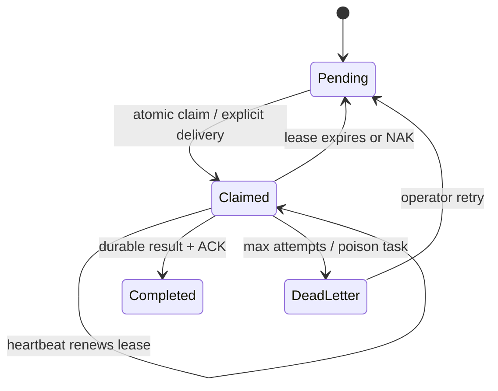
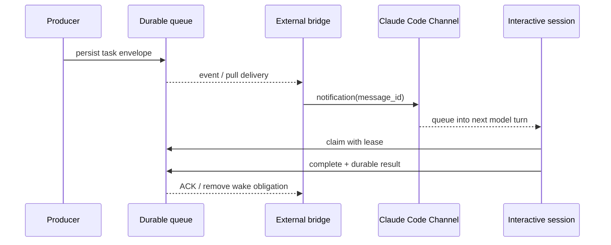

# Cross-session handoff for interactive AI coding agents

**Status:** complete

**Created:** 2026-08-02

**Task:** SW-996

## Table of Contents

- [Context](#context)
- [Temporal Scope](#temporal-scope)
- [Executive Summary](#executive-summary)
- [1. Build-your-own handoff architectures](#1-build-your-own-handoff-architectures)
  - [1.1 Queue and claim semantics](#11-queue-and-claim-semantics)
  - [1.2 Checkpoint, lease, and mailbox model](#12-checkpoint-lease-and-mailbox-model)
- [2. Open-source candidates](#2-open-source-candidates)
  - [2.1 Purpose-built terminal orchestrators](#21-purpose-built-terminal-orchestrators)
  - [2.2 Adoptable coordination primitives](#22-adoptable-coordination-primitives)
- [3. Claude Code native mechanisms](#3-claude-code-native-mechanisms)
  - [3.1 Agent Teams and task coordination](#31-agent-teams-and-task-coordination)
  - [3.2 Hooks, sessions, memory, and headless workers](#32-hooks-sessions-memory-and-headless-workers)
- [4. Delivery into a live interactive session](#4-delivery-into-a-live-interactive-session)
- [5. Community experience and operational limits](#5-community-experience-and-operational-limits)
- [6. Gaps, blindspots & emergent findings](#6-gaps-blindspots--emergent-findings)
- [Comparison](#comparison)
- [Recommendation](#recommendation)
- [Open Questions](#open-questions)
- [Sources](#sources)
- [Ambiguous Items from Auto-Remediation (Post-Run Review)](#ambiguous-items-from-auto-remediation-post-run-review)
- [Appendix: Research Prompt](#appendix-research-prompt)
- [Appendix: Provenance Ledger](#appendix-provenance-ledger)
- [Run History](#run-history)

<!-- doc:region name="context" kind="immutable" -->

## Context

This report evaluates durable task, message, and context handoff between parallel interactive AI-agent sessions on one or two machines. The consuming fleet already combines a flat-file queue, NATS JetStream signaling, pre-launch/restart pickup, and unreliable `tmux send-keys` delivery; same-session restart/compaction recovery is a separate solved concern. The decision constraints are no metered API spend, no paid SaaS dependency, preference for event-driven operation, and observable work.

**Primary period:** 2024–2026
**Source weighting:** 2026 primary, then 2025, then 2024; official documentation and upstream source are primary, with community reports used secondarily. Pre-2024 material is background only unless foundational.

<!-- /doc:region name="context" -->

<!-- doc:region name="body" kind="replaceable" -->

## Temporal Scope

Research and access validation were performed on 2026-08-02. The primary window is 2024–2026, weighted 2026 → 2025 → 2024. Current product behavior comes from live official documentation; package characteristics come from upstream repositories. Community reports are used only to expose failure modes that official documentation does not measure. Repository activity, preview status, and CLI flags are point-in-time observations.

The two separately mandated template paths, `docs/research/prompts/TEMPLATE.md` and `docs/research/TEMPLATE.md`, were absent from the working tree at research time. The supplied `docs/research/.sw996-template-ref.md` was present and read in full. This report therefore follows that canonical `research-1.2.0` reference and the brief’s embedded grounding instructions. [INFERENCE]

## Executive Summary

1. **Adopt native Channels as the live-session ingress, but keep a durable source of truth.** Claude Code Channels are explicitly designed to push external events into an already-running local session; busy-session events queue in order for the next turn. The same contract provides no processing acknowledgment and can silently drop an event when the channel is not registered. [VERIFIABLE][^7] Therefore, a Channel should wake or notify a session about durable work, not be the only copy of that work. [INFERENCE]
2. **Retain the existing file queue for now, then add lease expiry, redelivery, idempotency, and reconciliation.** Same-filesystem rename is atomic when successful, which makes a file queue a sound low-volume, single-filesystem claim mechanism. [VERIFIABLE][^1] It is not by itself a two-machine queue, a lease, or a delivery receipt. [INFERENCE]
3. **Use JetStream as the cross-machine transport only if its consumer state becomes authoritative.** Durable consumers, explicit acknowledgments, `AckWait`, `MaxDeliver`, and backoff already implement the missing redelivery machinery. [VERIFIABLE][^2] File-backed streams and replication provide durable, multi-node storage. [VERIFIABLE][^3] A best-effort publish layered over a separate file truth does not gain those semantics. [INFERENCE]
4. **Do not replace the fleet with Agent Teams or Agent View yet.** Agent Teams are experimental, session-scoped, cannot be shared across existing sessions, and do not restore in-process teammates on resume. [VERIFIABLE][^9] Agent View is a promising native replacement for tmux supervision, but remains a research preview and current issue reports show background-worker reaping on macOS, Linux, and Windows. [VERIFIABLE][^10][^26][^27][^28]
5. **No surveyed package is a clean whole-stack adopt.** [INFERENCE] Claude Squad is an active AGPL tmux/worktree manager; Ruflo is a large meta-harness; MCP Agent Mail implements inbox/lease concepts but its current license contains a field-of-use rider; and Beads is now a Dolt-backed task graph rather than the SQLite primitive implied by older descriptions. [VERIFIABLE][^16][^17][^18][^19][^20][^21] None of those facts establishes a durable, native live-session handoff stack by itself. [INFERENCE]

## 1. Build-your-own handoff architectures

### 1.1 Queue and claim semantics

A correct handoff design separates four concerns:

1. **Durable intent:** an immutable task/message envelope survives producer, consumer, terminal, and network failure.
2. **Exclusive work ownership:** one consumer claims a task for a bounded time.
3. **Wake-up:** an event tells a potentially idle session that work exists.
4. **Conversation delivery:** the harness inserts context at a defined turn boundary.

Conflating these concerns is the current stack’s central weakness. A successful NATS publish does not prove conversational delivery; successful keystrokes do not prove task acceptance; and an atomic file move without expiry can strand a task forever. [INFERENCE]

The minimum envelope should include `message_id`, `schema_version`, `sender`, `target`, `created_at`, `payload_ref` or content, `dedupe_key`, `attempt`, `lease_owner`, `lease_expires_at`, `status`, and timestamps for claim, acknowledgment, completion, and last error. Consumers should be idempotent by `message_id`; “exactly once” should be treated as an application effect, not a transport promise. [HEURISTIC]



**When a plain file queue is right:** one authoritative local filesystem; low write rate; small messages; few consumers; human inspection and shell-level recovery matter more than query flexibility; and the producer can tolerate directory scans at lifecycle boundaries. Rename-based claiming is atomic on success but may fail across filesystems. [VERIFIABLE][^1] Add a claim sidecar or frontmatter containing owner and expiry, a reconciler that returns expired claims to pending, `fsync`/directory-sync where crash durability matters, and a dead-letter directory. [HEURISTIC]

**Where it stops being right:** consumers on both machines need to claim the same work; routing, replay, metrics, retention, or backpressure become first-class; or the queue volume makes scans expensive. Replicating a directory with Git, rsync, or a network filesystem does not preserve a simple local rename protocol’s assumptions. [INFERENCE]

### 1.2 Checkpoint, lease, and mailbox model

For JetStream, use a file-backed stream, a durable **pull** consumer per logical mailbox or worker pool, explicit ack, bounded `AckWait`, `MaxDeliver`, exponential backoff, and an advisory-driven dead-letter flow. JetStream redelivers when the acknowledgment window expires and retains max-delivery messages in the stream for operator action. [VERIFIABLE][^2] Work-queue retention deletes a message after acknowledgment, while configured limits can still evict unconsumed work; limits must therefore be sized as safety bounds, not routine retention. [VERIFIABLE][^3]

Leases should carry holder identity, acquisition/renewal time, duration, and transition count. Kubernetes’ 2026 Lease guidance uses exactly those fields and optimistic concurrency so only one claimant wins; expiration permits takeover when renewal stops. [VERIFIABLE][^6] This is the appropriate adjacent-field pattern for interactive agents whose turns can run longer than expected.

Redis Streams is a credible alternative: consumer groups track pending entries, require explicit `XACK`, and allow another consumer to claim abandoned messages. [VERIFIABLE][^5] For this fleet it adds a second broker without a demonstrated advantage over the already-running JetStream. [INFERENCE]

SQLite is attractive for a single-host shared task table because transactions serialize writers. It should be served by one host over an API for two-machine use, not placed in WAL mode on a network filesystem: SQLite states that WAL clients must share a host and that only one writer exists at a time. [VERIFIABLE][^4] A database also makes leases, attempts, indexes, and audit queries easier than filename transitions, at the cost of a schema and service boundary. [INFERENCE]

Checkpoint/resume is orthogonal. A task record should point to a checkpoint or artifact, but the queue must not assume a checkpoint means the external effect completed. LangGraph checkpointers persist a thread's graph state for conversation continuity, fault tolerance, and resumption after interruption. [VERIFIABLE][^22] OpenHands persists event files plus base state and restores by conversation ID. [VERIFIABLE][^23] Both are adoptable design references, but embedding either runtime merely to hand messages between existing Claude Code terminals would be a whole-platform buy. [INFERENCE]

## 2. Open-source candidates

### 2.1 Purpose-built terminal orchestrators

| Candidate | Maturity / activity on 2026-08-02 | License / self-hosting | Delivery into a live session | Failure handling | Fit |
|---|---|---|---|---|---|
| Claude Squad | Small Go TUI; upstream shows v1.0.19 and 2026 releases. [VERIFIABLE][^17] | AGPL-3.0; local. [VERIFIABLE][^16] | Uses tmux sessions. [VERIFIABLE][^16] No mailbox or receipt is documented. [INFERENCE] | Worktree isolation is documented; it inherits tmux input risks. [VERIFIABLE][^16] [INFERENCE] | Good session UI; not the handoff layer. [INFERENCE] |
| Ruflo (formerly Claude Flow) | Broad surface: upstream describes 98 agents, 60+ commands, 30 skills, daemon, hooks, MCP, and memory. [VERIFIABLE][^18] | MIT repository; self-hostable. [VERIFIABLE][^18] | Runs through its own meta-harness. [VERIFIABLE][^18] | Many internal subsystems; operational behavior must be evaluated as a platform. [INFERENCE] | Too much replacement risk for this narrow gap. [INFERENCE] |
| MCP Agent Mail | Inbox/outbox, threads, Git artifacts, SQLite indexing, acknowledgments, and TTL reservations. [VERIFIABLE][^19] | “MIT License with OpenAI/Anthropic Rider”; the rider withholds rights from named parties. [VERIFIABLE][^20] Treat as source-available, not standard OSS. [INFERENCE] | HTTP-only MCP service; ordinary MCP fetch is request-driven, so push requires another mechanism. [VERIFIABLE][^19] [INFERENCE] | Ack records, audit archive, and TTL leases are documented; service complexity is material. [VERIFIABLE][^19] [INFERENCE] | Mine protocol ideas; legal review before adoption. [INFERENCE] |
| Beads | Current upstream is Dolt-backed and supports atomic `--claim`, dependencies, messaging, and cross-machine push/pull. [VERIFIABLE][^21] | MIT; local with optional Dolt remotes. [VERIFIABLE][^21] | No direct insertion into a busy conversation is documented. [INFERENCE] | Durable task graph and claim history; sync/merge is a separate operational plane. [INFERENCE] | Strong task-store candidate, not a delivery mechanism. [INFERENCE] |
| tmux-orchestrator variants | A representative 2026 MIT project uses file status, heartbeats, pane scraping, and delayed `send-keys`. [VERIFIABLE][^24] | Small and self-hosted in the examined example. [VERIFIABLE][^24] | PTY/TUI injection. [VERIFIABLE][^24] | Heuristic idle detection, sleeps, ANSI stripping, and ready-file handshakes. [VERIFIABLE][^24] | Useful prior art; avoid as a correctness boundary. [INFERENCE] |

No purpose-built package found combines durable cross-machine claim semantics, reliable native injection into an arbitrary existing Claude Code session, and first-class harness observability without replacing the harness. [NO SOURCE] The closest composition is a durable queue plus a Claude Code Channel.

### 2.2 Adoptable coordination primitives

LangGraph and OpenHands validate checkpoint-per-thread and event-log/base-state patterns, but neither is a drop-in mailbox for already-running CLI sessions. [VERIFIABLE][^22][^23]

MCP is a good interoperability surface for reading or mutating a shared task store. Claude Code supports local, project, user, managed, and Claude.ai connector precedence, and account-configured Claude.ai MCP servers can appear automatically when subscription authentication is active. [VERIFIABLE][^15] Standard MCP remains request-driven; only the Channels capability pushes unsolicited events into a session. [VERIFIABLE][^7] Thus an “agent inbox MCP server” without a Channel still needs polling or lifecycle hooks. [INFERENCE]

## 3. Claude Code native mechanisms

### 3.1 Agent Teams and task coordination

Agent Teams provide separate Claude Code instances, a shared task list, and per-agent JSON-file mailboxes; teammate messages reach recipients automatically. [VERIFIABLE][^9] They also solve idle lifecycle better than an external tmux script: `TeammateIdle` can block idling and send feedback. [VERIFIABLE][^9]

They do **not** replace fleet-wide handoff. A team is local and scoped to one lead session; only one team exists per session; teams cannot be shared across existing sessions; in-process teammates are not restored by `/resume`; task status can lag; and shutdown can be slow. [VERIFIABLE][^9] Use Agent Teams for work decomposition inside one initiated job, with file ownership partitioned, not as the global mailbox. [INFERENCE]

Agent View (`claude agents`, v2.1.139+) is the more relevant native fleet surface: it dispatches independent background conversations, shows working/needs-input/done states, supports reply/attach, and keeps sessions running without an attached terminal. [VERIFIABLE][^10] It could replace some tmux supervision and improve harness visibility. Its research-preview status plus current reaping reports make it an evaluation candidate rather than the durable authority. [INFERENCE]

### 3.2 Hooks, sessions, memory, and headless workers

**Hooks.** `SessionStart` can inject `additionalContext` at startup/resume/fork; `UserPromptSubmit` can inject context before every user prompt; and `Stop` fires when the main agent finishes responding and can continue the conversation. [VERIFIABLE][^8] These are reliable turn-boundary pickup points. `Notification` is for outward side effects and cannot block or modify the notification, so it is not an inbound delivery point. [VERIFIABLE][^8] A stuck `UserPromptSubmit` hook stalls prompt processing, and Stop hooks are capped after eight consecutive blocks; hook pickup must be fast, bounded, and idempotent. [VERIFIABLE][^8]

**Sessions and memory.** Sessions are continuously saved locally; `--resume` continues one conversation, while `--fork-session` creates a new ID. Two terminals resuming the same unforked session interleave messages into one transcript. [VERIFIABLE][^11] Auto memory carries selected knowledge across sessions and is machine-local. [VERIFIABLE][^12] It is model context rather than an enforced configuration mechanism. [INFERENCE] Neither sessions nor auto memory is a task mailbox. [INFERENCE]

**Headless workers and tasks.** `claude -p` accepts stdin and emits text, JSON, or streaming JSON, making it a strong target for a new, bounded worker process. [VERIFIABLE][^13] It does not inject into an existing interactive conversation. Session-scheduled tasks fire only while Claude Code is running and idle; fresh conversations clear them, and background Bash/monitor tasks are not restored on resume. [VERIFIABLE][^14] `/tasks` is therefore an observability surface for work owned by one session, not a cross-session durable queue. [INFERENCE]

**Channels—the emergent native mechanism.** A Channel is an MCP subprocess on the same machine that declares `claude/channel` and emits `notifications/claude/channel`. Events enter the already-running session; if it is busy, they queue in order and are handled together on the next turn. [VERIFIABLE][^7] The preview’s custom channels require `--dangerously-load-development-channels`, and channel notification writes are not processing acknowledgments; unregistered or policy-blocked sessions can drop events without error to the server. [VERIFIABLE][^7] This is the strongest available live-delivery primitive, but its preview and acknowledgment limits require a durable backing queue. [INFERENCE]

## 4. Delivery into a live interactive session

The robust sequence is:



The Channel notification should contain a short task ID, priority, and safe summary—not the sole task body. The session should claim the durable record before acting, then complete it with a result reference. If no claim arrives before the notification lease expires, the external bridge redelivers. [HEURISTIC]

Without Channels, the next-best path is file/NATS wake plus bounded pickup at `UserPromptSubmit`, `Stop`, and `SessionStart`. This gives deterministic safe points but cannot preempt a long busy turn. [INFERENCE] `Stop` should usually inject one concise “pending handoffs exist” context and let the model claim; it should not loop indefinitely to drain an unbounded queue. [HEURISTIC]

`tmux send-keys` should be removed from the correctness path. A representative orchestrator needs literal mode, separate Enter with a delay, paste buffers for multiline content, ANSI stripping, pane scraping, and ready-file handshakes to reduce races. [VERIFIABLE][^24] A 2026 practitioner running 6–11 agents reported silent drops and no delivery confirmation, then moved to a central PTY owner with explicit status. [VERIFIABLE][^25] These reports do not prove every `send-keys` call fails; they do show the abstraction lacks delivery acknowledgment and couples correctness to mutable TUI state. [INFERENCE]

## 5. Community experience and operational limits

Community implementations converge on three compensations: separate worktrees, file-backed state, and an external supervisor that observes structured files/logs rather than trusting pane appearance. [VERIFIABLE][^16][^24][^25] They diverge on how to inject: delayed tmux input, owned PTYs, polling MCP inboxes, or new Channels.

What breaks at scale is less “number of terminals” than loss of explicit state. Pane scraping cannot reliably distinguish idle, blocked, approval-needed, rate-limited, and dead; missing completion messages stall dependency chains; and parallel sessions multiply context/tool overhead. [VERIFIABLE][^24][^25] Native Agent View now exposes explicit states and attach/reply, but open 2026 issues document background tasks or workers killed without a matching stop across Windows, Linux update transitions, and macOS orphan-watchdog behavior. [VERIFIABLE][^26][^27][^28] These are issue reports, not an established universal defect rate. [INFERENCE]

The fleet’s established reports about idle-time reaping are therefore consistent with broader current issue evidence, but the exact trigger differs by platform and version. An OS-owned bridge (launchd/systemd/supervisor) remains safer than a `run_in_background` task launched from a Claude turn. [INFERENCE]

## 6. Gaps, blindspots & emergent findings

### 6.1 Anchor-bias correction: Channels and Agent View

The brief’s named mechanisms underweighted two 2026 native additions: Channels directly address inbound live-session delivery, and Agent View directly addresses multi-session supervision. Both were pursued beyond the initial examples and materially changed the recommendation. [INFERENCE]

### 6.2 Delivery acknowledgment is still missing

Channels acknowledge only transport write, not model processing, and standard hooks do not provide an external end-to-end receipt. [VERIFIABLE][^7] The application must define `notified`, `claimed`, `started`, `completed`, and `failed/dead-letter` states. [INFERENCE]

### 6.3 Security boundary

Anthropic explicitly warns that an ungated Channel is a prompt-injection vector and recommends sender allowlisting before emitting a notification. [VERIFIABLE][^7] Queue payloads must be treated as untrusted data, authenticated per producer, size-limited, schema-validated, and rendered with provenance. [HEURISTIC]

### 6.4 License is a technical adoption constraint

MCP Agent Mail’s rider prohibits use by named parties and downstream access for their benefit. [VERIFIABLE][^20] Even if the fleet is not a restricted party, that nonstandard restriction complicates redistribution and contradicts an ordinary OSS adoption assumption. [INFERENCE]

### 6.5 Unresolved evidence gaps

No controlled benchmark was found comparing file queues, JetStream, Channels, Agent Teams, and OSS orchestrators for loss rate, pickup latency, or recovery time in interactive Claude Code fleets. [NO SOURCE] No significant post-2024 controlled comparative literature was found for **cross-terminal interactive-agent handoff** specifically; current evidence is product documentation, upstream implementation, and practitioner reports. [NO SOURCE]

## Comparison

| # | Option | Durability | Live-session delivery | Multi-machine support | Dependency weight | Harness visibility | Principal failure modes | Adopt/build verdict |
|---:|---|---|---|---|---|---|---|---|
| 1 | Current custom: file + NATS + `send-keys` | File truth survives restart; file and signal have separate state. [NO SOURCE] | Immediate when it works; no receipt. [NO SOURCE] | NATS crosses machines; file authority is unclear. [NO SOURCE] | Existing. [NO SOURCE] | High for files/NATS; low for TUI delivery. [INFERENCE] | Stranded claims, duplicate paths, silent PTY drop. [INFERENCE] | **Preserve temporarily; replace delivery path.** [INFERENCE] |
| 2 | File queue + hook pickup | Rename can atomically claim on one filesystem; lease/reconciler behavior must be built. [VERIFIABLE][^1] [INFERENCE] | Next `SessionStart`, prompt, or Stop boundary; not mid-turn. [VERIFIABLE][^8] | No native cross-machine claim. [INFERENCE] | Very low. [INFERENCE] | Human-readable; scan and hook state remain visible. [INFERENCE] | Stale claims, scan latency, hook timeout. [INFERENCE] | **Build now as fallback.** [INFERENCE] |
| 3 | File queue + native Channel wake | Durable file truth plus ordered native ingress; Channel itself is unacknowledged. [VERIFIABLE][^1][^7] | Busy events arrive together on the next turn. [VERIFIABLE][^7] | Queue behavior depends on file placement; a bridge can be remote-aware. [INFERENCE] | Low–medium. [INFERENCE] | High if claim/result remain in files. [INFERENCE] | Preview flag, silent Channel drop, bridge death. [VERIFIABLE][^7] [INFERENCE] | **Preferred near-term hybrid.** [INFERENCE] |
| 4 | JetStream-centric + Channel | Durable consumer state, ack/redelivery/backoff, and configured replication. [VERIFIABLE][^2][^3] | Native Channel at the next turn. [VERIFIABLE][^7] | Strong when a replicated stream is reachable from both machines. [VERIFIABLE][^3] [INFERENCE] | Medium; existing NATS reduces incremental weight. [NO SOURCE] | Consumer/stream metrics plus an optional task projection. [INFERENCE] | Poison tasks, duplicate effects, broker/tunnel outage, Channel without receipt. [INFERENCE] | **Best scalable build option.** [INFERENCE] |
| 5 | SQLite service / Beads-adjacent store | SQLite supports a local transactional store; Beads is Dolt-backed with atomic claim. [VERIFIABLE][^4][^21] | Requires hooks or a Channel. [INFERENCE] | Use a service or Dolt remote; do not share SQLite WAL across hosts. [VERIFIABLE][^4][^21] | Medium. [INFERENCE] | Strong query/audit potential. [INFERENCE] | Service availability, schema/sync conflicts, no direct injection. [INFERENCE] | **Evaluate for task authority, not delivery.** [INFERENCE] |
| 6 | Claude Code Agent Teams | Local tasks persist, but `/resume` does not restore in-process teammates. [VERIFIABLE][^9] | Automatic messaging within one team. [VERIFIABLE][^9] | One session-scoped team cannot be shared across sessions. [VERIFIABLE][^9] | Low; native. [INFERENCE] | High inside the lead session. [INFERENCE] | Experimental, task lag, no in-process resume, one team/session. [VERIFIABLE][^9] | **Adopt only inside bounded jobs.** [INFERENCE] |
| 7 | Claude Code Agent View | Background conversations persist without attached terminals. [VERIFIABLE][^10] | Native reply and attach. [VERIFIABLE][^10] | Per-machine supervisor; no shared fleet queue is documented. [INFERENCE] | Low; native. [INFERENCE] | Native working/needs-input/done states. [VERIFIABLE][^10] | Research preview; current reaping reports. [VERIFIABLE][^10][^26][^27][^28] | **Pilot as tmux manager replacement.** [INFERENCE] |
| 8 | Claude Squad | Worktree and tmux session management, not documented message durability. [VERIFIABLE][^16] [INFERENCE] | tmux attach/reprompt. [VERIFIABLE][^16] | SSH/tmux composition only. [INFERENCE] | Low–medium. [INFERENCE] | Good TUI; weak explicit message state. [INFERENCE] | Same PTY delivery class; no documented ack/lease. [INFERENCE] | **Adopt only for UI if desired.** [INFERENCE] |
| 9 | MCP Agent Mail | Git archive, SQLite index, acknowledgments, and TTL leases. [VERIFIABLE][^19] | Request-driven fetch; another mechanism is needed for unsolicited push. [VERIFIABLE][^19] [INFERENCE] | HTTP service supports remote clients. [VERIFIABLE][^19] | High relative to the current stack. [INFERENCE] | Strong audit and query surfaces. [VERIFIABLE][^19] | Service/Git complexity, restrictive rider, no native push. [VERIFIABLE][^20] [INFERENCE] | **Do not wholesale-adopt without legal review.** [INFERENCE] |
| 10 | Ruflo | Upstream claims a broad harness with memory, hooks, daemon, and agents. [VERIFIABLE][^18] | Own meta-harness. [VERIFIABLE][^18] | Federation is claimed upstream. [VERIFIABLE][^18] | Very high for this narrow need. [INFERENCE] | High inside the replacement platform. [INFERENCE] | Large blast radius, version churn, duplicated harness. [INFERENCE] | **Do not adopt for this narrow problem.** [INFERENCE] |

## Recommendation

The coordinator retains the final build-versus-adopt decision. Evidence ranks the options as follows:

1. **Preferred hybrid — build a thin Channel bridge over the existing durable queue.** Keep the file record authoritative in the first iteration. Replace `send-keys` with a custom Claude Code Channel notification containing the task ID; require the session to claim and complete through a small CLI or MCP tool. Run the bridge outside Claude Code under the OS service manager. This directly uses the native live-delivery mechanism while containing its unacknowledged-preview risk. [INFERENCE]
2. **Immediate safe fallback — finish hook-based pickup.** Implement fast, idempotent `UserPromptSubmit`, `Stop`, and `SessionStart` checks. Add lease expiry, attempt count, dead-letter, and a reconciler to the file queue. Treat NATS as a wake-up hint until its consumer acknowledgment is tied to durable claim/completion. [INFERENCE]
3. **Scale path — make JetStream authoritative if two-machine claiming becomes routine.** Use durable pull consumers and explicit ack/redelivery; project task state to human-readable files or a status command so observability is not lost. Ack only after durable claim, and make completion idempotent. [INFERENCE]
4. **Pilot, do not depend on, Agent View.** It may eliminate much tmux supervision and gives native reply/attach/state, but the preview and current reaping reports preclude making it the sole durable worker host. [INFERENCE]
5. **Selective adoption only.** Evaluate Beads for dependency-aware task authority if the fleet wants a larger issue graph. Claude Squad may improve manual session navigation. Do not adopt Ruflo as a narrow fix; do not adopt MCP Agent Mail without license review and an operations comparison against a much smaller in-house mailbox. [INFERENCE]

Suggested evidence-gated acceptance criteria:

- **When** a session is busy and three handoffs arrive, **the system shall** preserve order, inject them at the next supported turn boundary, and expose `notified` versus `claimed` separately.
- **When** a consumer dies after claim, **the system shall** return the task to pending after a configured lease without duplicate external effects.
- **When** the Channel is absent or policy-blocked, **the system shall** retain the task and surface the failed notification without relying on tmux.
- **When** either machine or the SSH tunnel is offline, **the system shall** preserve work and reconcile it after recovery.
- **When** a poison task exceeds `MaxDeliver`, **the system shall** move or mark it dead-letter and alert an operator.
- **When** an unauthorized producer sends a payload, **the system shall** reject it before it reaches model context.

## Open Questions

1. Does the fleet’s installed Claude Code version expose Channels and Agent View, and can the custom Channel development flag be accepted operationally during the research preview?
2. Is the flat-file queue physically authoritative on one machine only, and what behavior is expected when the other machine must claim work while that host or tunnel is unavailable?
3. Should acknowledgment mean “inserted into conversation,” “agent claimed,” “work started,” or “result committed”? The recommendation assumes all four are distinct.
4. What maximum handoff latency is acceptable for a busy turn? This determines whether hook-only pickup is sufficient while Channels mature.
5. Are tasks allowed to be executed twice after lease expiry? If not, which external effects need idempotency keys or compensating actions?
6. Is the nonstandard MCP Agent Mail license acceptable to counsel and to the public-package policy? If not, only protocol ideas—not code—should be reused.
7. What failure-injection matrix (process kill, host reboot, tunnel loss, broker restart, malformed payload, duplicate publish, long busy turn) will be required before removing the old fallback?

## Sources

[^1]: Python Software Foundation. (2026). [os — Miscellaneous operating system interfaces](https://docs.python.org/3/library/os.html#os.replace). Python 3.14.6 Documentation. Verified accessible (HTTP 200) 2026-08-02. (Atomic rename/replace and cross-filesystem limitation.)
[^2]: Synadia Communications. (2026). [Consumers](https://docs.nats.io/nats-concepts/jetstream/consumers). NATS Documentation. Verified accessible (HTTP 200) 2026-08-02. (Durable consumers, explicit ack, redelivery, backoff, and max delivery.)
[^3]: Synadia Communications. (2026). [JetStream](https://docs.nats.io/nats-concepts/jetstream). NATS Documentation. Verified accessible (HTTP 200) 2026-08-02. (File storage, replication, retention, and consistency.)
[^4]: SQLite Consortium. (2026). [Write-Ahead Logging](https://www.sqlite.org/wal.html). SQLite Documentation. Verified accessible (HTTP 200) 2026-08-02. (Same-host WAL and single-writer limits; includes 2026 WAL-reset notice.)
[^5]: Redis Ltd. (2026). [Redis Streams](https://redis.io/docs/latest/develop/data-types/streams/). Redis Documentation. Verified accessible (HTTP 200) 2026-08-02. (Consumer groups, pending entries, acknowledgments, and claiming.)
[^6]: Kubernetes Authors. (2026). [Coordinated Leader Election](https://kubernetes.io/docs/concepts/cluster-administration/coordinated-leader-election/). Kubernetes Documentation. Verified accessible (HTTP 200) 2026-08-02. (Lease fields, renewal, expiry, and optimistic concurrency.)
[^7]: Anthropic. (2026). [Channels reference](https://code.claude.com/docs/en/channels-reference). Claude Code Documentation. Verified accessible (HTTP 200) 2026-08-02. (Native inbound event contract, ordered busy-session queueing, missing acknowledgments, preview allowlist, and sender gating.)
[^8]: Anthropic. (2026). [Hooks reference](https://code.claude.com/docs/en/hooks). Claude Code Documentation. Verified accessible (HTTP 200) 2026-08-02. (Lifecycle events, context injection, timeouts, Stop behavior, and Notification limits.)
[^9]: Anthropic. (2026). [Orchestrate teams of Claude Code sessions](https://code.claude.com/docs/en/agent-teams). Claude Code Documentation. Verified accessible (HTTP 200) 2026-08-02. (Agent Teams architecture, mailbox/task semantics, idle hook, and limitations as of v2.1.178+.)
[^10]: Anthropic. (2026). [Manage multiple agents with agent view](https://code.claude.com/docs/en/agent-view). Claude Code Documentation. Verified accessible (HTTP 200) 2026-08-02. (Research-preview supervisor, dispatch, attach/reply, and persistence behavior.)
[^11]: Anthropic. (2026). [Manage sessions](https://code.claude.com/docs/en/sessions). Claude Code Documentation. Verified accessible (HTTP 200) 2026-08-02. (Resume, fork, transcript persistence, and concurrent-resume warning.)
[^12]: Anthropic. (2026). [How Claude remembers your project](https://code.claude.com/docs/en/memory). Claude Code Documentation. Verified accessible (HTTP 200) 2026-08-02. (Auto-memory scope and behavior.)
[^13]: Anthropic. (2026). [Run Claude Code programmatically](https://code.claude.com/docs/en/headless). Claude Code Documentation. Verified accessible (HTTP 200) 2026-08-02. (Print mode, stdin, and structured output.)
[^14]: Anthropic. (2026). [Run prompts on a schedule](https://code.claude.com/docs/en/scheduled-tasks). Claude Code Documentation. Verified accessible (HTTP 200) 2026-08-02. (Idle-only execution and resume limitations.)
[^15]: Anthropic. (2026). [Connect Claude Code to tools via MCP](https://code.claude.com/docs/en/mcp). Claude Code Documentation. Verified accessible (HTTP 200) 2026-08-02. (MCP scopes, Claude.ai connectors, and distinction between MCP queries and Channels.)
[^16]: smtg-ai. (2026). [Claude Squad](https://github.com/smtg-ai/claude-squad). GitHub repository. Verified accessible (HTTP 200) 2026-08-02. (tmux/worktree architecture, AGPL-3.0 license, and session UI.)
[^17]: smtg-ai. (2026). [Claude Squad releases](https://github.com/smtg-ai/claude-squad/releases). GitHub. Verified accessible (HTTP 200) 2026-08-02. (v1.0.19 release list and 2026 activity.)
[^18]: RuvNet. (2026). [Ruflo](https://github.com/ruvnet/ruflo). GitHub repository. Verified accessible (HTTP 200) 2026-08-02. (Meta-harness scope, bundled components, MIT license, and activity.)
[^19]: Emanuel, J. (2026). [MCP Agent Mail](https://github.com/Dicklesworthstone/mcp_agent_mail). GitHub repository. Verified accessible (HTTP 200) 2026-08-02. (Mailbox, Git/SQLite storage, acknowledgments, and leases.)
[^20]: Emanuel, J. (2026). [MCP Agent Mail license](https://github.com/Dicklesworthstone/mcp_agent_mail/blob/main/LICENSE). GitHub repository. Verified accessible (HTTP 200) 2026-08-02. (MIT text plus OpenAI/Anthropic field-of-use rider.)
[^21]: Gas Town Hall. (2026). [Beads](https://github.com/gastownhall/beads). GitHub repository. Verified accessible (HTTP 200) 2026-08-02. (Current Dolt-backed task graph, atomic claim, messaging, and MIT license.)
[^22]: LangChain. (2026). [Persistence](https://docs.langchain.com/oss/python/langgraph/persistence). LangGraph Documentation. Verified accessible (HTTP 200) 2026-08-02. (Step checkpoints, threads, recovery, and storage implementations.)
[^23]: OpenHands. (2026). [Persistence](https://docs.openhands.dev/sdk/guides/convo-persistence). OpenHands Documentation. Verified accessible (HTTP 200) 2026-08-02. (Conversation save/restore and event/base-state layout.)
[^24]: PrimeLine AI. (2026). [Claude tmux orchestration](https://github.com/primeline-ai/claude-tmux-orchestration). GitHub repository. Verified accessible (HTTP 200) 2026-08-02. (Representative heartbeat, file coordination, and `send-keys` mitigations.)
[^25]: nmelo. (2026). [I built a TUI that replaces tmux for running multiple Claude Code agents in parallel](https://www.reddit.com/r/ClaudeCode/comments/1s3mjzs/i_built_a_tui_that_replaces_tmux_for_running/). Reddit. Verified accessible (HTTP 200) 2026-08-02. (Practitioner report of silent drops and explicit-receipt redesign.)
[^26]: briansboyd. (2026). [Background task killed with status “killed” though no TaskStop was issued](https://github.com/anthropics/claude-code/issues/76249). anthropics/claude-code issue #76249. Verified accessible (HTTP 200) 2026-08-02. (Windows reproduction report; open issue.)
[^27]: gorkem2020. (2026). [Auto-update daemon transition reaps in-flight headless background tasks](https://github.com/anthropics/claude-code/issues/78046). anthropics/claude-code issue #78046. Verified accessible (HTTP 200) 2026-08-02. (Linux reproduction report; open issue.)
[^28]: Haohaokankan123. (2026). [macOS background agent workers reaped mid-work](https://github.com/anthropics/claude-code/issues/73332). anthropics/claude-code issue #73332. Verified accessible (HTTP 200) 2026-08-02. (macOS reproduction report; open issue.)

<!-- /doc:region name="body" -->

<!-- doc:region name="ambiguous_items" kind="replaceable" -->

## Ambiguous Items from Auto-Remediation (Post-Run Review)

(none — this was a direct research run, not an auto-remediation pass)

<!-- /doc:region name="ambiguous_items" -->

<!-- doc:region name="appendix_research_prompt" kind="immutable" -->

## Appendix: Research Prompt

**Registry ID:** none — cx research delegation under SW-996
**Model:** Codex flagship research, high effort
**Date:** 2026-08-02

````text
# Research brief — AI/CC cross-session handoff: survey of patterns, OSS, and native mechanisms (SW-996)

You are a research worker (Codex, research profile). You are a LEAF worker: you cannot and must
not spawn any sub-agents. Your ONLY deliverable is the write-target file
`docs/research/ai-session-cross-terminal-handoff.md` (already scaffolded from the canonical STUB —
fill it in place, preserving the `doc:region` markers).

## Template conformance (mandatory)

Conform to `research-1.2.0`. A verbatim copy of the canonical template is at
`docs/research/.sw996-template-ref.md` in this workspace (reference only — do not edit it; it will
be removed before commit). Required section order: frontmatter (`status: complete`,
`source: "codex-flagship-research-2026-08-02"`, `template_version: "research-1.2.0"`) → Table of
Contents → Context (primary period 2024–2026; source weighting: official docs + upstream source
primary, community reports secondary) → Temporal Scope → Executive Summary (3-5 numbered findings)
→ numbered topic sections → Comparison table (with a numbered `#` first column) → Recommendation →
Open Questions → Sources (GFM footnote definitions, APA form, access stamps) → Appendix: Research
Prompt (Registry ID: none — cx research delegation under SW-996; Model: Codex flagship research,
high effort; Date: 2026-08-02; full prompt = this brief in a fenced text block, 4-backtick outer
fence) → Appendix: Provenance Ledger → Run History (one entry for this run).
Diagrams Mermaid only; math LaTeX; never binary images.

<grounding_instructions>
You are a principal engineer who has built multi-agent orchestration systems and developer-tooling
state management in production — durable job queues, message buses, and CLI agent harnesses. You
have strong opinions backed by evidence. When you cannot find a source, you say so explicitly.

Temporal scope: Weight sources by recency — 2026 (primary) → 2025 → 2024.
Pre-2024 sources are background context only unless foundational to the topic.
If post-2024 literature is genuinely sparse for a subtopic, state
"[subtopic]: no significant post-2024 developments found" rather than
backfilling with older sources. Backfilling is a failure mode, not a hedge.

Before generating your final output, execute a Chain-of-Verification (CoVe)
to ensure factual fidelity over compliance.

Inside your thought process:
1. Isolate the core facts required.
2. Draft a tentative response.
3. Hostile Cross-Examination: flag any claim where you are citing a source because
   the prompt implied you should, rather than because you verified it.
4. Strip away any claim that cannot be empirically verified.

When generating your final output, classify every major claim. Write your rationale
before appending the tag — writing the tag first causes post-hoc rationalization.
Rationale → evidence check → tag.

- [VERIFIABLE]: backed by documentation, peer-reviewed research, or official
  tech blogs (2024–2026). Carry an inline footnote ref to the source: [VERIFIABLE][^N].
- [HEURISTIC]: widely accepted best practice without a specific citation.
- [INFERENCE]: a logical conclusion drawn from context. Provide your reasoning
  in-text. Do not fabricate a source. Tier tag only — NO footnote ref.
- [NO SOURCE]: explicitly state when you cannot find verifiable data. Tier tag
  only — NO footnote ref.

Citation format (mandatory for every externally-sourced claim):
- Inline: append the GFM footnote ref directly after the tier tag — [VERIFIABLE][^N].
  A claim citing multiple sources carries ascending separate refs — [VERIFIABLE][^3][^7]
  (never grouped [^3,^7]; never out of order).
- Footnote definitions live once, under ## Sources, in APA form with a clickable
  URL or DOI and an access-verification stamp. Worked example:
    [^1]: LangChain. (2026). [Threads](https://docs.langchain.com/langsmith/threads).
    LangSmith Documentation. Verified accessible (HTTP 200) 2026-06-03. (Scope note.)
- URL-or-DOI ALWAYS: every source entry carries a clickable URL or a doi.org link —
  paywalled/gated is fine (link it anyway; stamp the access status). Only the
  truly-irreducible case (no online catalog presence anywhere) gets an explicit
  [no online source located] marker with a one-line justification.
- Integrity: footnote refs are contiguous from [^1], every [^N] ref has a matching
  definition, and every definition is referenced — no gaps, no orphans.
- [INFERENCE] / [NO SOURCE] claims carry the tier tag with NO footnote ref.

Hard constraint (overrides all formatting preferences): never invent a citation
to satisfy a formatting instruction. Accuracy > completeness.

Format diagrams using Mermaid.js or ASCII. Format math using LaTeX.
NEVER generate binary images.
</grounding_instructions>

RETRIEVAL ENFORCEMENT (mandatory — this is a live-retrieval task, not a recall task):
For each load-bearing claim run at least one live web search or fetch. You must NOT
return [VERIFIABLE] for any claim without a URL you actually fetched in this session. Do not stop
after one round of searching. If no source is found for a sub-question, run additional searches
across alternate framings before tagging it [NO SOURCE] — that tag is reserved for genuine
evidence absence, never for retrieval avoidance.

## Scope note — questions, examples, and named references are a starting point, not a checklist
The questions, topics, and named examples below are illustrative anchors and a FLOOR for this
research — not an exhaustive list to answer only or evaluate only. Reason independently: survey the
landscape broadly, follow the evidence where it leads, expand scope where warranted, and surface
relevant work, factors, and failure modes not named here. Actively resist answering only the listed
questions or evaluating only the named approaches — an output that merely fills in the listed items
has NOT met the research goal.

## Independent exploration (gaps, blindspots, emergent threads) — required
Treat the question list as a FLOOR, not a ceiling. As you research, actively surface what this
framing may be missing and pursue each promising thread to a logical conclusion:
- Adjacent or upstream factors the questions don't capture.
- Contrarian / disconfirming evidence — report it even when it challenges the premise.
- Emerging 2025–2026 practices, tools, or research not anchored by the named examples.
- Known failure modes and second-order effects.
Whenever a load-bearing thread surfaces mid-research, follow it to its conclusion and report it in a
dedicated "Gaps, blindspots & emergent findings" subsection. Explicitly NAME any blindspot you
suspect but cannot resolve (and why) rather than omitting it. Anchor bias — over-fitting to the
listed questions and example approaches — is a known failure mode; counter it deliberately and say
where you did.

## Background — established; do NOT re-derive or re-research these
Assume all Background points are established facts about the consuming fleet (verified locally
2026-08-02); use them to judge fit, cite them as local context (not with web footnotes):
- The fleet runs many parallel Claude Code CLI sessions in tmux (sw-1..sw-6 + per-repo sessions)
  on two machines (macOS primary + a Linux/Hetzner box over SSH). NATS with JetStream runs on the
  Linux box; Mac reaches it via an auto SSH tunnel.
- Current handoff system (this repo, ai-cli-utils): durable flat-file queue at
  `~/projects/sergei/.handoff-queue/{pending,claimed,completed}/NNN-slug.md` (YAML frontmatter;
  claim = atomic rename), plus best-effort NATS JetStream push (`handoff.{project}` subjects), a
  pre-launch synchronous drain, a session-restart while-loop pickup, and a NATS signal-watch
  process per session. Two planned pickup layers (Claude Code Stop hook + UserPromptSubmit hook)
  were designed but never implemented. Delivery into a LIVE mid-conversation CC session relies on
  tmux send-keys, which is unreliable.
- Separately, context handoff ACROSS compaction/restart of the SAME session is handled by a
  `save-state` skill + a SessionStart `resume-inject.sh` hook (resume-message outbox/ack files).
- Claude Code's harness reaps `run_in_background` Bash tasks when the launching turn ends and the
  session idles (publicly reported: anthropics/claude-code#76249, #78046, #73332) — any design
  relying on CC background tasks must account for this.
- Fleet constraints: no metered API spend and no paid SaaS dependencies (free/self-hostable OSS
  only); prefer event-driven over polling; work must stay visible/observable to the harness.

## Research questions (floor)
1. Build-your-own patterns: what are the current (2024–2026) best-practice architectures for
   task/message/context handoff between parallel interactive AI-agent sessions on one or two
   machines? Durable queue + claim semantics (file-based, SQLite, Redis Streams, NATS JetStream),
   lease/heartbeat/redelivery, checkpoint/resume, mailbox-per-agent patterns. When is a plain
   file-queue + atomic-rename actually the right answer?
2. OSS packages/plugins/frameworks purpose-built for THIS problem: multi-Claude-Code/tmux
   orchestrators (e.g. projects like claude-squad, tmux-orchestrator variants, claude-flow,
   agent-mail/mailbox MCP servers, "agent inbox" tools), MCP servers for inter-agent messaging or
   shared task stores, and general agent-framework primitives (LangGraph checkpointers, OpenHands
   state persistence) insofar as they are adoptable pieces rather than whole-platform buys.
   For each candidate: maturity, maintenance activity, license, self-hostable?, how delivery into
   a live session works, failure-mode handling.
3. Claude Code native mechanisms (current official docs — verify versions/flags live): Agent Teams
   (teammate SendMessage/inbox semantics, idle-teammate lifecycle), hooks usable as delivery points
   (Stop, UserPromptSubmit, SessionStart, Notification), the memory tool / auto memory, session
   resume/fork (`--resume`, `--fork-session`), headless `claude -p` as a worker target, the
   task-list/`/tasks` surface, and any 2026 additions relevant to cross-session coordination
   (e.g. account-level MCP connectors). Which of these could replace or strengthen a custom
   handoff layer, and what are their documented limits?
4. Delivery-into-a-live-session problem specifically: what do practitioners use instead of tmux
   send-keys to hand a task to a busy interactive agent — hook-based injection at turn boundaries,
   file-watch + next-turn pickup, queue-checked-on-Stop patterns? Evidence of send-keys
   unreliability and alternatives.
5. Community experience reports (blogs, GitHub READMEs/issues, forum/HN/Reddit threads, 2025–2026)
   on running fleets of parallel Claude Code (or similar CLI agent) sessions and coordinating work
   between them: what breaks, what scales, what people converged on.

## Comparison + Recommendation requirements
The `## Comparison` table must compare at least: current custom stack (file queue + NATS +
send-keys), file-queue-only + hook-based pickup, NATS/JetStream-centric, SQLite/Beads-adjacent
shared task store, CC Agent Teams native, best OSS orchestrator candidate(s). Columns: durability,
live-session delivery, multi-machine support, dependency weight, harness visibility, failure modes,
adopt/build verdict. Numbered `#` first column. The `## Recommendation` must be evidence-ranked
options for the fleet (adopt X / build Y / hybrid), honest about uncertainty — the final
build-vs-adopt decision is made by the coordinator, not you.

## Method (replicated from the fleet's research-doc skill — you cannot load skills)
1. Researcher fan-out: run ≥3 distinct search framings — mainstream/consensus, contrarian/minority,
   adjacent-field (CI runners, job queues, durable execution), recency-first (2026). Cross-reference
   each load-bearing claim across ≥2 independent sources where possible.
2. Adversarial critic pass before finalizing — stress-test your draft from 5 vantage points:
   conventional, contrarian, historical (prior art missed), adjacent (cross-domain), skeptic
   (every uncited finding is suspect). Fix or explicitly concede high/medium findings; note the
   pass and its outcomes in the doc's Run History entry.
3. Citation validation: live-fetch EVERY citation; classify failures (DNS/malformed = likely
   fabricated, downgrade hard; 404/410 = dead, downgrade + try Wayback; 401/403 = paywalled/WAF,
   keep + flag; timeout/5xx = transient, keep + flag + retry once). Stamp every source
   "Verified accessible (HTTP <code>) 2026-08-02" or an explicit failure note. Never silently drop.
4. Provenance ledger (Appendix): for every [VERIFIABLE] claim, a row
   | Claim | Source URL | Verbatim quote | Verdict | Live? | — the quote must literally appear in
   the fetched page text (check it yourself); verdict SUPPORTED/PLAUSIBLE/UNVERIFIABLE/CONTRADICTED,
   conservative default UNVERIFIABLE. Only quote-present + SUPPORTED + live URL earns [VERIFIABLE].
5. Synthesis discipline: write final content in the template's section order; GFM footnotes only,
   never inline URLs; honest Open Questions; re-check output against the ledger before finishing.

## Output contract
- Fill the write-target file completely in one pass, structure-first: get all required sections
  present early, then enrich. If you run out of time, a complete-but-thinner doc beats a rich
  fragment.
- End your stdout with a ≤150-word summary: sections completed, count of sources fetched+validated,
  the 3 strongest findings, and anything you could not verify (flag-and-escalate with the raw
  evidence rather than smoothing it over).
````

<!-- /doc:region name="appendix_research_prompt" -->

<!-- doc:region name="appendix_provenance" kind="replaceable" -->

## Appendix: Provenance Ledger

| Claim | Source URL | Verbatim quote | Verdict | Live? |
|---|---|---|---|---|
| Same-filesystem rename is atomic on success. | https://docs.python.org/3/library/os.html#os.replace | “If successful, the renaming will be an atomic operation (this is a POSIX requirement).” | SUPPORTED | Yes, HTTP 200 |
| JetStream consumers support acknowledgment-driven redelivery. | https://docs.nats.io/nats-concepts/jetstream/consumers | “If an acknowledgment is not received in time, the message will be redelivered.” | SUPPORTED | Yes, HTTP 200 |
| JetStream provides file storage and replication. | https://docs.nats.io/nats-concepts/jetstream | “File storage. Replication (1 (none), 2, 3) between nats servers for Fault Tolerance.” | SUPPORTED | Yes, HTTP 200 |
| SQLite WAL is unsuitable for multi-host network-filesystem access. | https://www.sqlite.org/wal.html | “All processes using a database must be on the same host computer; WAL does not work over a network filesystem.” | SUPPORTED | Yes, HTTP 200 |
| Redis consumer groups use explicit acknowledgments. | https://redis.io/docs/latest/develop/data-types/streams/ | “Consuming a message, however, requires an explicit acknowledgment using a specific command.” | SUPPORTED | Yes, HTTP 200 |
| Kubernetes uses leases as distributed locks. | https://kubernetes.io/docs/concepts/cluster-administration/coordinated-leader-election/ | “A Lease acts as a lightweight distributed lock.” | SUPPORTED | Yes, HTTP 200 |
| Channels queue busy-session events in order but do not acknowledge processing. | https://code.claude.com/docs/en/channels-reference | “Events queue into the session and are processed in order.” / “Claude Code doesn’t acknowledge notifications.” | SUPPORTED | Yes, HTTP 200 |
| Hooks can add context to Claude. | https://code.claude.com/docs/en/hooks | “Any text your hook script prints to stdout is added as context for Claude.” | SUPPORTED | Yes, HTTP 200 |
| Agent Teams are limited to one session-scoped team. | https://code.claude.com/docs/en/agent-teams | “One team per session: a session has exactly one team, scoped to that session.” | SUPPORTED | Yes, HTTP 200 |
| Agent View runs full conversations without attached terminals. | https://code.claude.com/docs/en/agent-view | “Each background session is a full Claude Code conversation that keeps running without a terminal attached” | SUPPORTED | Yes, HTTP 200 |
| Concurrent resume interleaves a transcript. | https://code.claude.com/docs/en/sessions | “If you resume the same session in two terminals without forking, messages from both interleave into one transcript.” | SUPPORTED | Yes, HTTP 200 |
| Auto memory does not cross machines. | https://code.claude.com/docs/en/memory | “Auto memory is machine-local.” | SUPPORTED | Yes, HTTP 200 |
| Headless mode accepts piped input. | https://code.claude.com/docs/en/headless | “Non-interactive mode reads stdin” | SUPPORTED | Yes, HTTP 200 |
| Background Bash and monitor tasks do not restore with scheduled tasks. | https://code.claude.com/docs/en/scheduled-tasks | “Background Bash and monitor tasks are never restored on resume.” | SUPPORTED | Yes, HTTP 200 |
| Claude.ai MCP connectors can appear in Claude Code. | https://code.claude.com/docs/en/mcp | “MCP servers you’ve added in Claude.ai are automatically available in Claude Code” | SUPPORTED | Yes, HTTP 200 |
| Claude Squad is tmux/worktree based and AGPL-3.0. | https://github.com/smtg-ai/claude-squad | “tmux to create isolated terminal sessions for each agent” / “AGPL-3.0” | SUPPORTED | Yes, HTTP 200 |
| Claude Squad has a current v1.0.19 release. | https://github.com/smtg-ai/claude-squad/releases | “v1.0.19” | SUPPORTED | Yes, HTTP 200 |
| Ruflo is a broad meta-harness. | https://github.com/ruvnet/ruflo | “98 agents, 60+ commands, 30 skills, MCP server, hooks, daemon” | SUPPORTED | Yes, HTTP 200 |
| MCP Agent Mail implements mailbox and lease concepts. | https://github.com/Dicklesworthstone/mcp_agent_mail | “an inbox/outbox, searchable message history, and voluntary file reservation ‘leases’” | SUPPORTED | Yes, HTTP 200 |
| MCP Agent Mail has a restrictive rider. | https://github.com/Dicklesworthstone/mcp_agent_mail/blob/main/LICENSE | “no rights are granted to any Restricted Party.” | SUPPORTED | Yes, HTTP 200 |
| Current Beads supports atomic task claiming and is Dolt-backed. | https://github.com/gastownhall/beads | “`bd update <id> --claim` Atomically claim a task” | SUPPORTED | Yes, HTTP 200 |
| LangGraph checkpoints every graph step. | https://docs.langchain.com/oss/python/langgraph/persistence | “a snapshot of the graph state is saved at every step of execution” | SUPPORTED | Yes, HTTP 200 |
| OpenHands restores conversation state across sessions. | https://docs.openhands.dev/sdk/guides/convo-persistence | “Save conversation state to disk and restore it later for long-running or multi-session workflows.” | SUPPORTED | Yes, HTTP 200 |
| tmux injection needs race mitigations. | https://github.com/primeline-ai/claude-tmux-orchestration | “Combining the message and Enter in one `send-keys` call can cause race conditions” | SUPPORTED | Yes, HTTP 200 |
| A practitioner reported silent `send-keys` drops. | https://www.reddit.com/r/ClaudeCode/comments/1s3mjzs/i_built_a_tui_that_replaces_tmux_for_running/ | “Messages get silently dropped: tmux send-keys is fire-and-forget.” | SUPPORTED | Yes, HTTP 200 |
| A Windows issue reports an unattributed killed background task. | https://github.com/anthropics/claude-code/issues/76249 | “status ‘killed’ although no `TaskStop` was ever issued for it.” | SUPPORTED | Yes, HTTP 200 |
| A Linux issue reports tasks reaped during an update transition. | https://github.com/anthropics/claude-code/issues/78046 | “Two background tasks spawned by the session’s Bash tool … were killed” | SUPPORTED | Yes, HTTP 200 |
| A macOS issue reports worker reaping mid-work. | https://github.com/anthropics/claude-code/issues/73332 | “background-agent worker processes are being killed mid-work” | SUPPORTED | Yes, HTTP 200 |

<!-- /doc:region name="appendix_provenance" -->

<!-- doc:region name="run_history" kind="append_only" -->

## Run History

- **2026-08-02 — Run 1:** Codex flagship research, high effort. Used four distinct retrieval framings: (1) mainstream/official native Claude Code mechanisms, (2) contrarian community and open-issue failure reports, (3) adjacent durable queues/leases/checkpointing, and (4) recency-first 2026 OSS discovery. Live-fetched every cited URL and validated 28 cited sources. Chain-of-Verification removed claims that Channels acknowledge processing, that MCP Agent Mail is standard MIT OSS, that Beads remains SQLite-backed, and that Agent Teams coordinate arbitrary existing sessions. Five-angle adversarial pass outcomes: **conventional**—preserved queue/lease/ack fundamentals; **contrarian**—retained current native reaping and tmux-drop evidence; **historical**—kept atomic rename as valid at low scale; **adjacent**—added lease expiry, idempotency, and dead-letter semantics; **skeptic**—downgraded unbenchmarked comparative claims to inference/no-source. The missing canonical template paths were recorded under Temporal Scope; the supplied reference was used. No prior run-history entries existed.

<!-- /doc:region name="run_history" -->
