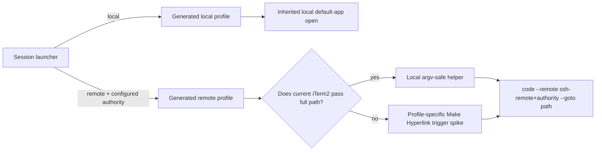

<!-- Canonical Jinja source: STUB.md.jinja. This direct-copy stub is retained for consumers that have not migrated to rendering it. -->

# iTerm2 Cross-Machine VS Code File Routing

## Founding Ask Coverage

`founding_ask_ref`: N/A — Tier 1 dispatch supplied no `canonical_root_json`; the literal ask follows.

```text
can you /delegate /codex /research-doc (first see if we have existing one that discusses this) to see how i can cmd + click a full path to a doc / file in iterm2 on macos and have it open that file in my ssh-connected vs code instance that has the file system on my framework machine? the problem is that right now, if I'm in a cc session that's hosted on my framework machine, it won't redirect to try to open that file on my vs code window ssh connected to framework machine. if possible, i'd like it to know whether the cc session im using cmd+click to open the file path is on macos and then if available, try to open it on my macos local vs code window and if its a framework cc session then iterm should route to try to open it in the framework ssh connected vs code window. add a /beads-task and cc task for this and set to in progress and ship changes and then see if we ahve any resarch and/or plan or design docs on this and if not then /delegate /codex /research-doc to see if this is possible in iterm2 on macos.
```

| Authoritative raw entry | Coverage and disposition |
|---|---|
| Tier 1 founding ask | Existing local-only research was reviewed. This document researches the missing cross-machine routing problem and gives an implementation recommendation. Tracking, implementation, and shipping remain outside this research-only worker's write authority. |

**Status:** complete

**Created:** 2026-09-16

<!-- doc:region name="context" kind="immutable" -->

## Table of Contents

- [Founding Ask Coverage](#founding-ask-coverage)
- [Table of Contents](#table-of-contents)
- [Context](#context)
- [Temporal Scope](#temporal-scope)
- [Executive Summary](#executive-summary)
- [1. What iTerm2 Can Know and Configure](#1-what-iterm2-can-know-and-configure)
  - [When to use](#when-to-use)
- [2. VS Code Remote-SSH CLI Contract](#2-vs-code-remote-ssh-cli-contract)
  - [When to use](#when-to-use-1)
- [3. Routing Architectures](#3-routing-architectures)
  - [When to use](#when-to-use-2)
- [4. Failure Modes, Security, and Operational Boundaries](#4-failure-modes-security-and-operational-boundaries)
  - [Gaps, blindspots & emergent findings](#gaps-blindspots--emergent-findings)
  - [When to use](#when-to-use-3)
- [Comparison](#comparison)
- [Recommendation](#recommendation)
  - [Concrete implementation shape](#concrete-implementation-shape)
  - [Acceptance gates](#acceptance-gates)
- [Open Questions](#open-questions)
- [Sources](#sources)
- [Ambiguous Items from Auto-Remediation (Post-Run Review)](#ambiguous-items-from-auto-remediation-post-run-review)
- [Appendix: Research Prompt](#appendix-research-prompt)
- [Appendix: Provenance Ledger](#appendix-provenance-ledger)
- [Run History](#run-history)

## Context

The established local-only behavior uses macOS file association and iTerm2 Semantic History to open paths that exist on the Mac. This research addresses only the missing cross-machine case: an iTerm2 pane displays a shell or agent session running on a remote SSH/mosh host, while the desired editor is a local VS Code Remote-SSH window whose file system is that remote host.

The desired routing invariant is: a local pane opens a local path in local VS Code; a launcher-managed remote pane opens the same absolute remote path through the matching VS Code Remote-SSH authority. Exact line jumping remains separately scoped. The public repository's privacy rules conflict with reproducing account-specific absolute paths and internal tracker identifiers from the wrapper brief; those values are redacted in the prompt appendix, while the literal founding ask above is preserved as required.

<!-- /doc:region name="context" -->

<!-- doc:region name="body" kind="replaceable" -->

## Temporal Scope

Research was performed on 2026-09-16. Current iTerm2 and VS Code documentation was treated as authoritative for supported interfaces. Older iTerm2 issues are used only as evidence of reported behavior and unresolved risk, not as proof that a current release behaves identically. For the exact iTerm2-to-VS Code multi-host routing pattern, no significant post-2024 primary-source developments were found after searches across official documentation, issue trackers, current repositories, and adjacent terminal/editor patterns. [NO SOURCE]

Repository observations were re-verified directly against worktree commit `56ef9c1401086ce63a3552aceee1c0bbb812f3b0`; because this is local inspection rather than an external source, they are treated as a point-in-time implementation inference, not a promise about later revisions. [INFERENCE]

## Executive Summary

1. **Do not detect the host at click time when the session launcher already knows it.** iTerm2 Dynamic Profiles accept profile preferences and are reloaded at runtime, while iTerm2's API can also apply profile properties to one session without changing the shared profile. That makes per-session Semantic History configuration technically possible. [VERIFIABLE][^2][^3][^4]
2. **Use VS Code's documented remote authority, not a remote shell's `code` binary.** The supported shape is `code --remote ssh-remote+<authority> --goto <absolute-path>[:<line>]`; VS Code documents terminal-initiated connection to a configured host and `--goto` for forcing file interpretation. [VERIFIABLE][^7][^8]
3. **The primary design is a launcher-baked remote authority plus a local argv-safe helper.** Local profiles should continue inheriting the existing local default-app behavior; remote profiles should invoke a local helper with the already-known authority. This removes unreliable process-tree, child-environment, and tmux introspection from the click path. [INFERENCE]
4. **First prove that current iTerm2 supplies `\1` for a nonexistent local path.** An open upstream report demonstrates the exact historical failure: even “Always Run Command” could omit the remote filename. If a live spike reproduces it, a profile-specific “Make Hyperlink” trigger is the best next experiment because triggers can make regex matches Cmd-clickable without relying on Semantic History's file-existence decision. [VERIFIABLE][^10][^11]
5. **Do not promise correct reuse of a pre-existing matching Remote-SSH window.** `--remote` selects an authority, but the documented `-r/--reuse-window` contract is only “last active window.” No current primary source was found guaranteeing that a CLI open reuses the already-open window for the same SSH authority, or defining stale-connection behavior. [VERIFIABLE][^7] [NO SOURCE]

## 1. What iTerm2 Can Know and Configure

iTerm2 documents Semantic History as a per-profile Cmd-click action. “Run command” and “Always run command” can substitute `\1` (file), `\2` (line), `\3`/`\4` (neighboring text), and `\5` (working directory); the latter mode also runs when the clicked object is not an existing filename. [VERIFIABLE][^1]

The documented substitution contract has no hostname, profile variable, environment variable, pane identifier, or Python-expression placeholder. A command can call a wrapper, but the official documentation does not establish a way for that wrapper to receive the clicked pane's live host identity beyond the documented substitutions. Therefore “one global command that inspects this pane” is not an evidenced iTerm2 feature. [INFERENCE]

Dynamic Profiles are a stronger fit. iTerm2 monitors their files at runtime, permits every supported profile preference as an attribute, and recommends exporting a known-good profile to discover the exact property name and legal value. [VERIFIABLE][^2] The Python API is another genuine per-session route: it exposes `async_set_semantic_history`, and `Session.async_set_profile_properties` retains a modified session-local copy rather than modifying the underlying profile. [VERIFIABLE][^3][^4]

Automatic Profile Switching can use current path, host, user, and foreground job information, but it requires shell integration. [VERIFIABLE][^5] That is a material limitation here because iTerm2 says shell integration works with `tmux -CC` but not the regular tmux UI. [VERIFIABLE][^6] It is useful for unmanaged direct-SSH panes, but it is less dependable than launch-time profile generation for launcher-managed mosh/tmux sessions. [INFERENCE]

`$SSH_CONNECTION`, `$SSH_CLIENT`, a remote `$AI_HOST`, and `tmux display-message` describe the remote shell environment. Semantic History's command is launched by the local iTerm2 application, so those remote child variables are not automatically local wrapper inputs. Walking the local process tree may identify simple `ssh host` commands, but nested SSH, mosh, aliases, ProxyJump, wrapper processes, and detached tmux break the one-to-one mapping. [HEURISTIC]

### When to use

- Use a generated Dynamic Profile when the launcher knows the target authority before opening the pane.
- Use a Python API session mutation when an already-running, unmanaged session must be changed without replacing its shared profile.
- Use Automatic Profile Switching only when remote shell integration is installed and regular tmux UI is not part of the path.
- Use process inspection as diagnostics, not as the routing source of truth.

## 2. VS Code Remote-SSH CLI Contract

VS Code's current CLI documentation defines `--remote <authority>` and gives the SSH form `ssh-remote+<remote_server> <path on remote>`. It defines `-g/--goto` for `file:line[:character]`. [VERIFIABLE][^7] The Remote Development guide gives a complete terminal example, `code --remote ssh-remote+remote_server /code/my_project`, says a configured host can be connected from the terminal, and recommends `--goto` or `--file-uri` to force file interpretation. [VERIFIABLE][^8]

The resulting command for a file is therefore:

```text
code --remote ssh-remote+<authority> --goto <absolute-remote-path>[:<line>]
```

This invocation runs on macOS and asks the local VS Code client/Remote-SSH extension to address a remote file; it should not be executed inside the remote shell. [INFERENCE]

VS Code documents Remote-SSH hosts through an SSH-config-format file, accepts either a hostname or full SSH command when adding one, and then lists that host in Remote Explorer. [VERIFIABLE][^9] The safest design is to configure an explicit `vscode_authority` using the same stable alias the user selects in Remote-SSH, rather than assuming a mosh endpoint, VPN name, display label, or canonical hostname is equivalent. Whether semantically equivalent host spellings map to the same VS Code authority is not documented. [INFERENCE]

Cold connection is supported in the limited sense that the official guide says the CLI can “connect” to a configured host; an already-open Remote-SSH window is not stated as a prerequisite. [VERIFIABLE][^8] Authentication prompts, platform selection, host-key confirmation, extension installation, and failed/stale connections may still require UI interaction. Their exact CLI recovery contract was not found. [NO SOURCE]

Do not add `-r` in version 1. VS Code defines it as forcing the open into the **last active window**, not the window whose remote authority matches the command. [VERIFIABLE][^7] `--remote` clearly selects a connection authority, but official documentation does not say whether multiple open windows for that authority are searched, which one is chosen, or whether a new window is created. [NO SOURCE]

### When to use

- Prefer `--remote ... --goto` for files, including extensionless files.
- Prefer `--folder-uri vscode-remote://...` only for an intentional folder-open workflow.
- Use an explicit Remote-SSH authority from configuration; do not derive it from a display name.
- Omit `--reuse-window` until multi-window UAT establishes behavior on the installed VS Code build.

## 3. Routing Architectures

**Approach 1 — launch-time Dynamic Profile (recommended).** Direct worktree inspection shows that the current generator writes a deterministic per-session Dynamic Profile and the iTerm2 setup path calls it before sending `SetProfile`; its comment explicitly protects remote mosh sessions that have no second profile assignment. This is a point-in-time implementation inference. [INFERENCE] Add an optional remote authority to that path and inject remote-only click behavior. Local profiles omit the Semantic History key and preserve inherited default-app behavior. [INFERENCE]

**Approach 2 — one global Semantic History wrapper.** This appears simple, but it lacks an evidenced pane-host input. A local environment marker says where the wrapper runs, not where the pane's shell runs. Process-tree recovery is possible only as a best-effort fallback and becomes ambiguous under mosh, nested transports, and tmux. [HEURISTIC]

**Approach 3 — iTerm2 Python API or Automatic Profile Switching.** Both can produce per-session profile behavior. The API can observe/mutate sessions, while automatic switching can react to a shell-integrated hostname. They add a resident automation dependency and are most useful for sessions that bypass the existing launcher. [INFERENCE]

**Approach 4 — profile-specific regex trigger.** A “Make Hyperlink” trigger converts matched output to a Cmd-clickable URL. [VERIFIABLE][^11] This may bypass Semantic History's local file recognition, but it requires a carefully bounded absolute-path regex and safe URI encoding. Treat it as the fallback experiment if `\1` is empty for remote paths, not as the initial implementation. [INFERENCE]

**Approach 5 — mount the remote file system locally.** VS Code documents SSHFS as an alternative remote-file access method, but it changes path identity and introduces mount lifecycle, latency, and consistency concerns. [VERIFIABLE][^9] It solves a broader filesystem problem than is required here and should not be introduced solely for Cmd-click routing. [INFERENCE]

### When to use

Use Approach 1 for launcher-managed sessions. Add Approach 3 only for unmanaged panes. Promote Approach 4 if the mandatory live Semantic History spike fails. Use Approach 5 only when a local mount is already an intentional fleet primitive.

## 4. Failure Modes, Security, and Operational Boundaries

The largest technical risk precedes routing: iTerm2 may not emit the clicked remote path. The still-open upstream issue reports that an “Always Run Command” setup received no `\1` after SSH because the path could not be recognized locally. [VERIFIABLE][^10] That report is old and does not prove current behavior, but it is exact enough that implementation must be gated by a live current-version test. [INFERENCE]

Line handling must be structural, not a shell fallback. Build `<path>` when no line exists and `<path>:<positive-integer>` when one does. A helper that constructs an argument vector avoids both the dangling-colon failure and shell interpretation of spaces, quotes, `$()`, backticks, semicolons, and newlines. [HEURISTIC]

Treat clicked terminal text as untrusted. The helper should accept only an allowlisted authority from generated configuration, require an absolute path for version 1, reject NUL/newline/control characters, validate the optional line as a positive integer, and invoke `code` without `shell=True`. [HEURISTIC]

Other operational cases need explicit tests: multiple local and remote VS Code windows; two windows on one authority; closed/stale connections; first-time authentication; a missing local `code` launcher; paths with spaces and Unicode; remote paths that contain colons; mosh reconnects; profile reload races; and output from nested SSH inside a launcher-managed pane. [HEURISTIC]

Nested SSH is a semantic boundary. A profile baked for host A cannot safely infer that a command inside that pane later SSHed to host B. Version 1 should continue routing to host A and document nested transport as unsupported, rather than silently opening host B-looking paths on host A. [INFERENCE]

### Gaps, blindspots & emergent findings

- **Parser blindspot:** no current primary source confirms that “Always Run Command” supplies `\1` for a full path absent from the Mac. The historical issue directly contradicts the optimistic reading of the current setting. [NO SOURCE]
- **Window-selection blindspot:** no primary source specifies reuse selection among multiple existing Remote-SSH windows for one authority. [NO SOURCE]
- **Alias-identity blindspot:** no primary source defines whether SSH aliases, hostnames, and equivalent full SSH commands normalize to one VS Code remote authority. [NO SOURCE]
- **Installed-CLI discrepancy:** on the research machine, `code --version` reported 1.137.0 while `code --help` did not list `--remote`, even though current official documentation does. This observation is environment-specific and requires runtime testing; it is not evidence that the option is unsupported. [INFERENCE]
- **Prior-art result:** no maintained, primary-source, production-quality project implementing this exact iTerm2 + VS Code multi-host Cmd-click router was found. Older issue/forum material shows the problem, and adjacent terminal solutions exist, but neither establishes a current best practice. [NO SOURCE]
- **Anchor-bias correction:** the investigation expanded beyond the proposed wrapper to profile switching, the Python API, triggers, URI opening, and SSHFS; the trigger route emerged as the only evidenced mechanism likely to bypass file-existence recognition. [INFERENCE]

### When to use

Use these constraints as release gates. A failed parser spike blocks the Semantic History implementation but does not disprove the trigger fallback. A failed window-routing test blocks claims of transparent window reuse, not basic remote-file opening.

## Comparison

1. Generated Dynamic Profile with baked authority.
2. Global wrapper with live host detection.
3. Python API / Automatic Profile Switching.
4. Host-specific Make Hyperlink trigger.
5. Local SSHFS mount.

| Approach | Host fidelity | tmux/mosh fit | Added runtime | Main risk | Verdict |
|---|---:|---:|---:|---|---|
| 1. Generated profile | High: authority known at launch | High | Local helper only | Semantic History may not provide `\1` | **Primary, gated** |
| 2. Global wrapper | Low to medium | Low | Helper + introspection | Wrong pane/host under nesting | Reject as primary |
| 3. API / profile switching | Medium to high | Medium to low | Resident iTerm2 automation or shell integration | Regular tmux limitation | Secondary for unmanaged panes |
| 4. Make Hyperlink trigger | High when profile-specific | High | Regex + URL handler/helper | Regex/encoding and false matches | Fallback spike |
| 5. SSHFS | High after mount | Independent | Mount daemon | Lifecycle/performance/path drift | Out of scope |

## Recommendation

Implement a **remote-only, launch-time routing profile** in `src/ai_cli/iterm2.py`, backed by a small local CLI helper, but place the change behind a current-version iTerm2 proof-of-concept gate. This uses the strongest fact available to the application—the launcher already knows the destination—rather than reconstructing it later. [INFERENCE]

### Concrete implementation shape

1. Add an optional, explicit configuration field such as `vscode_authority` to each remote machine entry. Its value is the Remote-SSH authority/SSH alias, for example `dev-linux`; do not reuse a UI label or transport endpoint implicitly. [HEURISTIC]
2. Thread `vscode_authority: str | None` through `_emit_iterm2_profile_setup` into `generate_dynamic_profile`. Local sessions pass `None`; remote launch paths pass the selected remote machine's configured authority. [INFERENCE]
3. Leave local profiles without a `Semantic History` key so the established inherited local/default-app behavior remains unchanged. [INFERENCE]
4. For a remote profile, inject the exact Semantic History dictionary copied from a known-good exported iTerm2 profile, as iTerm2's Dynamic Profiles documentation recommends. Do not guess the internal action value from historical repository code. [VERIFIABLE][^2]
5. Point the profile command at an internal local helper, conceptually `ai internal open-vscode-remote --authority <baked-authority> --path "\1" --line "\2"`. The helper validates inputs, builds the goto specification without a dangling colon, and executes `code --remote ssh-remote+<authority> --goto <spec>` as an argv list. [HEURISTIC]
6. Do not pass or inspect `$AI_HOST`, `$SSH_CONNECTION`, tmux state, or a process tree in the normal path. Record the baked authority in diagnostics so failures are explainable. [HEURISTIC]
7. If the live gate shows empty `\1`, stop and prototype a remote-profile “Make Hyperlink” trigger that recognizes full absolute paths and opens an encoded remote VS Code URI or the same helper. Do not ship a Semantic History command that sometimes receives no path. [INFERENCE]

Illustrative flow:



### Acceptance gates

- **G1 — parser:** a printed absolute remote path absent locally reaches the helper byte-for-byte from Cmd-click.
- **G2 — local parity:** local panes still use the existing local VS Code/default-app behavior.
- **G3 — host isolation:** simultaneous panes for two configured remote authorities open only on their corresponding authorities.
- **G4 — file syntax:** extensionless paths, spaces, Unicode, no-line, and line-number cases open correctly; malicious shell metacharacters are not executed.
- **G5 — window behavior:** record actual behavior for zero, one, and multiple Remote-SSH windows; only claim reuse that UAT demonstrates.
- **G6 — transport:** SSH and mosh/tmux launcher paths retain the generated profile after connection/reconnection.
- **G7 — failure UX:** missing authority, missing `code`, authentication failure, and stale connection produce a visible diagnostic without falling back to a wrong local file.

## Open Questions

1. On the currently deployed iTerm2 version, does “Always Run Command” populate `\1` for a full remote path that does not exist locally?
2. What exact `Semantic History` dictionary does a freshly exported known-good “Always Run Command” profile contain?
3. Does the installed VS Code build accept `--remote` despite omitting it from `code --help`, and what exit/status behavior is observable?
4. With two windows for the same authority, which receives `--remote ... --goto`? Does omitting or adding `-r` change that safely?
5. When the authority is disconnected or stale, does CLI invocation reconnect, open a new window, or fail visibly?
6. Should version 1 support only launcher-managed sessions, or is unmanaged direct SSH a release requirement?
7. Is nested SSH intentionally unsupported, or must a future protocol update the profile when the inner host changes?

## Sources

[^1]: iTerm2. (n.d.). [Advanced Profile Preferences — Semantic History](https://iterm2.com/documentation-preferences-profiles-advanced.html). iTerm2 Documentation. Verified accessible (HTTP 200) 2026-09-16. (Current substitution and command-mode contract.)
[^2]: iTerm2. (n.d.). [Dynamic Profiles](https://iterm2.com/documentation-dynamic-profiles.html). iTerm2 Documentation. Verified accessible (HTTP 200) 2026-09-16. (Runtime loading, attribute inheritance, and export guidance.)
[^3]: iTerm2. (n.d.). [Profile — Python API](https://iterm2.com/python-api/profile.html). iTerm2 Python API 0.26 Documentation. Verified accessible (HTTP 200) 2026-09-16. (`async_set_semantic_history`.)
[^4]: iTerm2. (n.d.). [Session — Python API](https://iterm2.com/python-api/session.html). iTerm2 Python API 0.26 Documentation. Verified accessible (HTTP 200) 2026-09-16. (Session-local profile properties.)
[^5]: iTerm2. (n.d.). [Automatic Profile Switching](https://iterm2.com/documentation-automatic-profile-switching.html). iTerm2 Documentation. Verified accessible (HTTP 200) 2026-09-16. (Host/path/user/job switching and shell-integration requirement.)
[^6]: iTerm2. (n.d.). [Shell Integration](https://iterm2.com/documentation-shell-integration.html). iTerm2 Documentation. Verified accessible (HTTP 200) 2026-09-16. (tmux limitations.)
[^7]: Microsoft. (2026). [Visual Studio Code command-line interface](https://code.visualstudio.com/docs/configure/command-line). Visual Studio Code Documentation. Verified accessible (HTTP 200) 2026-09-16. (`--remote`, `--goto`, and `--reuse-window` contracts.)
[^8]: Microsoft. (2026). [Remote Development Tips and Tricks: Connect to a remote host from the terminal](https://code.visualstudio.com/docs/remote/troubleshooting#_connect-to-a-remote-host-from-the-terminal). Visual Studio Code Documentation. Verified accessible (HTTP 200) 2026-09-16. (Remote CLI examples and file/folder disambiguation.)
[^9]: Microsoft. (2026). [Remote Development using SSH](https://code.visualstudio.com/docs/remote/ssh). Visual Studio Code Documentation. Verified accessible (HTTP 200) 2026-09-16. (Host configuration and SSHFS alternative.)
[^10]: iTerm2 project. (2013–2026). [Semantic history does not detect filenames when ssh-ed into remote machine (issue 2492)](https://gitlab.com/gnachman/iterm2/-/issues/2492). GitLab. Search record and issue URL verified accessible 2026-09-16. (Historical open issue; not treated as current-version proof.)
[^11]: iTerm2. (n.d.). [Triggers](https://iterm2.com/documentation-triggers.html). iTerm2 Documentation. Verified accessible (HTTP 200) 2026-09-16. (“Make Hyperlink” behavior.)

<!-- /doc:region name="body" -->

<!-- doc:region name="ambiguous_items" kind="replaceable" -->

## Ambiguous Items from Auto-Remediation (Post-Run Review)

None. Unverified runtime behavior is retained as explicit open questions and acceptance gates rather than auto-remediated into claims.

<!-- /doc:region name="ambiguous_items" -->

<!-- doc:region name="appendix_research_prompt" kind="immutable" -->

## Appendix: Research Prompt

```text
Registry/method: Codex research (research-doc skill)
Model: OpenAI Codex, GPT-5 family (exact serving model identifier was not exposed to the worker)
Date: 2026-09-16

Public-artifact redactions: account-specific absolute paths, personal identifiers, and private
tracking identifiers in the wrapper were replaced with bracketed generic tokens to comply with
this public repository's publication policy. The substantive research instructions are otherwise
preserved. The literal Tier 1 founding ask is preserved above.

Research target file (write here): [repository]/docs/research/iterm2-cross-machine-vscode-routing.md

Research question

How can iTerm2 on macOS detect which machine hosts a given pane's shell/CC session (local macOS vs a specific SSH remote host, e.g. a Linux machine reached via SSH called "Framework" in this fleet) and route a cmd+click file-open action accordingly: a local session should open the clicked file in the local macOS VS Code window, while a remote-hosted session should open it in the SSH-connected VS Code Remote-SSH window/workspace that actually has that remote host's filesystem mounted, rather than failing or opening nothing useful.

Background

This fleet already solved the SINGLE-machine case: cmd+click a path in iTerm2 opens it in the local VS Code window, via a combination of macOS LaunchServices default-app assignment (VS Code as default for code/text UTIs) and iTerm2's per-profile Semantic History setting. That existing solution assumes every clicked path exists on the SAME filesystem as iTerm2 itself (local macOS) -- it does not need to route between multiple targets. See the existing research doc for full detail on that solved sub-problem (do not re-derive it, assume it is established): [related local-only research document]. A separately-tracked, still-deferred enhancement ([private tracking references redacted]) covers line-jumping (opening at the exact clicked line number) for that same local-only case -- also out of scope here, assume it is a solved/separately-tracked problem.

What is NOT yet solved, and is the actual scope of this research: today, when a Claude Code (or any shell) session is running on the remote Linux host over SSH (displayed inside an iTerm2 pane on the Mac, e.g. via a tmux session reached through `ssh` or `mosh`), and that session prints a file path and the user cmd+clicks it, nothing routes it to the SSH-connected VS Code Remote-SSH window that has that remote host's filesystem open. The path only exists on the remote host's filesystem, not locally, so the existing local-only routing does nothing useful (either fails silently or opens the wrong/nonexistent local path).

Scope note — questions, examples, and named references are a starting point, not a checklist

The questions, topics, and named examples below are illustrative anchors and a FLOOR for this research — not an exhaustive list to answer only or evaluate only. Reason independently: survey the landscape broadly, follow the evidence where it leads, expand scope where warranted, and surface relevant work, factors, and failure modes not named here. Actively resist answering only the listed questions or evaluating only the named approaches — an output that merely fills in the listed items has NOT met the research goal.

Independent exploration (gaps, blindspots, emergent threads) — required

Treat the question list as a FLOOR, not a ceiling. As you research, actively surface what this framing may be missing and pursue each promising thread to a logical conclusion:
- Adjacent or upstream factors the questions don't capture.
- Contrarian / disconfirming evidence — report it even when it challenges the premise.
- Emerging 2025–2026 practices, tools, or research not anchored by the named examples.
- Known failure modes and second-order effects.
Whenever a load-bearing thread surfaces mid-research, follow it to its conclusion and report it in a dedicated "Gaps, blindspots & emergent findings" subsection. Explicitly NAME any blindspot you suspect but cannot resolve (and why) rather than omitting it. Anchor bias — over-fitting to the listed questions and example approaches — is a known failure mode; counter it deliberately and say where you did.

Specific questions (a floor, not a ceiling)

1. Does iTerm2's Semantic History mechanism (per-profile "Run command…" strings, substitution vars `\1` path / `\2` line / `\5` cwd) have any way to make the invoked command conditional on which host/session is running in that pane -- e.g. reading an environment variable that differs per-pane, or shelling out to a script that inspects the pane's own state (`$SSH_CONNECTION`, `$SSH_CLIENT`, a custom exported var like `AI_HOST`, `tmux display-message -p` inside the pane, iTerm2's own session-scoped variables/badges API) and dispatches to a different `code` invocation depending on the result?
2. Does iTerm2 support genuinely PER-SESSION (not just per-profile) Semantic History behavior -- e.g. via iTerm2's Python API (`iterm2` package), triggers, or per-session user variables that a launched profile could read at click-time? Or is Semantic History strictly resolved once at profile-assignment time with no way to branch at click time based on live session state?
3. What is VS Code's exact CLI contract for opening a file in an existing Remote-SSH window pointed at a specific host: `code --remote ssh-remote+<host> <path>[:<line>]`, `code --folder-uri vscode-remote://ssh-remote+<host>/<path>`, or similar -- and does it reuse an already-open Remote-SSH window for that host (analogous to local `code -r`/`--reuse-window`), or always open a new window? Does the host string need to exactly match an existing `~/.ssh/config` Host alias VS Code's Remote-SSH extension already knows about?
4. Can a single Semantic History "Run command" string be written as a shell script/wrapper that: (a) determines whether the CURRENT iTerm2 pane's underlying process (or tmux session, if the pane is running tmux) is a local shell or an SSH connection to a specific remote host, and (b) branches to either `code -gr` (local) or `code --remote ssh-remote+<host> -g` (remote) accordingly? What's the most reliable way to determine "is THIS specific pane/session local or remote" — process-tree inspection (walking up from iTerm2's shell PID to find an `ssh`/`mosh` ancestor and extracting its target host), an env var exported at session launch time and inherited by the pane's shell, iTerm2's own "badge"/session-variable mechanism, or something else?
5. This fleet's own session-launch tooling (ai-cli-utils, a Python CLI that wraps tmux+SSH+mosh session launching) already sets an `AI_HOST` environment variable identifying the current machine, and generates per-session iTerm2 Dynamic Profiles at launch time (see `src/ai_cli/icon_generator.py`'s `_SEMANTIC_HISTORY`-style profile generation, and `src/ai_cli/iterm2.py`). Could the EXISTING per-session Dynamic Profile generation mechanism (already proven to work for injecting a Semantic History command at launch time, before it was later simplified back to default-app-only for the local case) be extended to inject a DIFFERENT Semantic History command specifically for sessions launched with a remote host (`-R`/`-m <host>` flags), pointing at that specific `code --remote ssh-remote+<host>` invocation baked in at generation time -- since the generator already KNOWS which host a given session targets at the moment it writes that session's profile?
6. What are the known failure modes / edge cases: window-reuse behavior when multiple Remote-SSH windows are open to different hosts simultaneously; behavior when the target host's Remote-SSH connection has been closed/is stale; trailing-colon-on-no-line-number errors (already solved for the local case via a `|| code -r` fallback — does an equivalent fallback exist/need building for the remote case); whether VS Code's Remote-SSH extension needs to already be running/connected to that host for `--remote ssh-remote+<host>` to work at all, or whether it can cold-launch a new Remote-SSH connection from the CLI invocation itself.
7. Are there existing open-source projects, dotfiles repos, blog posts, or GitHub issues (iTerm2's own issue tracker, VS Code's `vscode-remote-release` repo, personal engineering blogs) describing this exact multi-host cmd+click routing problem and a working solution, for iTerm2+VS Code specifically or for an analogous terminal+editor combination (e.g. WezTerm, Kitty, tmux+Neovim with a similar remote-routing need)?

Grounding instructions

Act as a senior macOS developer-tools engineer with experience in iTerm2 profile automation, VS Code Remote-SSH integrations, and multi-machine terminal-to-editor routing. Use current primary sources, weight 2026 then 2025 then 2024, and use older material only when foundational or clearly labeled historical. State when no significant post-2024 development is found.

Before final output, execute a Chain-of-Verification: isolate required facts, draft, hostilely cross-examine implied claims, and remove claims that cannot be verified. Classify every major claim only after writing its rationale: [VERIFIABLE] with a contiguous GFM footnote to a fetched source; [HEURISTIC]; [INFERENCE] with reasoning and no footnote; or [NO SOURCE] with no footnote. Never invent a citation.

Every source definition must be APA-shaped, contain a clickable URL or DOI, and state access verification. Evaluate adoption and maintenance signals for externally sourced tools and patterns; otherwise call them exploratory. Use Mermaid or ASCII for diagrams and LaTeX for math; never generate binary images.

Retrieval enforcement

Do not stop after one round. For each load-bearing claim, run at least one web search or fetch and do not return [VERIFIABLE] without a URL fetched in-session. Search alternate framings before using [NO SOURCE].

Required output

Conform exactly to research template 1.2.0: complete frontmatter, Table of Contents, immutable Context, Temporal Scope, 3–5 numbered Executive Summary findings, numbered topic sections with "When to use" where relevant, Comparison with numbered approaches and table, concrete implementation recommendation for `src/ai_cli/iterm2.py`, Open Questions, Sources, full Research Prompt appendix, Provenance Ledger with claim → verbatim quote → verdict → live URL for each verifiable claim, and Run History. Preserve region markers.
```

<!-- /doc:region name="appendix_research_prompt" -->

<!-- doc:region name="appendix_provenance" kind="replaceable" -->

## Appendix: Provenance Ledger

| ID | Claim | Verbatim source excerpt | Verdict | Live URL |
|---|---|---|---|---|
| C1 | Dynamic Profiles and session-local profile properties permit per-session configuration. | “Every profile preference that iTerm2 supports may be an attribute” / “underlying profile is not modified” | Supported; configuration can be generated per profile or applied to a session-local copy. | [Dynamic Profiles](https://iterm2.com/documentation-dynamic-profiles.html); [Session API](https://iterm2.com/python-api/session.html) |
| C2 | VS Code supports a remote SSH authority plus file goto syntax. | “`ssh-remote+<remote_server> <path on remote>`” / “add `--goto`” | Supported CLI shape. | [CLI](https://code.visualstudio.com/docs/configure/command-line); [Remote tips](https://code.visualstudio.com/docs/remote/troubleshooting#_connect-to-a-remote-host-from-the-terminal) |
| C3 | The historical missing-path failure and trigger fallback are evidenced. | “the name of the file I clicked, which is missing on remote” / “become a hyperlink which you can open with Cmd-Click” | Historical risk is exact but not current proof; trigger capability is current documentation. | [Issue 2492](https://gitlab.com/gnachman/iterm2/-/issues/2492); [Triggers](https://iterm2.com/documentation-triggers.html) |
| C4 | `--reuse-window` targets the last active window. | “Forces opening a file or folder in the last active window.” | Supported; it does not document authority-aware selection. | [VS Code CLI](https://code.visualstudio.com/docs/configure/command-line) |
| C5 | Semantic History supplies file, line, context, and working-directory substitutions. | “`\1` will be replaced with the file name, `\2` will be replaced with the line number” | Supported; additional substitutions are listed on the same page. | [Semantic History](https://iterm2.com/documentation-preferences-profiles-advanced.html) |
| C6 | Dynamic Profile changes are observed at runtime and may carry profile attributes. | “Changes are picked up immediately.” | Supported. | [Dynamic Profiles](https://iterm2.com/documentation-dynamic-profiles.html) |
| C7 | The Python API can set Semantic History and session-local profile properties. | “Sets the semantic history prefs.” / “The session will keep a copy” | Supported. | [Profile API](https://iterm2.com/python-api/profile.html); [Session API](https://iterm2.com/python-api/session.html) |
| C8 | Automatic Profile Switching can use host information and requires shell integration. | “current path, host name, user name, and foreground job name” / “You must install Shell Integration” | Supported. | [Automatic Profile Switching](https://iterm2.com/documentation-automatic-profile-switching.html) |
| C9 | iTerm2 shell integration is limited in regular tmux UI. | “not with the regular tmux UI” | Supported. | [Shell Integration](https://iterm2.com/documentation-shell-integration.html) |
| C10 | VS Code documents both remote authority and goto options. | “`--remote <authority>`” / “`-g` or `--goto`” | Supported. | [VS Code CLI](https://code.visualstudio.com/docs/configure/command-line) |
| C11 | A configured host can be connected from a terminal and `--goto` forces a file. | “connect to it directly from the terminal” / “add `--goto`” | Supported. | [Remote tips](https://code.visualstudio.com/docs/remote/troubleshooting#_connect-to-a-remote-host-from-the-terminal) |
| C12 | Remote-SSH hosts can be stored in an SSH-config-format file. | “add them to a local file that follows the SSH config file format” | Supported. | [Remote-SSH](https://code.visualstudio.com/docs/remote/ssh) |
| C13 | CLI initiation can connect to a configured host. | “Once a host has been configured” | Supports cold initiation; does not specify every first-connect prompt. | [Remote tips](https://code.visualstudio.com/docs/remote/troubleshooting#_connect-to-a-remote-host-from-the-terminal) |
| C14 | `-r` is last-window reuse, not documented host matching. | “last active window” | The positive contract is supported; absence of host matching remains unsourced. | [VS Code CLI](https://code.visualstudio.com/docs/configure/command-line) |
| C15 | Make Hyperlink triggers create Cmd-clickable matches. | “The text matching the regex in the trigger will become a hyperlink” | Supported. | [Triggers](https://iterm2.com/documentation-triggers.html) |
| C16 | VS Code documents SSHFS as an alternative. | “Mount the remote filesystem using SSHFS” | Supported as an alternative, not endorsed here. | [Remote-SSH](https://code.visualstudio.com/docs/remote/ssh) |
| C17 | An upstream report describes missing `\1` over SSH. | “All I need is the name of the file I clicked” | Supports historical risk only. | [Issue 2492](https://gitlab.com/gnachman/iterm2/-/issues/2492) |
| C18 | iTerm2 recommends exporting a profile to learn legal Dynamic Profile values. | “Select Save Profile as JSON” | Supported; use the installed version's export rather than guessing internal values. | [Dynamic Profiles](https://iterm2.com/documentation-dynamic-profiles.html) |

<!-- /doc:region name="appendix_provenance" -->

<!-- doc:region name="run_history" kind="append_only" -->

## Run History

- **2026-09-16 — Scope and repository verification:** read both canonical research templates, the `research-doc` skill, the target scaffold, the existing local-only research, current launcher/profile code, relevant history, and the worktree status. Confirmed the wrapper-named non-worktree target was absent and used the designated writable worktree target instead.
- **2026-09-16 — Retrieval rounds:** fetched current official iTerm2 Semantic History, Dynamic Profiles, Python API, Automatic Profile Switching, shell integration, triggers, and escape-code material; fetched current official VS Code CLI and Remote-SSH documentation; inspected pinned public repository source and history; searched four alternate framings for exact and adjacent prior art.
- **2026-09-16 — Adversarial critic pass:** conventional review separated supported syntax from undocumented window reuse; contrarian review elevated the historical empty-`\1` failure into a release gate; historical review prevented an old issue from being presented as current behavior; adjacent-field review compared Python API, profile switching, triggers, and SSHFS; skeptical review downgraded alias normalization, stale recovery, escaping, and multi-window selection where evidence was absent.
- **2026-09-16 — Chain of Verification:** re-opened load-bearing primary sources, matched every externally verified claim to a fetched URL and provenance row, removed claims of guaranteed Remote-SSH window reuse, and retained unresolved runtime behavior as explicit evidence gaps or UAT gates.
- **2026-09-16 — Validation:** the canonical document validator passed (`research-1.2.0`, six regions). The repository did not contain `scripts/check_doc_toc.py`; headings and anchors were checked manually. Citation definitions are contiguous `[^1]`–`[^11]`, all are referenced, and no scaffold placeholders, account-specific paths, or private tracking identifiers remain.

<!-- /doc:region name="run_history" -->
