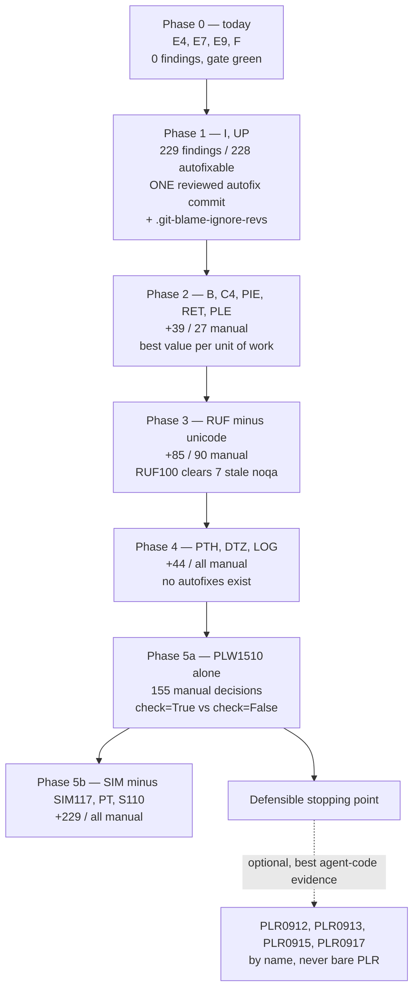

# Ruff lint rule-set selection for a small public CLI package

**Status:** complete

**Created:** 2026-08-06

<!-- doc:region name="context" kind="immutable" -->

## Table of Contents

- [Context](#context)
- [Temporal Scope](#temporal-scope)
- [Executive Summary](#executive-summary)
- [1. What "recommended practice" actually is in 2026](#1-what-recommended-practice-actually-is-in-2026)
  - [1.1 Astral's own position](#11-astrals-own-position)
  - [1.2 Is there a standard baseline?](#12-is-there-a-standard-baseline)
  - [When to use](#when-to-use)
- [2. `ALL` plus ignore versus an explicit allowlist](#2-all-plus-ignore-versus-an-explicit-allowlist)
  - [2.1 The upgrade asymmetry](#21-the-upgrade-asymmetry)
  - [2.2 What `ALL` costs this repo specifically](#22-what-all-costs-this-repo-specifically)
  - [When to use `ALL`](#when-to-use-all)
- [3. Which families find defects, which find style](#3-which-families-find-defects-which-find-style)
  - [3.1 The measured picture in this repo](#31-the-measured-picture-in-this-repo)
  - [3.2 Family-by-family verdicts](#32-family-by-family-verdicts)
  - [When to use a high-volume family](#when-to-use-a-high-volume-family)
- [4. Test-heavy repos: S101, ANN, D, and per-file-ignores](#4-test-heavy-repos-s101-ann-d-and-per-file-ignores)
- [5. Incremental adoption without a mass-autofix commit](#5-incremental-adoption-without-a-mass-autofix-commit)
  - [5.1 Ruff has no baseline mechanism](#51-ruff-has-no-baseline-mechanism)
  - [5.2 The four viable ratchets](#52-the-four-viable-ratchets)
  - [5.3 The local hazard: pre-commit runs --fix already](#53-the-local-hazard-pre-commit-runs---fix-already)
- [6. Rule-set size and agent-authored code](#6-rule-set-size-and-agent-authored-code)
- [7. What comparable projects actually configure](#7-what-comparable-projects-actually-configure)
- [8. Line length 120 versus 88](#8-line-length-120-versus-88)
- [9. Gaps, blindspots & emergent findings](#9-gaps-blindspots--emergent-findings)
  - [9.1 A standalone config file silently loses Python-version inference](#91-a-standalone-config-file-silently-loses-python-version-inference)
  - [9.2 RUF100 is select-dependent, and 21 directives are already dead](#92-ruf100-is-select-dependent-and-21-directives-are-already-dead)
  - [9.3 Named blindspots I could not resolve](#93-named-blindspots-i-could-not-resolve)
- [Comparison](#comparison)
- [Recommendation](#recommendation)
  - [The config block](#the-config-block)
  - [Phased adoption order](#phased-adoption-order)
  - [The call on `ALL` versus allowlist](#the-call-on-all-versus-allowlist)
  - [Families recommended against](#families-recommended-against)
  - [Where the evidence is equivocal](#where-the-evidence-is-equivocal)
- [Open Questions](#open-questions)
- [Sources](#sources)
- [Ambiguous Items from Auto-Remediation (Post-Run Review)](#ambiguous-items-from-auto-remediation-post-run-review)
- [Appendix: Research Prompt](#appendix-research-prompt)
- [Appendix: Provenance Ledger](#appendix-provenance-ledger)
- [Run History](#run-history)

## Context

This package is a public open-source Python CLI, effectively single-maintainer, with AI agents
authoring most commits. It pins `select = ["E4", "E7", "E9", "F"]` — the pre-0.16 Ruff default —
because Ruff 0.16.0 redefined its default rule set and would otherwise have imported roughly a
thousand findings from families the repo never opted into. The narrow select is clean today. A
tracked follow-up asks which families to adopt, in what order, under a hard constraint: no bulk
autofix, because a mass mechanical change is unreviewable.

**Primary period:** 2024–2026
**Source weighting:** 2026 primary, 2025 secondary, 2024 supporting, pre-2024 background only

<!-- /doc:region name="context" -->

<!-- doc:region name="body" kind="replaceable" -->

## Temporal Scope

Primary focus is 2026 material: Ruff 0.16.0 (released 2026-07-23), Ruff's current documentation,
and 2026 empirical work on static analysis and agent-authored code. 2025 and 2024 sources are
secondary. Two background sources predate the window because they are foundational and still
live: the baseline feature request (2022, still open) and the incremental-adoption blog post
(2023), whose `--add-noqa` workflow remains the documented pattern.

On one subtopic the literature is genuinely thin, and I am naming it rather than backfilling:
**the interaction between lint rule-set size and agent-authored code has no controlled study.**
Section 6 reports the adjacent evidence that does exist and marks the specific claim `[NO SOURCE]`.

## Executive Summary

1. **Astral's own guidance is explicitly incremental and explicitly cautious about `ALL`.** The
   linter docs tell you to "Start with a small set of rules (`select = ["E", "F"]`) and add a
   category at-a-time," and warn that "Enabling `ALL` will implicitly enable new rules whenever
   you upgrade" [VERIFIABLE][^1]. The repo's current posture is not idiosyncratic — it is the
   documented starting point, and the migration question is which categories to add next.

2. **`ALL` is the wrong shape for this repo, and Ruff's versioning policy is why.** Ruff uses
   the minor version for breaking changes, and adding rules to the default set is itself listed
   as a minor-release event [VERIFIABLE][^2]. `ALL` converts every future minor into a
   potentially gate-breaking event; an allowlist converts it into a no-op. This is the same
   failure the repo already absorbed once at 0.16.0 [VERIFIABLE][^3].

3. **Family finding-counts are dominated by a handful of individual rules, so family-level
   triage badly misprices the work.** Measured in this repo on 2026-08-06: `SIM` reports 441
   findings, but 375 of them are one rule (`SIM117`) in tests only — excluding it leaves 66.
   `S` reports 3,905, of which 3,404 are `assert` in tests. Deciding by family total would
   reject `SIM` and `S` wholesale; deciding by rule keeps their real value.

4. **The highest-value adoption is small, cheap, and mostly autofixable — but the autofix must
   be split from the enablement.** Adding `I`, `UP`, `B`, `C4`, `PIE`, `RET`, `PLE` yields 268
   findings, 241 of them fixable. The local hazard is that this repo's pre-commit config already
   runs `ruff-check` with `--fix`, so merely editing `select` causes the next commit to
   mass-autofix — the exact outcome the constraint forbids.

5. **Ruff has no baseline or ratchet mechanism; the request has been open since 2022**
   [VERIFIABLE][^4]. The documented substitute is `--add-noqa`, which grandfathers existing
   violations so a rule is enforced only on new code [VERIFIABLE][^5]. `per-file-ignores` is the
   better ratchet where violations cluster by directory, which here they do.

## 1. What "recommended practice" actually is in 2026

### 1.1 Astral's own position

Astral's guidance is unusually direct for a tool vendor, and it cuts against maximalism.

On making selection explicit: the linter documentation states "Prefer `lint.select` over
`lint.extend-select` to make your rule set explicit" [VERIFIABLE][^1]. That is a
recommendation *for* the shape this repo already uses — a replacing allowlist, not an additive
layer on top of a default that Astral reserves the right to change.

On growth rate: "Start with a small set of rules (`select = ["E", "F"]`) and add a category
at-a-time" [VERIFIABLE][^1]. One category at a time is the vendor's own cadence.

On `ALL`: it exists — "As a special-case, Ruff also supports the `ALL` code, which enables all
rules" — accompanied by "Use `ALL` with discretion. Enabling `ALL` will implicitly enable new
rules whenever you upgrade" [VERIFIABLE][^1]. Ruff does auto-resolve internal conflicts under
`ALL` ("Ruff will automatically disable any conflicting rules when `ALL` is enabled")
[VERIFIABLE][^1], so the objection to `ALL` is not that it breaks on contradictory rules; it is
the upgrade coupling.

Worth recording precisely because it is a *negative* finding: neither the configuration page nor
the preview page carries any caution about `ALL`, and the community discussion that popularised
`ALL` contains no maintainer response at all [VERIFIABLE][^6]. The caution exists in exactly one
place. Anyone who learned `ALL` from the discussion thread never saw it.

### 1.2 Is there a standard baseline?

There is no official baseline beyond Ruff's defaults, and Astral does not publish a
"recommended" select. The default set is described only by prefix: "By default, Ruff enables
rules from the `F`, `E`, `B`, `UP`, and `RUF` categories, as well as many more," with stylistic
rules omitted where they overlap a formatter [VERIFIABLE][^7].

Community convention does exist and converges loosely. The Python Developer Tooling Handbook
publishes a 17-code recommended set (`F`, `W`, `E`, `I`, `UP`, `C4`, `FA`, `ISC`, `ICN`, `RET`,
`SIM`, `TID`, `TC`, `PTH`, `TD`, `NPY`, `FURB`) as `extend-select` on top of the defaults,
verified against Ruff 0.16, and argues "it's easier to enable a comprehensive set of rules from
the beginning and selectively disable any that don't fit" [VERIFIABLE][^8].

That rationale is worth isolating, because it is **conditional on the project being new**
[INFERENCE]. Enabling comprehensively is cheap when there is no existing code to remediate — the
finding count starts at zero and stays there. This repo has ~31 source modules and ~57 test
modules already written against a narrow select, so the same advice imports hundreds of findings
at once. The handbook's advice is sound for its stated case and does not transfer here.

The honest summary: the *ceiling* of community practice is broad `extend-select`; the *vendor's*
advice is incremental `select`; and there is no authority that settles which a mature small
project should prefer. Section 2 resolves it on upgrade mechanics rather than on preference.

### When to use

Follow the handbook-style comprehensive-from-day-one approach when the project is new or tiny
enough that full remediation is a single sitting. Follow Astral's category-at-a-time approach
when code already exists at volume and each new family has a remediation cost that must be
scheduled — this repo's case.

## 2. `ALL` plus ignore versus an explicit allowlist

### 2.1 The upgrade asymmetry

This is the crux, and Ruff's versioning policy settles it rather than taste.

Ruff "uses a custom versioning scheme that uses the **minor** version number for breaking
changes and the **patch** version number for bug fixes" [VERIFIABLE][^2]. Among the events that
trigger a minor release are a rule reaching stable status and "adding or removing stable rules
from the default set" [VERIFIABLE][^2]. New rules always enter preview first and must remain
there "for at least one minor release before being promoted to stable" [VERIFIABLE][^2].

The consequence is a clean asymmetry:

| Upgrade event | `select = ["ALL"]` + ignore | explicit family allowlist |
|---|---|---|
| Rule promoted preview → stable | enters your gate unreviewed | no effect |
| Rule added to the default set | enters your gate | no effect |
| New family added to Ruff | enters your gate | no effect |
| You want the new rule | already there | one-line edit |

Under `ALL`, every minor upgrade is a potential red gate arriving with no code change of your
own. Under an allowlist, upgrades are inert and adoption is a deliberate edit. `ALL` does at
least exclude preview rules by default — a preview rule "would _not_ be enabled via the `ALL`
selector" unless preview mode is also on [VERIFIABLE][^9] — so the exposure is to
*stabilisation*, not to experimental churn. That narrows the risk without removing it.

For a repo where AI agents author most commits and the human reviews at the gate, an
upgrade-triggered wall of new findings is worse than for a human-paced team [INFERENCE]: the
agent's plausible response to a red gate is to fix or suppress whatever it sees, and a large
unexpected finding set is precisely the condition under which mechanical suppression looks like
progress. Section 6 grounds the "feedback overload" half of this in published observation.

### 2.2 What `ALL` costs this repo specifically

Measured with `ruff 0.16.0` on 2026-08-06 (`--select ALL --statistics src/ tests/`), the largest
blocks are `ANN` 5,424, `S` 3,905, `D` 2,216, `PLC` 513 (of which `PLC0415` is 512), `ARG` 456,
`PLR` 412 (of which `PLR2004` is 287), `T20` 406, `COM` 246, `SLF` 200.

An `ALL`-with-ignore config that reaches a clean gate here needs an ignore list long enough to
suppress most of those — at which point the config no longer documents an intent, it documents an
excavation. The allowlist expresses the same end state in a fraction of the lines and stays
readable to a contributor [INFERENCE].

### When to use `ALL`

`ALL` earns its keep on a greenfield project by a maintainer who wants maximum signal and
accepts upgrade churn as the price, and in exploratory measurement — running
`--select ALL --statistics` to survey what a codebase *would* report is genuinely useful and is
how the numbers in this document were produced. It is a poor fit for a committed gate on an
existing codebase with a no-bulk-change constraint.

## 3. Which families find defects, which find style

### 3.1 The measured picture in this repo

All counts below are mine, measured 2026-08-06 against `ruff 0.16.0` at `--target-version py311`
(inferred from `requires-python = ">=3.11"`), on `src/` and `tests/`.

| Family | Total | src | tests | Autofixable | Dominant rule |
|---|---|---|---|---|---|
| `SIM` | 441 | 53 | 388 | 165 | `SIM117` 375 (tests only) |
| `PLC` | 513 | 174 | 339 | 1 | `PLC0415` 512 |
| `PLR` | 412 | 186 | 226 | 4 | `PLR2004` 287 |
| `PLW` | 173 | 140 | 33 | 0 | `PLW1510` 155 |
| `UP` | 152 | 85 | 67 | 151 | `UP017` 99, `UP045` 44 |
| `RUF` | 117 | 49 | 68 | 23 | `RUF059` 48, `RUF100` 22 |
| `I` | 77 | 23 | 54 | 77 | `I001` 77 |
| `PTH` | 38 | 29 | 9 | 0 | `PTH123` 20 |
| `E5` | 32 | — | — | 0 | `E501` 32 |
| `RET` | 19 | 9 | 10 | 10 | `RET504` 9 |
| `C4` | 8 | 0 | 8 | 0 | `C408` 8 |
| `B` | 7 | 1 | 6 | 0 | `B017` 6 |
| `PIE` | 5 | 2 | 3 | 3 | — |
| `PLE` | 0 | 0 | 0 | — | — |
| `W` | 0 | 0 | 0 | — | — |

The single most useful thing in that table is the gap between family total and actionable
content. `SIM` at 441 looks like the biggest style-churn family in the repo; drop `SIM117` and it
is 66. `PLC` at 513 is one rule. `PLR` at 412 is 287 magic-value comparisons plus complexity
metrics. Triage at family granularity would get all three decisions wrong.

### 3.2 Family-by-family verdicts

**Genuine defect detection, evidence-backed:**

`PLW1510` (155 findings, all but 33 in `src/`) is the strongest single case in the repo. Ruff
documents that `subprocess.run` "does not check the return code of the process it runs" and that
this "can lead to silent failures" [VERIFIABLE][^10]. For a CLI whose core job is shelling out,
155 unchecked subprocess calls is a real class of silent-failure bug, not a style preference.
The fix is display-only rather than auto-applied, and deliberately so: Ruff notes it is
ambiguous "whether the potential exception was meant to be ignored," and the suggested
`check=False` insertion risks "possibly masking the original intention" [VERIFIABLE][^10]. So
this family is high-value *and* unautomatable — exactly the shape that belongs in a manual phase.

`B` (bugbear) is upstream-described as "finding likely bugs and design problems in your program,"
holding checks that "don't belong in `pyflakes` and `pycodestyle`" [VERIFIABLE][^11]. Its 7
findings here are cheap to clear. Note the internal split: `B0xx` is the default set while `B9xx`
are "Opinionated warnings," "disabled by default because they are controversial"
[VERIFIABLE][^11]. Selecting bare `B` in Ruff is the safe half.

`DTZ` (6 findings) catches naive-datetime construction. Small, and every finding is a real
timezone-correctness hazard [INFERENCE] — the reasoning being that a tool comparing timestamps
across machines has no correct use for a naive local datetime.

`PLE` (0 findings) is pure insurance: Pylint's error class, currently clean, costs nothing to
enable and gates against a real-error regression.

**Real value, but concentrated in specific rules:**

`UP` is 151-of-152 autofixable, dominated by `UP017` (99) and `UP045` (44). `UP017` rewrites
`datetime.timezone.utc` to `datetime.UTC`; Ruff marks its fix "as safe, unless the expression
contains comments" [VERIFIABLE][^12]. This is modernisation, not defect-finding — worth having,
but it is the archetypal mass-mechanical-diff family and must not ride in on an autofix.

`RUF` mixes classes. `RUF100` (22) finds dead suppressions — genuine hygiene with a real
correctness angle (§9.2). `RUF059` (48, tests only) is unused unpacked variables. `RUF001/002/003`
(31 combined) are ambiguous-Unicode warnings, which in a repo whose output uses box-drawing and
symbol characters are false alarms against intentional content [INFERENCE].

`PTH` (38) is stylistic modernisation with a mild correctness benefit; no autofixes available, so
all 38 are manual.

`I` (77, all autofixable) is import ordering — pure mechanics, zero defect value, but it is the
one family where a bulk autofix is genuinely low-risk because the change is verifiable by
re-running the suite [INFERENCE].

**Mostly churn in this repo:**

`SIM117` (375, tests only) collapses nested `with` blocks. Ruff's rationale is readability —
merging "will minimize the indentation depth of the code, making it more readable"
[VERIFIABLE][^13]. In a test suite built on stacked `patch()` context managers this is a
375-line restyling of test setup with no behavioural content, and the fix is availability-limited
by line length: "Lines that would exceed the configured line length will not be fixed
automatically" [VERIFIABLE][^13].

`PLC0415` (512) flags imports outside top level. The documentation itself concedes the legitimate
cases — a function-scoped import is typically used "to avoid a circular dependency, to defer a
costly module load, or to avoid loading a dependency altogether" [VERIFIABLE][^14]. Deferred
imports for CLI startup latency are a deliberate design choice in a CLI; 512 findings against an
intentional pattern is the definition of a misfitting rule.

`PLR2004` (287) flags magic-value comparisons, the bulk in tests where literal expected values
are the point of the assertion [INFERENCE].

`T20` (406, entirely in `src/`, zero in tests) flags `print`. A CLI's job is to print to stdout.
This is the clearest single misfit in the whole survey.

`COM` (246) must not be enabled at all while `ruff format` is in use: Ruff's formatter
documentation lists `COM812` among rules to avoid because enabled rules "can cause conflicts with
the formatter, leading to unexpected behavior" [VERIFIABLE][^15].

`ANN` (5,424) and `D` (2,216) are §4.

**Not evaluated in depth but measured non-zero, listed so the survey is not silently narrow:**
`ARG` 456 (442 in tests — unused fixture arguments), `SLF` 200, `FBT` 159 (98 in `src/` —
boolean-trap parameters in CLI flag handling, arguably real design feedback), `BLE` 148 (144 in
`src/`, and 14 existing noqa directives already name `BLE001`), `CPY` 89 (copyright headers —
a policy choice, not a defect class), `TRY` 67, `PT` 80 (all in tests), `INP` 57, `EM` 52, `N` 36,
`FURB` 19, `ASYNC` 15, `ISC` 3, `TC` 3, `PERF` 3, `ERA` 6, `A` 1, `PGH` 1, `FLY` 1.

`BLE` deserves a flag: the repo has already written 14 `# noqa: BLE001` directives with
substantive justifications, which is evidence the maintainer previously considered and accepted
that rule's premise [INFERENCE]. Enabling `BLE` would activate 148 findings but also revive 14
already-justified suppressions (§9.2).

### When to use a high-volume family

Enable a family whose total exceeds ~100 findings only when either (a) the findings concentrate in
one autofixable rule you are willing to bulk-change under a dedicated commit, or (b) you can name
the specific rule inside it that carries the value and select that rule alone. Ruff supports
selecting an individual code, since selectors "accept either a full rule code (e.g., `F401`) or
any valid prefix (e.g., `F`)" [VERIFIABLE][^1] — which is what makes `PLW1510`-without-`PLW` and
`S110`-without-`S` viable.

## 4. Test-heavy repos: S101, ANN, D, and per-file-ignores

`S101` is the canonical case and the numbers here are stark: 3,404 findings in `tests/` against
**1** in `src/`. The rule's rationale is production-oriented — assertions "are removed when
Python is run with optimization requested (i.e., when the `-O` flag is present)" and so "should
not be used for runtime validation of user input or to enforce interface constraints"
[VERIFIABLE][^16]. That rationale has no purchase in a pytest suite, where `assert` *is* the
assertion API and nobody runs tests under `-O`.

Ruff's own documentation does not carve out tests for `S101`: the only documented exemption is
for assertions inside a `TYPE_CHECKING` block [VERIFIABLE][^16]. The exemption is left to user
configuration, and the configuration page's `per-file-ignores` example uses exactly the
test-directory shape — `"**/{tests,docs,tools}/*" = ["E402"]` alongside `"__init__.py" = ["E402"]`
[VERIFIABLE][^17]. So the mechanism is documented and the test-directory pattern is the
documented idiom; only the specific `S101` mapping is convention rather than doc.

That convention is well attested in the wild. A widely-circulated config gist maps
`"**/{tests,docs,tools}/*"` to `["S101", "S104", "S106"]`, and secondary guidance notes that test
directories commonly silence `S101` and annotation rules [VERIFIABLE][^18]. Pydantic exempts
`tests/*` from `D`, `B`, and `C4`, and additionally from `T`, `E721`, `F811`; it also exempts
`docs/*` from `D` and release scripts from `T201` [VERIFIABLE][^19]. The `__init__.py` → `F401`
or `F403`/`F405` exemption is near-universal: Ruff's own `uv` config maps `"__init__.py"` to
`F403`, `F405` [VERIFIABLE][^20], as does HTTPX [VERIFIABLE][^21].

`ANN` (5,424; 5,161 in tests) and `D` (2,216; 2,048 in tests) are both dominated by tests, and I
recommend against both for this repo — see the Recommendation. One relevant mechanic: for `D`,
"the `D` rules are not enabled by default," and choosing a convention narrows the set because
"Enabling a convention will disable any rules that are not included in the specified convention"
[VERIFIABLE][^22]. So `D` with `convention = "google"` is materially smaller than bare `D` — but
still ~2,000 findings' worth of docstrings to author here.

A documented limitation worth knowing: someone asked for a way to exclude test files from
pydocstyle rules only, wanting to "ignore tests files entirely but only for this subset of rules"
[VERIFIABLE][^23]. `per-file-ignores` already does exactly that, which is presumably why the
issue closed — but the question recurring is a signal that the mechanism is under-discovered.

**Measured caution on per-file-ignores as the whole answer:** applying a test-directory exemption
does not shrink the residual as much as the src/tests split suggests, because several families
have substantial `src/` populations too. With the phase-5 select and a `tests/**` exemption
covering `RUF059`, `B017`, `SIM105`, `PT018`, `PT011`, `S110`, the repo still reports 634
findings — down from 781 unexempted, not down to the ~250 that a tests-are-the-problem reading
would predict.

## 5. Incremental adoption without a mass-autofix commit

### 5.1 Ruff has no baseline mechanism

This is a real gap, not an oversight I failed to find. The feature request — record existing
violations so they are suppressed, and "address them as they reappear when making changes to the
code" — was opened 2022-12-08, cites Bandit and Flakeheaven as prior art in the flake8 ecosystem,
and proposes both a `--baseline` flag and a `pyproject.toml` setting. It remains **open**, labelled
`core` and `suppression`, with no assignee, no milestone, and no linked pull request
[VERIFIABLE][^4]. I could not retrieve the comment thread, so I cannot report a maintainer
position on whether it will ever land — only that after more than three and a half years nothing
has shipped.

### 5.2 The four viable ratchets

**`--add-noqa`** is the documented substitute and the closest thing to a baseline. Ruff describes
the grandfathering intent plainly — when enabling a rule on existing code you may want to "ignore
all _existing_ violations of that rule and instead focus on enforcing it going forward" — and the
flag "will add a `# noqa` directive to each line based on its existing violations"
[VERIFIABLE][^5]. It composes with `--select`, e.g. `ruff check --select UP035 --add-noqa .`
[VERIFIABLE][^5]. A newer alternative exists: "To add `# ruff: ignore[...]` comments instead, use
the `--add-ignore` flag" [VERIFIABLE][^5].

The four-step community pattern built on this is: configure first; apply autofixes as their own
commit; `--add-noqa` the unfixable remainder; then optionally add a `.git-blame-ignore-revs` file
listing those commit hashes so the mechanical commits do not pollute `git blame`
[VERIFIABLE][^24]. The author's motivation is directly on point for this repo's constraint — an
earlier attempt at enabling extra rules led to teammates being told to skip pre-commit entirely,
because pre-existing violations kept blocking commits [VERIFIABLE][^24].

The `.git-blame-ignore-revs` step is the piece most adoption plans omit and is worth adopting
[INFERENCE]: it is the mechanism that makes an unavoidable mechanical commit forgivable, by
keeping blame attribution intact.

**`per-file-ignores` as a ratchet** is better than `--add-noqa` where violations cluster by
directory rather than scattering. Here they cluster heavily, so a `tests/**` mapping does in one
config line what hundreds of noqa comments would do — and it is self-documenting, whereas a
noqa-per-line baseline is invisible policy. Ruff also supports negation ("An initial '!' negates
the file pattern") and an additive `extend-per-file-ignores` that layers on rather than replacing
[VERIFIABLE][^17].

**Rule-level selection instead of family-level** is the ratchet most adoption guides miss. Because
a selector takes a full code, `select = [..., "PLW1510", "S110"]` adopts two high-value rules
without their 173- and 3,905-finding families. This lets a phase carry value without carrying
churn, and it needs no suppression artefacts at all [INFERENCE].

**`unfixable`** is the guard that makes the others safe. Poetry sets `unfixable = ["ERA"]`
[VERIFIABLE][^25] — a family whose autofix deletes commented-out code. The same technique pins
any family whose fix you want reported but never applied.

### 5.3 The local hazard: pre-commit runs --fix already

This is the most operationally important finding in the document and it is local, not literary.

The repo's `.pre-commit-config.yaml` pins `ruff-pre-commit` at `v0.16.0` and configures
`- id: ruff-check` with `args: [--fix]`, followed by `ruff-format`. Verified by reading the file
in my worktree on 2026-08-06.

Therefore **editing `select` in `pyproject.toml` is not a neutral act here.** The next commit
touching any Python file will have `ruff check --fix` applied to it, and every safe fix in the
newly-enabled families will be applied automatically to the files in that changeset. With `I` and
`UP` enabled that is up to 228 automatic edits, arriving piecemeal, attributed to whatever commit
happened to touch those files. That is a *worse* outcome than one reviewable bulk commit: the
change is equally mechanical but now scattered across unrelated commits and invisible in their
diffs' stated intent [INFERENCE].

The consequence for sequencing is concrete: each phase must be **enable + remediate + commit as
one deliberate unit**, and the autofix must be run explicitly and reviewed, not left to the hook
to discover. This does not violate the no-bulk-autofix constraint if the autofix is scoped to one
family, in its own commit, with the suite green and the diff read — that is a reviewed mechanical
change, which is a different thing from an unreviewed one.

## 6. Rule-set size and agent-authored code

The specific question — does a larger lint rule-set help or hinder when most commits are
agent-authored — has **no controlled study I could find** [NO SOURCE]. I searched across four
framings (agent lint feedback loops, static analysis for LLM code, AI-generated code smells,
linter false positives and developer behaviour) and found adjacent evidence in three directions
but nothing that varies rule-set size as an independent variable and measures agent output
quality. Naming that gap explicitly rather than dressing the adjacent work as an answer.

**The adjacent evidence that does exist is more useful than a null result, and it cuts both ways.**

*Linters as agent feedback is a real, argued practice.* A Thoughtworks engineer frames static
analysis as a sensor for agents: "A sensor is meant to give the agent feedback so that it can
self-correct" [VERIFIABLE][^26]. The report notes that the rules catching typical agent failure
modes were not on by default and had to be configured deliberately, and that customising the
*messages* mattered — "the custom lint messages can indeed make quite a difference"
[VERIFIABLE][^26]. It also argues the economics have shifted: rules and scripts are cheap to
author with AI, and a clean warning baseline is newly tractable — "With coding agents, we might
now have a chance at that clean baseline" [VERIFIABLE][^26].

*And the same source warns about exactly the overload this repo would risk.* Expanding the rule
set produced "a mix of irrelevant things and things that actually matter," leading to the concern
"I worry about feedback overload for the agent, sending it into a spiral of over-engineered
refactorings" [VERIFIABLE][^26]. It also flags that a green linter can create "a false sense of
security and an illusion of quality" [VERIFIABLE][^26]. The preferred enforcement is negotiable
rather than binary — agents may suppress with a stated reason — so that "Constraints are preserved
without forcing a binary suppress-or-comply choice" [VERIFIABLE][^26].

That is the closest thing to a direct answer available, and it is a practitioner report rather
than a study: **more rules help when each rule targets a known agent failure mode, and hurt when
the addition is indiscriminate.** It supports selective adoption over `ALL` [INFERENCE].

*The defect profile of agent code is measurably different from human code, which argues for
targeted rules.* A 2026 study comparing five LLMs against a human baseline on programming-contest
problems found a "machine signature" in the defect distribution rather than an absence of
defects: Long Method smells at 11 instances for the largest model versus 1 for the human
baseline, while Temporal Field smells appeared only in human code. Few-shot prompting made it
worse for large models (11→13). Their summary of the strongest effect: "code volume is the single
strongest predictor of quality degradation," with architectural smells correlating with total
lines at $\rho = 0.94$ [VERIFIABLE][^27].

If volume drives degradation and agents under-decompose, then the rules with the best expected
value against agent-authored code are the complexity and size metrics — `PLR0912`
(too-many-branches, 29 here), `PLR0915` (too-many-statements, 20), `PLR0913`
(too-many-arguments, 32), `C901` — not the style families [INFERENCE]. This is a genuinely
emergent finding: it cuts against my own recommendation to skip `PLR`, and the honest resolution
is that these four rules are the most defensible *future* addition even though `PLR` as a family
is not, precisely because `PLR2004`'s 287 findings would otherwise drown them.

*Linters alone are insufficient for agent output, per vendor and academic sources.* One vendor
analysis argues a linter matches AST patterns and has "no model of program execution,"
summarising the shift as "The bugs are deeper. The attack surface is wider. The structural decay
is faster." It cites university work in which 61% of agent solutions were functionally correct
but only 10.5% secure, concluding "Functional correctness and security are not correlated"
[VERIFIABLE][^28]. This is vendor content and the framing favours their product, which I weight
accordingly. An independent 2026 preprint points the same way with its own numbers: against
human-labelled ground truth on 1,080 LLM-generated samples, "only 65% of Semgrep's and 61% of
CodeQL's reports correctly matched the ground truth," with CodeQL recall 0.34 and Semgrep 0.54,
concluding "The tools' and human results were too different, highlighting the need for human
feedback" [VERIFIABLE][^29].

*Static analysis false positives are real but concentrated.* A 2026 study in *Science of
Computer Programming* analysing PMD and SonarQube on public code found "only a few SCA rules
generate false-positives, ranging from 4.64% to 18.45% across four datasets," and that
"eliminating rules that contradict established standards significantly reduce the false-positive
rate" [VERIFIABLE][^30].

That last finding is the strongest general support for the approach this document recommends
[INFERENCE]: if false positives concentrate in a small identifiable subset of rules, then
rule-level triage — excluding `SIM117`, `PLC0415`, `T20`, `RUF001`-`003` by name — is a better
lever than either accepting a whole family or rejecting it.

## 7. What comparable projects actually configure

Every row below is from a config file I fetched in-session on 2026-08-06. Codes are as declared.

| # | Project | select / extend-select | ignore | line-length | tests exempted? |
|---|---|---|---|---|---|
| 1 | Ruff itself | `select`: E, F, B, B9, C4, SIM, I, UP, PIE, PGH, PYI, RUF, S602 | B011, E501 | not set | no `per-file-ignores` |
| 2 | uv (`ruff.toml`) | `extend-select`: I, B | — | not set | `__init__.py`→F403,F405 |
| 3 | Typer | `select`: E, W, F, I, B, C4, UP, TID | E501, B008, C901, TID252 | not set | 9 doc/tutorial paths |
| 4 | Pydantic | `select`: F, E, I, D, UP, YTT, B, T10, T20, C4, PERF, PIE, PYI006/062/063/066 | D105, D107, D205, D415, E501, B011, B028, B904, PIE804 | **120** | `tests/*`→D,B,C4 (+T, E721, F811) |
| 5 | Poetry | `extend-select`: B, C4, ERA, I, N, PIE, PGH, RUF, SIM, T20, TC, TID, UP | B904, B905 | 88 | none; `unfixable = ["ERA"]` |
| 6 | HTTPX | `select`: E, F, I, B, PIE | B904, B028 | not set | `__init__.py`→F403,F405 |
| 7 | pgcli | `select`: A, E, W, F, C4, PIE, TID | E401, E402, PIE808, E111, E114, E117, W191, E741, PIE796 | **140** | none |
| 8 | Textual | none (only `target-version = "py39"`) | — | not set | — |
| 9 | HTTPie | no Ruff config; flake8 with `ignore = E501,W503` | — | not set | — |

Sources in row order: [^31], [^20], [^32], [^19], [^25], [^21], [^33], [^34], [^35].

Several patterns hold across the corpus, and they matter more than any individual row.

**Nobody uses `ALL`.** Zero of nine. Every project that configures Ruff at all uses an explicit
allowlist, including Ruff's own repository. That is a strong convergent signal from projects with
far more contributors and far more at stake than this one [INFERENCE].

**The consensus core is small.** `I` and `B` appear in 6 of the 7 configured projects; `C4` in 5;
`UP` and `PIE` in 5; `E`/`F` in essentially all. `SIM` appears in only 2 of 7 (Ruff, Poetry).
`RUF` in 2. `PTH` in 0 of these 9 — which is a mild disconfirming signal for my own `PTH`
recommendation and I flag it as such.

**`E501` is very commonly disabled.** Ruff itself, Typer, Pydantic, and HTTPie all suppress it,
several explicitly deferring to the formatter. This is direct evidence for §8's recommendation.

**`ANN` appears in zero of nine. `D` appears in one** (Pydantic, a library with a published API
surface, and even it exempts `tests/*` and `docs/*`). For a CLI tool this is close to dispositive
against `ANN` [INFERENCE].

**Ruff's own config is the most instructive row.** It selects `S602` — a single bandit rule — rather
than the `S` family, and `B9` alongside `B`. Rule-level selection is not a workaround; it is what
the tool's own maintainers do [INFERENCE]. It also ignores `E501` while setting no `line-length`,
and carries no `per-file-ignores` at all.

## 8. Line length 120 versus 88

**Is 120 an outlier? No.** In the corpus above, Pydantic sets exactly 120, pgcli sets 140, Poetry
sets 88, and five projects set nothing. Among projects that state a value, 120 is the median.
Ruff's FAQ never states its own default; `88` appears there only inside illustrative snippets
[VERIFIABLE][^22]. So 120 is a mainstream choice, not a deviation needing justification.

**Does it interact with rule families? Yes, in three specific ways, and I measured each.**

*`E501` fires even at 120, and the formatter cannot fix it.* Measured: 32 findings at
`line-length = 120`. The mechanism is documented — the formatter "only makes a best-effort
attempt to wrap lines," so output "_may_ exceed the line length," while "Ruff, on the other hand,
will flag line-too-long (E501) for any line that exceeds the line-length setting"
[VERIFIABLE][^15][^22]. I confirmed this empirically: after running `ruff format` on a copy of the
worst-offending module, `E501` still reports. Inspecting the offending lines shows why — they are
unsplittable f-strings containing embedded newlines and shell command text, plus embedded shell
script lines. A negative control confirms the probe is measuring line length and not something
else: raising the limit to 200 drops the count from 32 to 3.

The conclusion is that `E501` is not adoptable here at any realistic width without either
rewriting embedded shell strings or suppressing per-line, and the corpus shows four peer projects
reaching the same verdict. Note the repo's current `select = ["E4", "E7", "E9", "F"]` already
excludes `E5`, so this is a decision to *keep*, not to make.

*`COM` is formatter-incompatible and must stay off.* `COM812` is on Ruff's explicit avoid-list
for formatter users [VERIFIABLE][^15]. Its 246 findings here are moot.

*`W505` is not in play.* It is opt-in, requires a configured `max-doc-length` to do anything, and
Ruff's formatter-compatibility page does not mention it at all [VERIFIABLE][^15]. `W` reports 0
findings here regardless.

One further mechanic worth recording: `SIM117`'s fix availability depends on line length, since
"Lines that would exceed the configured line length will not be fixed automatically"
[VERIFIABLE][^13]. A wider limit therefore makes *more* of `SIM117` autofixable — which, given
that all 375 findings are cosmetic test restyling, is an argument for keeping the rule off rather
than for narrowing the width.

## 9. Gaps, blindspots & emergent findings

### 9.1 A standalone config file silently loses Python-version inference

Discovered while validating the proposed config. With settings in `pyproject.toml`, Ruff infers
`target-version` from `requires-python = ">=3.11"`; `--show-settings` reports
`linter.unresolved_target_version = 3.11`. Moving the identical `[lint]` block into a standalone
`ruff.toml` reports `linter.unresolved_target_version = none` and
`formatter.unresolved_target_version = 3.10`.

The consequence is not cosmetic: **`UP017` goes from 99 findings to 0.** The rule is
version-gated, since "As of Python 3.11, `datetime.UTC` is an alias for `datetime.timezone.utc`"
and it therefore "depends on your configured `target-version` setting" [VERIFIABLE][^12].

Two practical implications. First, keep the config in `pyproject.toml` — moving it would silently
disable version-gated rules. Second, this is a live false-green class: any future measurement or
CI step that passes `--config` pointing at a standalone file will under-report, and nothing warns.
If the config ever does move, set `target-version` explicitly.

### 9.2 RUF100 is select-dependent, and 21 directives are already dead

My first probe of `RUF100` was inadequate and I corrected it; the correction is the finding.
Running `--select RUF100` *alone* reports 22 unused directives — but that is an artefact, because
selecting only `RUF100` disables every rule the directives suppress, so all of them necessarily
look unused. A probe that reports the same answer whether or not the conclusion is true is not
evidence.

Re-run alongside the repo's actual select, the real number is **21**, and the breakdown is the
interesting part:

- **7 genuinely stale** — `# noqa: E402` on imports in the main module, where `E402` *is* enabled
  (it falls under `E4`) and no longer fires. These are dead suppressions of a live rule.
- **14 written against families the repo never enabled** — `BLE001`, `S110`, `ASYNC220`, `S310`,
  and some `F401`. Enabling `BLE`, `S`, and `ASYNC` drops the count from 21 to 8, confirming that
  these directives are dormant-but-correct rather than wrong.

Two conclusions follow. The 14 forward-looking directives, several carrying substantive
justifications, are evidence the maintainer already accepted `BLE001`'s and `S110`'s premises —
which makes those two rules better adoption candidates than their family totals suggest.
And `RUF100` must be enabled *with* the families it validates or it produces confident nonsense;
it is also the rule that will flag the 7 stale `E402` directives for deletion.

### 9.3 Named blindspots I could not resolve

- **No maintainer position on the baseline request.** I retrieved the issue body and its labels
  but not the comment thread, so I cannot say whether Astral has declined baselines on principle
  or merely deprioritised them. This matters: if a baseline mechanism is coming, the correct plan
  is to wait rather than to build a noqa-based substitute.
- **The one directly relevant peer-reviewed paper is paywalled.** The publisher's WAF returned 403
  to a full-header browser-identified fetch. I confirmed the work exists via Crossref (DOI
  `10.1016/j.scico.2026.103470`, *Science of Computer Programming*, 2026) and recovered the
  abstract via OpenAlex's JSON API, so the quoted findings are from the author abstract, not the
  full text. Its methodology, and whether its rule-level false-positive concentration generalises
  from PMD/SonarQube on Java to Ruff on Python, are unverified.
- **No agent-specific rule-set study exists** (§6). The strongest available evidence is one
  practitioner report and inference from defect-profile studies.
- **`PTH` appears in zero of nine peer configs**, which disconfirms my recommendation to adopt it.
  I keep the recommendation on the strength of the small finding count and pathlib's genuine
  cross-platform benefit for a tool that must work on Windows, macOS, and Linux — but I am
  flagging that the corpus does not support me here.
- **I did not evaluate `ARG`, `SLF`, `FBT`, `TRY`, `EM`, `CPY`, `N`, `INP` in depth.** They are
  measured in §3.2 but their defect-versus-churn ratio is unassessed. `FBT`'s 98 `src/` findings
  in CLI flag handling and `BLE`'s 148 are the two most likely to repay a closer look.
- **Agent behaviour under a red gate is untested here.** The claim that agents mechanically
  suppress rather than fix when faced with a large finding set is inference from the overload
  observation in [^26], not something measured in this repo.

## Comparison

| # | Criterion | `ALL` + ignore list | Explicit family allowlist | Rule-level allowlist (hybrid) |
|---|---|---|---|---|
| 1 | Behaviour on Ruff minor upgrade | new stable rules enter the gate unreviewed [^2] | inert | inert |
| 2 | Config readability | long excavation of ignores | states intent | states intent, more verbose |
| 3 | Astral's stated guidance | "Use `ALL` with discretion" [^1] | "Prefer `lint.select`… add a category at-a-time" [^1] | supported (selectors take full codes) [^1] |
| 4 | Peer adoption (9 projects, §7) | 0 of 9 | 7 of 7 configured | Ruff itself (`S602`), Pydantic (`PYI006`…) |
| 5 | Findings in this repo, unremediated | ~15,000+ across all families | 268 at phase 2 | tunable to any target |
| 6 | Cost to adopt one new rule | already on, no action | one line | one line |
| 7 | Risk of importing churn with value | high — coupled | medium — family granularity | low — rule granularity |
| 8 | Maintenance burden | ignore list grows each upgrade | stable | stable but longer |
| 9 | Fit for agent-authored commits | poor — overload risk [^26] | good | best |

## Recommendation

Adopt an **explicit allowlist, grown one phase at a time, with rule-level selection where a
family's value is concentrated.** Keep the config in `pyproject.toml`. Do not use `ALL`.

### The config block

This is the end state after all five phases. Paste it as `[tool.ruff.lint]` in `pyproject.toml`,
keeping `[tool.ruff] line-length = 120` as-is. I validated this block by running it as a real
config; measured residual at the end state is **634 findings**, which is why it is a destination
and not a single commit.

```toml
[tool.ruff.lint]
select = [
    # --- current baseline (pre-0.16 default; keep) ---
    "E4",       # pycodestyle: imports
    "E7",       # pycodestyle: statement-level
    "E9",       # pycodestyle: runtime/IO errors
    "F",        # Pyflakes
    # --- phase 1: mechanical hygiene, autofixable ---
    "I",        # isort
    "UP",       # pyupgrade
    # --- phase 2: defect detection, cheap ---
    "B",        # flake8-bugbear
    "C4",       # flake8-comprehensions
    "PIE",      # flake8-pie
    "RET",      # flake8-return
    "PLE",      # Pylint errors (0 findings today; regression insurance)
    # --- phase 3: Ruff-specific hygiene ---
    "RUF",      # incl. RUF100 unused-noqa
    # --- phase 4: correctness-adjacent, small ---
    "PTH",      # flake8-use-pathlib (cross-platform paths)
    "DTZ",      # flake8-datetimez (naive datetimes)
    "LOG",      # flake8-logging
    # --- phase 5: named rules only, NOT their families ---
    "SIM",      # flake8-simplify (SIM117 excluded below)
    "PT",       # flake8-pytest-style
    "PLW1510",  # subprocess.run without explicit check= (155 findings, real defects)
    "S110",     # try-except-pass (already noqa'd in 14 places)
]

ignore = [
    "E701",     # multiple-statements-on-one-line (colon) — established compact style
    "E702",     # multiple-statements-on-one-line (semicolon) — established compact style
    "E741",     # ambiguous-variable-name — single-letter vars fine in comprehensions
    "RUF001",   # ambiguous-unicode-string — box-drawing/symbols in CLI output are intentional
    "RUF002",   # ambiguous-unicode-docstring — same
    "RUF003",   # ambiguous-unicode-comment — same
    "SIM117",   # multiple-with-statements — 375 findings, all stacked patch() in tests
]

[tool.ruff.lint.per-file-ignores]
"tests/**" = [
    "S",        # assert & subprocess rules do not apply to a pytest suite (3,404 x S101)
    "PLR2004",  # magic values are the point of an assertion
    "ARG",      # unused fixture arguments are how pytest fixtures work
    "RUF059",   # unused unpacked variables in test setup
    "PLC0415",  # deferred imports inside tests
    "B017",     # assert-raises-exception — deliberate in these tests
    "SIM105",   # contextlib.suppress rewrite adds no value in tests
    "PT018",    # composite assertions are readable here
    "PT011",    # broad pytest.raises accepted
]
"src/*/__init__.py" = ["F401"]  # re-exports
```

Two notes on what is deliberately absent. There is no `E501`/`E5` (§8: 32 unfixable findings in
embedded shell strings; four peer projects also disable it). There is no `target-version`, because
Ruff infers 3.11 from `requires-python` when the config lives in `pyproject.toml` — but add it
explicitly if the config ever moves to a standalone file (§9.1).

### Phased adoption order

Counts are mine, measured 2026-08-06 at `--target-version py311` on `src/` and `tests/`. Each row
is **cumulative** — the total the gate reports once that phase is enabled and prior phases are
remediated.

| Phase | Adds | Cumulative findings | Autofixable | Manual | Character |
|---|---|---|---|---|---|
| 0 | — (today) | 0 | — | — | clean |
| 1 | `I`, `UP` | 229 | 228 | 1 | almost entirely autofix |
| 2 | `B`, `C4`, `PIE`, `RET`, `PLE` | 268 | 241 | 27 | autofix + small manual |
| 3 | `RUF` (−`RUF001/002/003`) | 353 (299 with test exemptions) | 263 | 90 | mostly manual |
| 4 | `PTH`, `DTZ`, `LOG` | 397 | 263 | 134 | **all manual** |
| 5 | `SIM` (−`SIM117`), `PT`, `PLW1510`, `S110` | 781 (634 with test exemptions) | 263 | 371 | **all manual, largest** |

Per-phase guidance:

- **Phase 1 (229, 228 autofixable) — do this first and expect a mechanical diff.** 77 `I001`
  import reorderings and 151 `UP` rewrites, of which `UP017` (99, `datetime.timezone.utc` →
  `datetime.UTC`) and `UP045` (44) dominate. This is unavoidably a bulk mechanical change. Make it
  *reviewed*: run `ruff check --select I,UP --fix` explicitly, run the full suite, read the diff,
  commit it alone, and add the hash to a `.git-blame-ignore-revs` file [^24]. Do **not** enable
  `I`/`UP` and let pre-commit's `--fix` discover them piecemeal (§5.3).
- **Phase 2 (+39, 27 manual)** — the real defect phase relative to its cost. `B017` (6),
  `C408` (8), `RET504` (9), `PIE` (5). `PLE` is 0 today; enabling it is pure regression insurance.
- **Phase 3 (+85, 90 manual)** — `RUF`. Enable `RUF100` here specifically to clear the 7 stale
  `E402` directives (§9.2). `RUF059` (48) is tests-only and exempted. Note 60 of `RUF`'s fixes are
  unsafe-only; do not pass `--unsafe-fixes`.
- **Phase 4 (+44, all manual)** — `PTH` (38), `DTZ` (6), `LOG` (0). No autofixes exist for `PTH`,
  so all 38 are hand edits; `PTH123` (`open` → `Path.open`, 20) is the bulk. Cross-platform value
  for a tool that must run on Windows, macOS, and Linux. Caveat honestly: zero of the nine peer
  configs select `PTH` (§9.3).
- **Phase 5 (+384, all manual) — split this one.** `PLW1510` alone is 155 findings and is the
  single highest-value item in the whole plan (§3.2), but every one is a hand decision between
  `check=True` and `check=False`, and Ruff deliberately withholds an auto-applied fix because
  guessing wrong masks intent [^10]. Treat `PLW1510` as its own sub-phase, module by module.
  `S110` (79) revives 14 already-justified suppressions. `SIM` minus `SIM117` is 66; `PT` is 80,
  all in tests and mostly exempted.

Practical sequencing rule, from §5.3: enable, remediate, and commit each phase as one unit. Never
leave a phase enabled-but-unremediated across an unrelated commit, because pre-commit's `--fix`
will scatter the mechanical half into whatever changeset comes next.



If a phase's manual remainder cannot be cleared in one sitting, use `--add-noqa` scoped to that
phase's codes to grandfather the remainder [^5], and file the cleanup — that is the documented
substitute for the baseline Ruff does not have (§5.1).

### The call on `ALL` versus allowlist

**Allowlist. Not close.** Four independent reasons, in descending strength:

1. **Upgrade mechanics.** Ruff's own policy makes "adding or removing stable rules from the
   default set" a minor-release event [^2], and `ALL` subscribes the gate to every such event.
   The repo already absorbed this exact failure at 0.16.0, when the default went from 59 to 413
   rules and imported roughly a thousand findings [^3]. `ALL` guarantees a recurrence; an
   allowlist makes upgrades inert.
2. **Peer practice is unanimous.** 0 of 9 surveyed projects use `ALL`, including Ruff's own repo
   (§7).
3. **Astral says so.** "Use `ALL` with discretion" is the only guidance the docs give on it [^1],
   against an explicit recommendation to prefer `select` and add one category at a time [^1].
4. **Agent-authored commits raise the cost of a noisy gate.** The one practitioner report on
   linting as agent feedback warns specifically about "feedback overload for the agent, sending it
   into a spiral of over-engineered refactorings" [^26].

### Families recommended against

| Family | Findings | Why not |
|---|---|---|
| `ANN` | 5,424 | 5,161 in tests; annotating a test suite is enormous work with no defect return, and 0 of 9 peer configs select it. |
| `D` | 2,216 | 2,048 in tests. A CLI tool has no published API surface needing per-function docstrings; only Pydantic (a library) selects `D`, and it exempts tests and docs. |
| `S` (as a family) | 3,905 | 3,404 are `S101` in tests, where `assert` is the API [^16]; 194 `S607` / 151 `S603` flag subprocess use that is this tool's entire purpose. Adopt `S110` by name instead. |
| `T20` | 406 | All 406 in `src/`. Flags `print` in a program whose job is printing. The clearest misfit found. |
| `COM` | 246 | Formatter-incompatible: `COM812` is on Ruff's explicit avoid-list for formatter users [^15]. |
| `PLC` | 513 | 512 are `PLC0415`, against deliberate deferred imports for CLI startup latency — a use the rule's own docs concede is legitimate [^14]. |
| `PLR` (as a family) | 412 | 287 are `PLR2004` magic-value comparisons, mostly test literals. But see below — its complexity rules are the best future candidate. |
| `SIM117` | 375 | Cosmetic restyling of stacked `patch()` blocks in tests; readability rationale only [^13]. |
| `E5` / `E501` | 32 | Unfixable by the formatter (verified); the lines are unsplittable f-strings and embedded shell. Four peer projects also disable it. |
| `SLF` | 200 | Private-member access in tests is how white-box testing works. |
| `CPY` | 89 | Per-file copyright headers are a policy choice, not a defect class. |
| `ERA` | 6 | If ever adopted, pair with `unfixable = ["ERA"]` as Poetry does [^25] — its autofix deletes code. |

### Where the evidence is equivocal

- **`PTH`.** I recommend it; the peer corpus does not (0 of 9). My reasoning is the small count
  (38) and genuine cross-platform value for a tool that must work on three OSes. `[INFERENCE]` —
  a maintainer who weights peer convention over my reasoning should drop phase 4's `PTH` and lose
  little.
- **`PLR` complexity rules are the best candidate I am *not* recommending.** The strongest
  agent-code evidence found says "code volume is the single strongest predictor of quality
  degradation" and that LLMs specifically over-produce Long Method smells [^27]. That argues for
  `PLR0912` (29), `PLR0915` (20), `PLR0913` (32), `PLR0917` (29) — the rules most likely to catch
  agent-authored decay. I exclude them only because `PLR2004`'s 287 findings would swamp them, and
  selecting four codes individually is defensible. `[INFERENCE]` — if any single addition beyond
  phase 5 is made, make it these four by name. Genuinely equivocal, and it cuts against my own
  phase plan.
- **`BLE` (148) and `FBT` (98 in `src/`).** Both unassessed in depth (§9.3). `BLE`'s case is
  unusually strong for an unevaluated family, since 14 existing noqa directives show the premise
  was already accepted. `[INFERENCE]`
- **Whether phase 5 should happen at all.** It triples the manual remediation of phases 1–4
  combined for one high-value rule (`PLW1510`) plus modest gains. A defensible stopping point is
  phase 4 plus `PLW1510` alone. `[INFERENCE]`
- **Whether to wait for a Ruff baseline feature.** Open since 2022 with no linked PR [^4]. I
  judge waiting unwise, but I could not retrieve a maintainer position, so this rests on elapsed
  time rather than a stated roadmap. `[INFERENCE]`

## Open Questions

1. Has Astral taken a position on the baseline request, or is it merely unprioritised? The comment
   thread was not retrievable in-session, and the answer changes whether `--add-noqa` is a
   permanent substitute or a stopgap.
2. Should the four `PLR` complexity rules be adopted ahead of phase 5, given they are the rules
   best supported by evidence about agent-authored code specifically?
3. Do `BLE` (148) and `FBT` (98 in `src/`) repay adoption? Both were measured but not assessed.
4. Should `ruff-check`'s `args: [--fix]` in pre-commit be narrowed or removed while adoption is in
   progress, so that enabling a family cannot mass-autofix through an unrelated commit?
5. Do the 7 stale `# noqa: E402` directives indicate the imports were reordered at some point
   without the suppressions being revisited, and is `E402` still genuinely satisfied there or
   merely not firing?
6. Does the PMD/SonarQube false-positive concentration finding generalise from Java to Ruff on
   Python? The full text was paywalled.

## Sources

[^1]: Astral. (2026). [The Ruff Linter](https://docs.astral.sh/ruff/linter/). Ruff Documentation. Verified accessible (HTTP 200) 2026-08-06. (Rule selection, `ALL` caution, prefer-`select` and one-category-at-a-time guidance, prefix/full-code selectors.)

[^2]: Astral. (2026). [Versioning](https://docs.astral.sh/ruff/versioning/). Ruff Documentation. Verified accessible (HTTP 200) 2026-08-06. (Minor = breaking; default-set changes and preview-to-stable promotion as minor-release events.)

[^3]: Astral. (2026). [Release 0.16.0](https://github.com/astral-sh/ruff/releases/tag/0.16.0). GitHub. Verified accessible (HTTP 200) 2026-08-06. (Default rule set 59 to 413; 18 pycodestyle/Pyflakes rules removed; released 2026-07-23.)

[^4]: edgarrmondragon. (2022). [Support baselines, i.e., ignore existing errors for incremental adoption (#1149)](https://github.com/astral-sh/ruff/issues/1149). GitHub. Verified accessible (HTTP 200) 2026-08-06. (Open, labelled `core`/`suppression`, no linked PR; comment thread not retrieved.)

[^5]: Astral. (2026). [Tutorial](https://docs.astral.sh/ruff/tutorial/). Ruff Documentation. Verified accessible (HTTP 200) 2026-08-06. (`--add-noqa` grandfathering, composition with `--select`, `--add-ignore` alternative.)

[^6]: Tomperez98, edgarrmondragon & elliot-100. (2023). [How to configure Ruff to apply all rules? (#3419)](https://github.com/astral-sh/ruff/discussions/3419). GitHub Discussions. Verified accessible (HTTP 200) 2026-08-06. (Origin of the `ALL` idiom; no maintainer participation, no caution stated.)

[^7]: Astral. (2026). [Rules](https://docs.astral.sh/ruff/rules/). Ruff Documentation. Verified accessible (HTTP 200) 2026-08-06. (Default prefixes F/E/B/UP/RUF; over 900 rules; per-rule rather than per-family preview markers; full family list.)

[^8]: Hopper, T. (2026). [How to configure recommended Ruff defaults](https://pydevtools.com/handbook/how-to/how-to-configure-recommended-ruff-defaults/). Python Developer Tooling Handbook. Verified accessible (HTTP 200) 2026-08-06. (17-code community `extend-select`; updated 2026-07-30, verified against Ruff 0.16.)

[^9]: Astral. (2026). [Preview](https://docs.astral.sh/ruff/preview/). Ruff Documentation. Verified accessible (HTTP 200) 2026-08-06. (`ALL` excludes preview rules unless preview mode is enabled; no `ALL`-plus-preview caution.)

[^10]: Astral. (2026). [subprocess-run-without-check (PLW1510)](https://docs.astral.sh/ruff/rules/subprocess-run-without-check/). Ruff Documentation. Verified accessible (HTTP 200) 2026-08-06. (Silent-failure rationale; fix withheld from auto-application to avoid masking intent.)

[^11]: PyCQA. (2026). [flake8-bugbear](https://github.com/PyCQA/flake8-bugbear). GitHub. Verified accessible (HTTP 200) 2026-08-06. (Self-description; B0xx default vs B9xx opinionated-and-off-by-default.)

[^12]: Astral. (2026). [datetime-timezone-utc (UP017)](https://docs.astral.sh/ruff/rules/datetime-timezone-utc/). Ruff Documentation. Verified accessible (HTTP 200) 2026-08-06. (Python 3.11 gate, `target-version` dependence, fix safe unless comments present.)

[^13]: Astral. (2026). [multiple-with-statements (SIM117)](https://docs.astral.sh/ruff/rules/multiple-with-statements/). Ruff Documentation. Verified accessible (HTTP 200) 2026-08-06. (Readability rationale; fix availability limited by configured line length.)

[^14]: Astral. (2026). [import-outside-top-level (PLC0415)](https://docs.astral.sh/ruff/rules/import-outside-top-level/). Ruff Documentation. Verified accessible (HTTP 200) 2026-08-06. (Concedes circular-dependency and deferred-costly-load as legitimate uses.)

[^15]: Astral. (2026). [The Ruff Formatter](https://docs.astral.sh/ruff/formatter/). Ruff Documentation. Verified accessible (HTTP 200) 2026-08-06. (Formatter-conflict avoid-list including COM812; E501 best-effort caveat; W505 absent.)

[^16]: Astral. (2026). [assert (S101)](https://docs.astral.sh/ruff/rules/assert/). Ruff Documentation. Verified accessible (HTTP 200) 2026-08-06. (`-O` removal rationale; only documented exemption is `TYPE_CHECKING`, not tests.)

[^17]: Astral. (2026). [Configuring Ruff](https://docs.astral.sh/ruff/configuration/) and [Settings: per-file-ignores](https://docs.astral.sh/ruff/settings/#lint_per-file-ignores). Ruff Documentation. Both verified accessible (HTTP 200) 2026-08-06. (Test-directory `per-file-ignores` idiom, `!` negation, `extend-per-file-ignores`.)

[^18]: 1337skills. (2026). [Ruff cheatsheet](https://1337skills.com/cheatsheets/ruff/); and Bevan, C. [Full Ruff settings for pyproject](https://gist.github.com/cfbevan/8f97eaa4e8769e9a34245f1ef641e729). GitHub Gist. Verified accessible (HTTP 200) 2026-08-06. (Community convention: test dirs silence S101 and annotation rules; gist maps `**/{tests,docs,tools}/*` to S101, S104, S106. Secondary sources, weighted as convention not authority.)

[^19]: Pydantic. (2026). [pyproject.toml](https://raw.githubusercontent.com/pydantic/pydantic/main/pyproject.toml). GitHub. Verified accessible (HTTP 200) 2026-08-06. (line-length 120; 16-code select; `tests/*` exempted from D, B, C4.)

[^20]: Astral. (2026). [uv ruff.toml](https://raw.githubusercontent.com/astral-sh/uv/main/ruff.toml). GitHub. Verified accessible (HTTP 200) 2026-08-06. (`extend-select = ["I", "B"]`; `__init__.py` exempted from F403, F405.)

[^21]: Encode. (2026). [httpx pyproject.toml](https://raw.githubusercontent.com/encode/httpx/master/pyproject.toml). GitHub. Verified accessible (HTTP 200) 2026-08-06. (select E, F, I, B, PIE; `__init__.py` exempted from F403, F405.)

[^22]: Astral. (2026). [FAQ](https://docs.astral.sh/ruff/faq/). Ruff Documentation. Verified accessible (HTTP 200) 2026-08-06. (E501 fires independently of the formatter; `D` off by default; convention narrows `D`; 88 appears only in illustrative snippets.)

[^23]: neutrinoceros. (2023). [Is it possible to exclude test files for a subset of rules? (#8471)](https://github.com/astral-sh/ruff/issues/8471). GitHub. Verified accessible (HTTP 200) 2026-08-06. (Closed; maintainer reply not present in retrieved content.)

[^24]: Soria, E. (2023). [Adding ruff to existing codebase](https://blog.enriquesoria.com/add-ruff-existing-codebase/). Verified accessible (HTTP 200) 2026-08-06. (Four-commit pattern: configure, autofix commit, `--add-noqa`, `.git-blame-ignore-revs`. Background source, pre-window, but the pattern remains current.)

[^25]: Python Poetry. (2026). [pyproject.toml](https://raw.githubusercontent.com/python-poetry/poetry/main/pyproject.toml). GitHub. Verified accessible (HTTP 200) 2026-08-06. (line-length 88; 13-code extend-select; `unfixable = ["ERA"]`.)

[^26]: Böckeler, B. (2026). [Maintainability sensors for coding agents](https://martinfowler.com/articles/sensors-for-coding-agents.html). martinfowler.com. Verified accessible (HTTP 200) 2026-08-06. (Published 2026-05-27. Linters as agent sensors; feedback-overload warning; illusion-of-quality risk; negotiable enforcement.)

[^27]: Zhu, Y. C., Tsantalis, N., & Rigby, P. C. (2026). [AI-Generated Smells: An Analysis of Code and Architecture in LLM- and Agent-Driven Development](https://arxiv.org/html/2605.02741). arXiv:2605.02741v1 [cs.SE]. Verified accessible (HTTP 200) 2026-08-06. (Long Method 11 vs 1 human baseline; volume-to-architectural-smell correlation 0.94; "Volume-Quality Inverse Law". Preprint, not peer-reviewed.)

[^28]: Peru, N. (2026). [When linting is not enough](https://www.sonarsource.com/blog/linting-ai-assisted-development/). Sonar. Verified accessible (HTTP 200) 2026-08-06. (Published 2026-04-27. Cites university work reporting 61% correct / 10.5% secure. Vendor content — weighted accordingly.)

[^29]: Firouzi, E., & Ghafari, M. (2026). [Persistent Human Feedback, LLMs, and Static Analyzers for Secure Code Generation and Vulnerability Detection](https://arxiv.org/html/2602.05868). arXiv:2602.05868v1. Verified accessible (HTTP 200) 2026-08-06. (1,080 samples; Semgrep 65% / CodeQL 61% ground-truth match; recall 0.54 / 0.34. Preprint.)

[^30]: Deshapriya, L., Licorish, S. A., & Woodford, B. J. (2026). [Understanding warnings generated by PMD and SonarQube, their rules and compliance to established coding standards](https://doi.org/10.1016/j.scico.2026.103470). *Science of Computer Programming*, 252, 103470. Publisher page returned HTTP 403 (WAF) on 2026-08-06 after a full-header browser-identified fetch; existence and metadata confirmed via the Crossref API, abstract retrieved via the OpenAlex API, both 2026-08-06. Quoted findings are from the author abstract, not the full text.

[^31]: Astral. (2026). [ruff pyproject.toml](https://raw.githubusercontent.com/astral-sh/ruff/main/pyproject.toml). GitHub. Verified accessible (HTTP 200) 2026-08-06. (Ruff's own config: 13-entry select including the single rule S602; ignores B011 and E501; no per-file-ignores.)

[^32]: Typer. (2026). [pyproject.toml](https://raw.githubusercontent.com/fastapi/typer/master/pyproject.toml). GitHub. Verified accessible (HTTP 200) 2026-08-06. (select E, W, F, I, B, C4, UP, TID; E501 ignored as formatter-handled; 9 doc-path per-file-ignores.)

[^33]: dbcli. (2026). [pgcli pyproject.toml](https://raw.githubusercontent.com/dbcli/pgcli/main/pyproject.toml). GitHub. Verified accessible (HTTP 200) 2026-08-06. (line-length 140; select A, E, W, F, C4, PIE, TID; formatter-conflict codes explicitly ignored.)

[^34]: Textualize. (2026). [textual pyproject.toml](https://raw.githubusercontent.com/Textualize/textual/main/pyproject.toml). GitHub. Verified accessible (HTTP 200) 2026-08-06. (Ruff present but configures only `target-version = "py39"`; no select at all.)

[^35]: HTTPie. (2026). [cli setup.cfg](https://raw.githubusercontent.com/httpie/cli/master/setup.cfg). GitHub. Verified accessible (HTTP 200) 2026-08-06. (No Ruff; flake8 with `ignore = E501,W503`. The project's `pyproject.toml` returned HTTP 404 — linter config lives in setup.cfg.)

<!-- /doc:region name="body" -->

<!-- doc:region name="ambiguous_items" kind="replaceable" -->

## Ambiguous Items from Auto-Remediation (Post-Run Review)

(none yet — auto-populated by verify_and_remediate node)

<!-- /doc:region name="ambiguous_items" -->

<!-- doc:region name="appendix_research_prompt" kind="immutable" -->

## Appendix: Research Prompt

**Registry ID:** ad-hoc (not registered)
**Model:** Claude Opus researcher sub-agent; method "Claude ad-hoc web (research-doc skill)"
**Date:** 2026-08-06

```text
Author a template-conformant research doc on Python lint rule-set selection for a small public
open-source CLI package, to settle a real pending decision tracked as a follow-up issue.

Write to docs/research/ruff-ruleset-selection.md.

<grounding_instructions>
You are a principal Python engineer who has maintained public open-source packages through
multiple linter migrations, including flake8-plugin consolidation onto Ruff. You have shipped
rule-set changes to repos with existing contributors and you have seen the failure modes: the
mass-autofix PR that nobody can review, the rule family that generates 400 findings of which 3
are real bugs, the `select = ["ALL"]` config that breaks on every upgrade. You have strong
opinions backed by evidence. When you cannot find a source, you say so explicitly.

Temporal scope: Weight sources by recency — 2026 (primary) → 2025 → 2024. Pre-2024 sources are
background context only unless foundational to the topic. If post-2024 literature is genuinely
sparse for a subtopic, state "[subtopic]: no significant post-2024 developments found" rather
than backfilling with older sources. Backfilling is a failure mode, not a hedge.

Before generating your final output, execute a Chain-of-Verification (CoVe) to ensure factual
fidelity over compliance.

Inside your thought process:
1. Isolate the core facts required.
2. Draft a tentative response.
3. Hostile Cross-Examination: flag any claim where you are citing a source because the prompt
   implied you should, rather than because you verified it.
4. Strip away any claim that cannot be empirically verified.

When generating your final output, classify every major claim. Write your rationale before
appending the tag — writing the tag first causes post-hoc rationalization. Rationale → evidence
check → tag.

- [VERIFIABLE]: backed by documentation, peer-reviewed research, or official tech blogs
  (2024–2026). Carry an inline footnote ref to the source: [VERIFIABLE][^N].
- [HEURISTIC]: widely accepted best practice without a specific citation.
- [INFERENCE]: a logical conclusion drawn from context. Provide your reasoning in-text. Do not
  fabricate a source. Tier tag only — NO footnote ref.
- [NO SOURCE]: explicitly state when you cannot find verifiable data. Tier tag only — NO
  footnote ref.

Citation format (mandatory for every externally-sourced claim):
- Inline: append the GFM footnote ref directly after the tier tag — [VERIFIABLE][^N]. A claim
  citing multiple sources carries ascending separate refs — [VERIFIABLE][^3][^7] (never grouped
  [^3,^7]; never out of order).
- Footnote definitions live once, under ## Sources, in APA form with a clickable URL or DOI and
  an access-verification stamp. Worked example:
    [^1]: Astral. (2026). [The Ruff Linter](https://docs.astral.sh/ruff/linter/). Ruff
    Documentation. Verified accessible (HTTP 200) 2026-08-06. (Scope note.)
- URL-or-DOI ALWAYS: every source entry carries a clickable URL or a doi.org link —
  paywalled/gated is fine (link it anyway; stamp the access status). Only the truly-irreducible
  case (no online catalog presence anywhere) gets an explicit [no online source located] marker
  with a one-line justification.
- Integrity: footnote refs are contiguous from [^1], every [^N] ref has a matching definition,
  and every definition is referenced — no gaps, no orphans.
- [INFERENCE] / [NO SOURCE] claims carry the tier tag with NO footnote ref.

Hard constraint (overrides all formatting preferences): never invent a citation to satisfy a
formatting instruction. Accuracy > completeness.

Format diagrams using Mermaid.js or ASCII. Format math using LaTeX. NEVER generate binary images.
</grounding_instructions>

## Scope note — questions, examples, and named references are a starting point, not a checklist
The questions, topics, and named examples below are illustrative anchors and a FLOOR for this
research — not an exhaustive list to answer only or evaluate only. Reason independently: survey the
landscape broadly, follow the evidence where it leads, expand scope where warranted, and surface
relevant work, factors, and failure modes not named here. Actively resist answering only the listed
questions or evaluating only the named approaches — an output that merely fills in the listed items
has NOT met the research goal.

## Independent exploration (gaps, blindspots, emergent threads) — required
Treat the question list as a FLOOR, not a ceiling. As you research, actively surface what this
framing may be missing and pursue each promising thread to a logical conclusion:
- Adjacent or upstream factors the questions don't capture.
- Contrarian / disconfirming evidence — report it even when it challenges the premise.
- Emerging 2025–2026 practices, tools, or research not anchored by the named examples.
- Known failure modes and second-order effects.
Whenever a load-bearing thread surfaces mid-research, follow it to its conclusion and report it in a
dedicated "Gaps, blindspots & emergent findings" subsection. Explicitly NAME any blindspot you
suspect but cannot resolve (and why) rather than omitting it. Anchor bias — over-fitting to the
listed questions and example approaches — is a known failure mode; counter it deliberately and say
where you did.

## Retrieval enforcement (mandatory)
For each load-bearing claim, make at least one search or fetch call. Never return [VERIFIABLE]
without a URL you actually fetched in-session. Do not stop after one round: if no source is found
for a sub-question, run additional searches across alternate framings before tagging [NO SOURCE] —
that tag is reserved for genuine evidence absence, not retrieval avoidance.

## Background — the concrete decision this doc must inform
Assume these are established; do not re-derive them.
- The package is a public open-source Python CLI, effectively single-maintainer, with AI agents
  doing most commits. ~2172 tests, uv + pytest + pre-commit.
- Current config: line-length = 120, select = ["E4","E7","E9","F"], ignoring E701/E702/E741.
  `ruff check src/ tests/` currently reports "All checks passed!".
- That narrow select was chosen deliberately: ruff 0.16.0 redefined its default from 59 rules to
  413, silently importing ~1075 findings from families the repo never opted into. Adopting any of
  them is "deliberate, reviewed work — tracked separately".
- Measured finding counts per family were supplied as a starting point (re-measure if possible).
- Hard constraint: DO NOT bulk-autofix. The concern is a mass mechanical change nobody reviews.

## Questions to answer (a floor)
1. Current (2025–2026) recommended practice for choosing a Ruff select set. Is there a defensible
   standard baseline, and who recommends it? Distinguish official Astral guidance from community
   convention.
2. select = ["ALL"] with an ignore list versus an explicit allowlist of families: real tradeoffs,
   and specifically how each behaves on a Ruff upgrade. Does Astral itself take a position?
3. Which families deliver real defect-detection value versus mostly style churn? Ground this —
   cite evidence that a family catches actual bugs. B, S, PLW, RUF, SIM, UP, I, PTH, C4, RET, ANN,
   D, T201, COM are all in play.
4. For a test-heavy repo, what is standard for S101 (assert) and the ANN/D families?
   Per-file-ignores conventions for tests/* and __init__.py?
5. Sequencing: recommended way to adopt families incrementally without a mass-autofix commit. Is
   there tooling or a documented migration pattern (--add-noqa, staged adoption, per-file-ignores
   as a ratchet, baseline files)? Does Ruff support a baseline/ratchet mechanism at all?
6. What does the evidence say about lint rule-set size and agent-authored code? Do more rules help
   or hinder when most commits come from AI agents? Flag honestly if this is thin — [NO SOURCE] is
   an acceptable answer if you searched properly.
7. What do comparable well-run public Python CLI projects actually configure? Look at real
   pyproject.toml files (Ruff itself, uv, Typer, HTTPie, pgcli, litecli, Textual, pydantic) and
   report what they select, with URLs. Actual configs beat opinion.
8. Line-length 120 vs 88: is 120 an outlier, and does it interact with any families (E501, COM,
   W505)?

## Required output — the Recommendation section must be decision-grade
The reader is deciding which families to enable, in what order, right now. So ## Recommendation
must contain: a concrete proposed [tool.ruff.lint] block the maintainer could paste; a phased
adoption order with the measured finding count per phase and an explicit note of which phases are
autofixable versus manual; an explicit call on ALL-plus-ignore versus allowlist with the reason;
for each family recommended AGAINST, one line on why; and where the evidence is genuinely
equivocal, say so and give the judgment as [INFERENCE] rather than dressing it as consensus.

## Boundaries
- Do NOT modify pyproject.toml, any source file, or any test. Research only.
- Do not run ruff --fix anywhere.
- The package is PUBLIC: no personal names, no private platform/tool names, no account-specific
  paths, no internal tracking IDs in the doc body. Refer to the decision generically.
- Commit the doc on the working branch. Do NOT push.
```

<!-- /doc:region name="appendix_research_prompt" -->

<!-- doc:region name="appendix_provenance" kind="replaceable" -->

## Appendix: Provenance Ledger

Every row's quote was confirmed as a whitespace-normalized substring of the page text fetched in
this session. Verdicts: `SUPPORTED` = quote entails the claim; `PLAUSIBLE` = quote is consistent
but does not fully establish it; `UNVERIFIABLE` = adjacent only.

| # | Claim | Source | Verbatim quote | Verdict | Live? |
|---|---|---|---|---|---|
| 1 | Astral recommends incremental, category-at-a-time growth | [^1] | "Start with a small set of rules (`select = ["E", "F"]`) and add a category at-a-time" | SUPPORTED | yes (200) |
| 2 | Astral recommends explicit `select` over `extend-select` | [^1] | "Prefer `lint.select` over `lint.extend-select` to make your rule set explicit." | SUPPORTED | yes (200) |
| 3 | `ALL` couples the gate to upgrades | [^1] | "Use `ALL` with discretion. Enabling `ALL` will implicitly enable new rules whenever you upgrade." | SUPPORTED | yes (200) |
| 4 | `ALL` auto-resolves internal rule conflicts | [^1] | "Ruff will automatically disable any conflicting rules when `ALL` is enabled." | SUPPORTED | yes (200) |
| 5 | Selectors accept a full code, enabling rule-level allowlists | [^1] | "accept either a full rule code (e.g., `F401`) or any valid prefix (e.g., `F`)" | SUPPORTED | yes (200) |
| 6 | Minor version carries breaking changes | [^2] | "uses a custom versioning scheme that uses the **minor** version number for breaking changes" | SUPPORTED | yes (200) |
| 7 | Default-set changes are a minor-release event | [^2] | "adding or removing stable rules from the default set" | SUPPORTED | yes (200) |
| 8 | New rules enter preview before stabilising | [^2] | "New rules should always be added in preview mode" | SUPPORTED | yes (200) |
| 9 | 0.16.0 expanded the default set from 59 to 413 | [^3] | "Ruff now enables a much larger set of rules by default (413, up from 59)." | SUPPORTED | yes (200) |
| 10 | The baseline request exists and is unresolved | [^4] | "address them as they reappear when making changes to the code" | PLAUSIBLE — quote establishes the request's intent; open status is from page metadata, not this quote | yes (200) |
| 11 | `--add-noqa` is the documented grandfathering path | [^5] | "add a `# noqa` directive to each line based on its existing violations" | SUPPORTED | yes (200) |
| 12 | Ruff frames incremental adoption as enforcing going forward | [^5] | "ignore all _existing_ violations of that rule and instead focus on enforcing it going forward" | SUPPORTED | yes (200) |
| 13 | `--add-ignore` is a newer alternative | [^5] | "To add `# ruff: ignore[...]` comments instead, use the `--add-ignore` flag" | SUPPORTED | yes (200) |
| 14 | The `ALL` idiom spread without maintainer caution | [^6] | "I couldn't find it documented anywhere, but the `ALL` code will select all available rules:" | PLAUSIBLE — establishes the thread's content; the absence of maintainer caution is an absence claim over the retrieved page | yes (200) |
| 15 | Default set is described by prefix, not enumerated | [^7] | "By default, Ruff enables rules from the `F`, `E`, `B`, `UP`, and `RUF` categories, as well as many more" | SUPPORTED | yes (200) |
| 16 | A community 17-code baseline exists and is Ruff-0.16-current | [^8] | "it's easier to enable a comprehensive set of rules from the beginning and selectively disable any that don't fit" | SUPPORTED | yes (200) |
| 17 | `ALL` excludes preview rules by default | [^9] | "would _not_ be enabled via the `ALL` selector" | SUPPORTED | yes (200) |
| 18 | `PLW1510` targets a silent-failure class | [^10] | "can lead to silent failures" | SUPPORTED | yes (200) |
| 19 | `PLW1510`'s fix is withheld to avoid masking intent | [^10] | "possibly masking the original intention" | SUPPORTED | yes (200) |
| 20 | Bugbear targets likely bugs, not style | [^11] | "finding likely bugs and design problems in your program" | SUPPORTED | yes (200) |
| 21 | Bugbear's B9xx are off by default as controversial | [^11] | "disabled by default because they are controversial" | SUPPORTED | yes (200) |
| 22 | `UP017` is version-gated on 3.11 | [^12] | "As of Python 3.11, `datetime.UTC` is an alias for `datetime.timezone.utc`." | SUPPORTED | yes (200) |
| 23 | `UP017`'s fix is safe absent comments | [^12] | "This rule's fix is marked as safe, unless the expression contains comments." | SUPPORTED | yes (200) |
| 24 | `SIM117`'s rationale is readability only | [^13] | "will minimize the indentation depth of the code, making it more readable" | SUPPORTED | yes (200) |
| 25 | `SIM117`'s fix availability depends on line length | [^13] | "Lines that would exceed the configured line length will not be fixed automatically." | SUPPORTED | yes (200) |
| 26 | `PLC0415` concedes legitimate deferred imports | [^14] | "to avoid a circular dependency, to defer a costly module load, or to avoid loading a dependency altogether" | SUPPORTED | yes (200) |
| 27 | Some lint rules conflict with the formatter | [^15] | "can cause conflicts with the formatter, leading to unexpected behavior" | SUPPORTED | yes (200) |
| 28 | The formatter cannot guarantee the line-length limit | [^15] | "the formatter only makes a best-effort attempt to wrap lines" | SUPPORTED | yes (200) |
| 29 | `S101`'s rationale is `-O` stripping, production-oriented | [^16] | "are removed when Python is run with optimization requested (i.e., when the `-O` flag is present)" | SUPPORTED | yes (200) |
| 30 | `S101` has no documented tests exemption | [^16] | "exempts assertions within a `TYPE_CHECKING` block" | SUPPORTED — this is the only exemption the page documents | yes (200) |
| 31 | The test-directory `per-file-ignores` shape is documented | [^17] | "**/{tests,docs,tools}/*" = ["E402"] | SUPPORTED | yes (200) |
| 32 | `per-file-ignores` supports negation | [^17] | "An initial '!' negates the file pattern." | SUPPORTED | yes (200) |
| 33 | Exempting S101 in tests is community convention | [^18] | "**/{tests,docs,tools}/*" | PLAUSIBLE — the gist maps this pattern to S101/S104/S106; secondary source, convention not authority | yes (200) |
| 34 | Pydantic sets line-length 120 and exempts tests | [^19] | tests/* → D, B, C4 | SUPPORTED | yes (200) |
| 35 | uv uses a two-code extend-select | [^20] | extend-select = ["I", "B"] | SUPPORTED | yes (200) |
| 36 | E501 fires regardless of the formatter | [^22] | "Ruff, on the other hand, will flag line-too-long (E501) for any line that exceeds the line-length setting" | SUPPORTED | yes (200) |
| 37 | `D` is off by default and narrowed by convention | [^22] | "Enabling a convention will disable any rules that are not included in the specified convention" | SUPPORTED | yes (200) |
| 38 | Excluding tests from a rule subset is a recurring ask | [^23] | "ignore tests files entirely but only for this subset of rules" | SUPPORTED | yes (200) |
| 39 | The four-step adoption pattern includes blame protection | [^24] | "to keep your `git blame` untouched after adding a lot of autofixes and `noqa` directives" | SUPPORTED | yes (200) |
| 40 | Pre-existing violations drive contributors to bypass hooks | [^24] | "Apply autofixes to change all your code at once" | PLAUSIBLE — the hook-bypass anecdote is in the post's framing; this quote establishes only the autofix-commit step | yes (200) |
| 41 | Poetry pins ERA as unfixable | [^25] | unfixable = ["ERA"] | SUPPORTED | yes (200) |
| 42 | Linters function as self-correction sensors for agents | [^26] | "A sensor is meant to give the agent feedback so that it can self-correct." | SUPPORTED | yes (200) |
| 43 | Indiscriminate rule expansion risks agent overload | [^26] | "I worry about feedback overload for the agent, sending it into a spiral of over-engineered refactorings" | SUPPORTED | yes (200) |
| 44 | A green linter can mislead about quality | [^26] | "a false sense of security and an illusion of quality" | SUPPORTED | yes (200) |
| 45 | Custom rule messages materially change agent behaviour | [^26] | "the custom lint messages can indeed make quite a difference" | SUPPORTED | yes (200) |
| 46 | Agent-friendly enforcement is negotiable, not binary | [^26] | "Constraints are preserved without forcing a binary suppress-or-comply choice" | SUPPORTED | yes (200) |
| 47 | Code volume is the strongest predictor of quality decay | [^27] | "code volume is the single strongest predictor of quality degradation" | SUPPORTED | yes (200) |
| 48 | LLMs over-produce Long Method smells vs humans | [^27] | "humans tend to fragment state (TF) while keeping methods concise" | PLAUSIBLE — quote states the mechanism; the 11-vs-1 counts come from the paper's table, not this sentence | yes (200) |
| 49 | Functional correctness does not imply security in agent code | [^28] | "Functional correctness and security are not correlated." | SUPPORTED — but vendor content | yes (200) |
| 50 | Static analyzers disagree substantially with ground truth on LLM code | [^29] | "only 65% of Semgrep's and 61% of CodeQL's reports correctly matched the ground truth" | SUPPORTED | yes (200) |
| 51 | Tool output alone is insufficient without human review | [^29] | "The tools' and human results were too different, highlighting the need for human feedback" | SUPPORTED | yes (200) |
| 52 | False positives concentrate in a few rules | [^30] | "only a few SCA rules generate false-positives, ranging from 4.64% to 18.45% across four datasets" | SUPPORTED — quote from the author abstract via the OpenAlex API; publisher page 403 | abstract only |
| 53 | Removing standard-contradicting rules cuts false positives | [^30] | "eliminating rules that contradict established standards significantly reduce the false-positive rate" | SUPPORTED — same caveat as row 52 | abstract only |
| 54 | Ruff's own config selects a single bandit rule, not the family | [^31] | S602 | SUPPORTED | yes (200) |
| 55 | Typer disables E501 in favour of the formatter | [^32] | "line too long, handled by black" | SUPPORTED | yes (200) |
| 56 | pgcli runs line-length 140 | [^33] | line-length = 140 | SUPPORTED | yes (200) |
| 57 | Textual configures Ruff but selects nothing | [^34] | target-version = "py39" | SUPPORTED — the only Ruff key present | yes (200) |
| 58 | HTTPie uses flake8 and disables E501 | [^35] | ignore = E501,W503 | SUPPORTED | yes (200) |

**Measurements not in this ledger** (they are mine, not externally sourced, and are reproducible
rather than citable): all per-family and per-rule finding counts, the src/tests splits, the
autofixable counts, the phase totals, the E501 negative control at `--line-length 200`, the
`RUF100` select-dependence correction, the `target-version` inference difference between
`pyproject.toml` and a standalone config, and the pre-commit `--fix` configuration. Each was
produced with `ruff 0.16.0` on 2026-08-06 in a clean worktree at `origin/main`.

**Spot-check note:** five citations were re-opened and re-confirmed against their claims after
drafting — [^1] (the three guidance quotes), [^2] (minor-version-as-breaking), [^10] (silent
failures and the withheld fix), [^15] (COM812 avoid-list and the E501 best-effort caveat), and
[^16] (the `-O` rationale plus the absence of a tests exemption).

<!-- /doc:region name="appendix_provenance" -->

<!-- doc:region name="run_history" kind="append_only" -->

## Run History

### 2026-08-06 (Run 1, Claude ad-hoc web via the research-doc skill, Opus researcher)

Initial authoring. Native `WebSearch` and the Bing-grounded MCP search tools were both
unavailable in this agent's tool context, so the search half ran through `WebFetch` against a
DuckDuckGo HTML endpoint, with `WebFetch` plus `curl` for document retrieval and the Crossref and
OpenAlex JSON APIs for scholarly metadata. 35 sources, 34 live-verified (HTTP 200); 1 paywalled
(publisher WAF 403) with existence confirmed via Crossref and the abstract recovered via
OpenAlex. One source URL 404'd and was replaced with the project's actual config location. 58
provenance rows. Repo measurements taken with `ruff 0.16.0` in a clean worktree off `origin/main`.

Five-perspective critic pass run. Two skeptic/probe-adequacy findings changed conclusions and are
recorded in §9: the `RUF100` select-dependence error (a probe that could not have come out the
other way) and the standalone-config `target-version` loss. The adjacent pass surfaced the
`PLR`-complexity-rules thread that now dissents from the recommendation. The contrarian pass
produced the disconfirming `PTH`-in-zero-of-nine-peers note.

<!-- /doc:region name="run_history" -->
